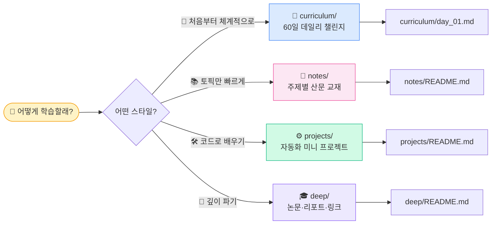

# 🛡️ AML Notes — 가상자산 자금세탁방지 학습

> 가상자산·온체인 업계의 AML(Anti-Money Laundering) 학습 노트. **60일 데일리 챌린지** + **토픽별 산문 교재** + **자동화 미니 프로젝트**. 치트시트가 아니라 **위에서 아래로 읽히는 교재**를 지향합니다.


---

## ✨ 이 노트의 특징

- ✅ **산문 교재 스타일** — 2026-04 전면 개편. 모든 노트가 prose intro + 용어 선설명 + 실무 포인트로 구성
- ✅ **초심자 read-through 가능** — 글로서리·외부 검색 점프 없이 위에서 아래로 이해됨
- ✅ **조문 → 실무 번역** — 특금법 §·이용자보호법 §가 실제 시스템의 어느 지점에 매핑되는지 명시
- ✅ **팩트 정확성** — 감독당국 검사·STR 작성에 인용 가능한 정확도를 목표
- ✅ **한국 VASP 실무 관점** — KoFIU 검사·DAXA 기준·본인확인기관·ISMS 등 한국 특수 인프라 반영

---

## 👋 처음이라면 — 5초 안에 시작



> 🚀 **추천 시작점** → [`curriculum/day_01.md`](curriculum/day_01.md)

---

## 📁 폴더 구조 (4개)

```
aml-notes/
├── 📅 curriculum/   ← 60일 데일리 챌린지 + 진척 트래커
├── 📖 notes/        ← 토픽별 산문 교재 (7카테고리 + 용어집)
├── 🛠️ projects/     ← 자동화 미니 프로젝트 6개 (코드 사양)
└── 🎓 deep/         ← 학술 논문·산업 리포트·컨퍼런스·외부 링크
```

| 폴더 | 누가 봐야 | 입구 |
|---|---|---|
| 📅 **`curriculum/`** | "처음부터 끝까지 끌고 가줘" | [`curriculum/README.md`](curriculum/README.md) |
| 📖 **`notes/`** | "특정 주제 빨리 보고 싶음" | [`notes/README.md`](notes/README.md) |
| 🛠️ **`projects/`** | "손으로 만들어야 이해됨" | [`projects/README.md`](projects/README.md) |
| 🎓 **`deep/`** | "논문·리포트 더 줘" | [`deep/README.md`](deep/README.md) |

---

## 🎯 60일 챌린지 한눈에

```mermaid
gantt
    title 60일 가상자산 AML 데일리 챌린지
    dateFormat X
    axisFormat D%d

    section Week 1
    AML 기초 (D1-7)              :w1, 0, 7d
    section Week 2
    한국 규제 (D8-14)             :w2, 7, 7d
    section Week 3
    FATF + 글로벌 (D15-21)       :w3, 14, 7d
    section Week 4
    🛠️ Travel Rule + IVMS101    :w4, 21, 7d
    section Week 5
    🛠️ 온체인 분석              :w5, 28, 7d
    section Week 6
    🛠️ 자금세탁 유형            :w6, 35, 7d
    section Week 7
    🛠️ 컴플라이언스 운영         :w7, 42, 7d
    section Week 8
    🛠️ 사례 + 리서치            :w8, 49, 7d
    section Capstone
    🎓 통합 설계 + 90일 로드맵   :cap, 56, 4d
```



- **하루 60~120분 × 60일** = 8주 + 캡스톤 4일
- 매주 끝에 **🛠️ 미니 프로젝트** (총 6개)
- 마지막 **🎓 캡스톤** = Mini AML Risk Engine 설계서
- 각 day 상단에 **"📖 오늘 뭘 배우나"** 2~3문단 intro로 맥락 연결

자세히 → [`curriculum/README.md`](curriculum/README.md) | 매일 진척 → [`curriculum/progress.md`](curriculum/progress.md)

---

## 🛠️ 미니 프로젝트 6개

| # | 프로젝트 | 주차 | 학습 포인트 |
|---|---|---|---|
| 01 | [IVMS101 빌더](projects/01-ivms101-builder/) | W4 | Travel Rule 메시지 표준 직접 작성 |
| 02 | [Onchain Tracer](projects/02-onchain-tracer/) | W5 | Etherscan API로 2-hop 자금 추적 |
| 03 | [Mixer Fetcher](projects/03-mixer-fetcher/) | W6 | OSINT 위험 wallet 데이터셋 구축 |
| 04 | [OFAC Screener](projects/04-ofac-screener/) | W7 | 제재 스크리닝 엔진 |
| 05 | [KYT Wrapper](projects/05-kyt-wrapper/) | W8 | 통합 위험 평가 API |
| 🎓 | [Risk Engine 설계](projects/06-capstone-risk-engine/) | Capstone | 시스템 통합 + 설계 문서 |

**연결 구조**: 01~04 각자 → 05에서 통합(`kyt_check()`) → 06 Capstone 설계서로 결산

→ [`projects/README.md`](projects/README.md)

---

## 🗺️ 학습 경로 추천

### 🟢 입문자 (AML 0)
```
curriculum/day_01.md ▶ 매일 1편씩 ▶ 60일 후 캡스톤
```
처음이면 **Day 1 → Day 60 순차 학습** 이 가장 효율적입니다. 각 day의 "📖 오늘 뭘 배우나" intro가 맥락을 이어줍니다.

### 🟡 한국 규제만 빨리
```
1. notes/2-regulations/korea-fiu-act.md       (특금법, 조문→실무 번역)
2. notes/2-regulations/korea-user-protection.md (이용자보호법)
3. notes/3-crypto-aml/vasp-obligations.md     (VASP 9 의무)
4. notes/3-crypto-aml/travel-rule.md          (Travel Rule 운영)
```

### 🔵 기술 / 분석가
```
1. notes/4-technology/kyc-kyt.md              (KYC·KYT 파이프라인 5단계)
2. notes/4-technology/blockchain-analytics.md (CIOH·Attribution·Exposure)
3. projects/02-onchain-tracer/                (실습)
4. projects/05-kyt-wrapper/                   (통합 실습)
```

### 🟣 솔루션 / 사업
```
1. notes/7-vendors/analytics-vendors.md        (Chainalysis·TRM·Elliptic·Crystal 비교)
2. notes/7-vendors/travel-rule-vendors.md      (Notabene·VerifyVASP·CODE)
3. notes/7-vendors/korea-solutions.md          (한국 시장 지도)
4. deep/reports.md                             (Chainalysis Crypto Crime Report 등)
```

---

## ⚡ 약어 빠른 참조 (Top 15)

<details>
<summary>가장 중요한 15개 — 펼쳐 보기</summary>

| 약어 | 풀이 |
|---|---|
| **AML / CFT** | 자금세탁방지 / 테러자금조달방지 |
| **KYC / KYT** | 고객확인(사람) / 거래·지갑확인(가상자산 특화) |
| **CDD / EDD** | 표준 실사 / 강화 실사 |
| **STR** | Suspicious Transaction Report — 의심거래 보고 |
| **VASP** | Virtual Asset Service Provider — 가상자산사업자 |
| **FATF / FIU** | 국제 표준 제정 / 각국 집행 (한국 KoFIU) |
| **특금법 / 이용자보호법** | 한국 양대 법 (AML vs 자산보호·시장규제) |
| **Travel Rule / IVMS101** | 송수신인 정보 동반 / 메시지 표준 |
| **OFAC / SDN** | 미국 제재 집행 / 제재 명단 |
| **PEP** | Politically Exposed Person — 정치적 주요인물 |
| **RBA** | Risk-Based Approach — 위험기반접근법 |
| **AMLO** | AML Officer — 자금세탁방지 보고책임자 (임원급) |
| **Mixer / Tornado Cash** | 익명화 도구 (2022 제재 → 2025-03 해제) |
| **Lazarus / DPRK** | 1순위 위협, Bybit $1.46B |
| **Tipping-off** | STR 사실 고객 누설 금지 (별도 처벌) |

전체 → [`notes/glossary.md`](notes/glossary.md) (💡 **실무** 블록 40+ 용어)

</details>

---

## 📊 컨텐츠 현황

| 영역 | 항목 | 수량 |
|---|---|---|
| 📅 일일 학습 플랜 | `curriculum/day_NN.md` | **60** (모두 prose intro 포함) |
| 📖 토픽 노트 | `notes/**/*.md` | **27** (전면 산문화 완료) |
| 🛠️ 미니 프로젝트 사양 | `projects/**/README.md` | **6** |
| 🎓 학술·리포트 큐레이션 | `deep/*.md` | **5** (README 포함) |
| 🔗 외부 참고 링크 | 1차·2차·벤더 | **150+** |
| 📚 글로서리 | `notes/glossary.md` | **200+** 용어 (Top 15 우선순위) |

**총 분량**: 약 **12,000+ 줄**의 한국어 AML 학습 자료

---

## 🎓 2026-04 대규모 개편 (Prose Revamp)

2026-04 기간 동안 **치트시트 → 산문 교재**로 전면 개편. 주요 변화:

### 표준 6원칙 일관 적용

모든 notes 파일에:
1. 상단 "이 글을 읽고 나면 무엇을 할 수 있는가" intro
2. 영문 약어 **처음 나올 때** 1~2문장 풀이
3. 각 `##` 섹션 2~4문장 prose intro
4. 표 위 "어떻게 읽어야 하나" 가이드
5. 각 섹션 말미 "실무에서 어떻게 쓰나" 포인트
6. 기존 bullet·table은 요약 부록으로 보존

### 팩트 교정

- Bybit 해킹 `$1.5B (ETH)` → **`$1.46B (ETH + stETH + mETH + cmETH)`**
- Tornado Cash 타임라인 표준화: **2022-08 제재 → 2024-11 Van Loon 판결 → 2025-03-21 해제**
- 기록보관 두 법 분리: **가상자산이용자보호법 §11 (거래정보 15년)** vs **특금법 §5의4 (AML 기록 5년)**
- Chainalysis DB 표현: **누적 추적 거래량 $24T+** (가치가 아님)
- FATF Travel Rule Supervision 날짜 교정 (2025-06 발표)

### 스펙 보강

- 프로젝트 02 Etherscan 2-hop tracer: **fan-out 폭발 가드** (캐싱·max_fanout·백오프)
- 프로젝트 01 IVMS101 빌더: **중첩 스키마 상세화** (naturalPerson·nameIdentifier·LEI)
- 링크 오류 15+ 건 수정 (underscore→hyphen)

---

## 🤝 사용 가이드

### 이 노트의 성격

- ✅ **학습용 노트** — 빠르게 일별·토픽별로 흡수하기 위한 구조
- ✅ **참조용 1차 자료** — 항상 출처 링크 포함
- ✅ **감독 대응 참고 자료** — 조문 번호와 함께 인용 가능한 정확도 목표
- ❌ **법률 자문 아님** — 실무 적용 전 법무·컨설팅 검토 필수
- ❌ **벤더 추천 아님** — 시장 정보 정리, 평가·선정은 별개

### 컨트리뷰션

이 저장소는 개인 학습 노트지만, 다음은 환영:

- 오타·링크 깨짐·사실 오류 PR
- 새 사례·논문·리포트 추가 제안
- 한국어 번역 개선
- 실무 경험에 기반한 "실무 포인트" 보강

---

## ⚠️ 면책

- 모든 문서는 **2026년 4월 기준** 최신화
- 가상자산 규제는 **빠르게 변동** — 원문 (법령정보센터 / FATF / FSC / ESMA / OFAC) 재확인 필수
- 사실 주장에는 출처 + 발행일 표기. 의심 시 원문 우선
- 법령 조문 번호 인용은 편의용이며, 실무 적용 시 현행 법령 반드시 재확인

---

## 📜 라이선스

[Creative Commons Attribution 4.0 International (CC BY 4.0)](https://creativecommons.org/licenses/by/4.0/)

- 자유 사용 · 공유 · 수정 가능
- 출처 명시만 부탁드립니다

---

<div align="center">

### 🚀 [지금 Day 1 시작하기 →](curriculum/day_01.md)

</div>
