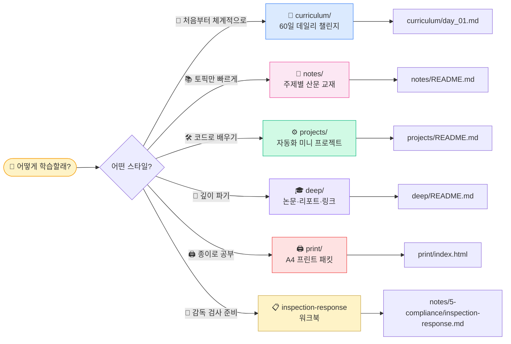

# 🛡️ AML Notes — 가상자산 자금세탁방지 학습

> 가상자산·온체인 업계의 AML(Anti-Money Laundering) 학습 노트. **60일 데일리 챌린지** + **토픽별 산문 교재** + **실무 현장 가이드** + **감독 검사 대응 워크북** + **자동화 미니 프로젝트**. 치트시트가 아니라 **이해 → 구현 → 감독 검사 대응**까지 끌고 가는 교재를 지향합니다.


---

## ✨ 이 노트의 특징

### 📚 교재로서
- ✅ **산문 교재 스타일** — 모든 노트가 prose intro + 용어 선설명 + 실무 포인트
- ✅ **초심자 read-through** — 글로서리·외부 검색 점프 없이 위에서 아래로 이해
- ✅ **조문 → 실무 번역** — 특금법 §·이용자보호법 §가 실제 시스템의 어느 지점에 매핑되는지 명시
- ✅ **팩트 정확성** — 감독당국 검사·STR 작성에 인용 가능한 정확도
- ✅ **2026 최신 규제** — 특금법 2026-01 대주주 심사, FATF R.16 2025-06, Tornado 2025-03 해제, Bybit $1.46B

### 💼 실무 현장 깊이
- ✅ **95개 파일에 "💼 실무 현장" 블록** — 한국 VASP(Upbit·Bithumb·Coinone·Korbit) + 글로벌(Coinbase·Binance·Kraken·OKX) 조직도·연봉·일과·FP 분석 포함
- ✅ **하루 루틴 시뮬레이션** — 주니어 AML Analyst 09:00~18:00 시나리오
- ✅ **실제 스택 명시** — Kafka·Flink·Neo4j·Chainalysis API·Snowflake 등
- ✅ **자주 나오는 오해** — 현장 감각 보정

### 🧮 구현 가능 수준 기술 rigor
- ✅ **Exposure Score 공식** — `score = clip(Σ direct + Σ indirect × decay × f_amount, 0, 100)` + 벤더 λ 비교 + SQL 검증
- ✅ **CIOH + CoinJoin Fingerprint** — pseudocode + 정확도 표 (75% → 95%)
- ✅ **Bridge Matching** — match_bridge() + 6 bridge nonce 가용성 표
- ✅ **IVMS101 Validator** — KR/EU/US 관할 dict + validate() pseudocode
- ✅ **Korean Fuzzy Matching** — JW 0.92 + 성씨 필터 + 다축 매칭 (FP 90% → 12%)
- ✅ **RBA Risk Score** — 5 Factor 공식 + calibrate() + 등급 매핑
- ✅ **Clustering Benchmark** — Elliptic·Elliptic2 + 8편 논문 (Meiklejohn·Möser·Weber·Bellei)

### 🧭 감독 검사·운영 도구
- ✅ **감독 검사 대응 워크북** (771줄) — 4주 타임라인·40 체크리스트·40 서류·FAQ·실패 Top5·이의제기 3단계(행정심판→소송→대법원)
- ✅ **STR 실무 템플릿** — FIU-TIS 7섹션 + Good vs Bad 비교 + 반송 사유
- ✅ **이의제기 프로세스** — 90일 기한·승소율·실제 사례·의사결정 체크리스트

### 🌏 커버리지
- ✅ **아시아 4개 관할** — 🇸🇬 싱가포르 MAS · 🇦🇪 UAE VARA/ADGM · 🇯🇵 일본 FSA/JVCEA · 🇭🇰 홍콩 SFC
- ✅ **Staking·LST 리스크** — Lido dominance 28~32% · MEV · Slashing · EigenLayer Restaking
- ✅ **DAXA 법적 정체성** — 자율기구 지위 + 사실상 준(準) 라이선스 역할

### 🔧 인프라
- 🖨 **A4 프린트 + 모바일 반응형** — 60일 전체 인쇄 최적화 HTML · `@media (max-width: 768px)` 폰/태블릿 대응
- 📊 **Mermaid 120개 + seaborn 차트 8개** — 모든 핵심 개념이 시각 자료와 함께
- 🔍 **자동 검증 인프라** — Mermaid 컴파일·내부 링크·외부 URL 상시 점검 (현재 120/120, 469/469 PASS)

---

## 👋 처음이라면 — 5초 안에 시작



> 🚀 **추천 시작점** → [`curriculum/day_01.md`](curriculum/day_01.md)

---

## 📁 폴더 구조 (5개)

```
aml-notes/
├── 📅 curriculum/   ← 60일 데일리 챌린지 + 진척 트래커
├── 📖 notes/        ← 토픽별 산문 교재 (7카테고리 + 용어집)
├── 🛠️ projects/     ← 자동화 미니 프로젝트 6개 (코드 사양)
├── 🎓 deep/         ← 학술 논문·산업 리포트·컨퍼런스·외부 링크
└── 🖨 print/        ← A4 프린트 패킷 (Task Sheet + Reading 통합)
```

| 폴더 | 누가 봐야 | 입구 |
|---|---|---|
| 📅 **`curriculum/`** | "처음부터 끝까지 끌고 가줘" | [`curriculum/README.md`](curriculum/README.md) |
| 📖 **`notes/`** | "특정 주제 빨리 보고 싶음" | [`notes/README.md`](notes/README.md) |
| 🛠️ **`projects/`** | "손으로 만들어야 이해됨" | [`projects/README.md`](projects/README.md) |
| 🎓 **`deep/`** | "논문·리포트 더 줘" | [`deep/README.md`](deep/README.md) |
| 🖨 **`print/`** | "종이에 프린트해서 공부하고 싶음" | [`print/index.html`](print/index.html) |

---

## 🎯 60일 챌린지 한눈에

```mermaid
gantt
    title 60일 가상자산 AML 데일리 챌린지
    dateFormat X
    axisFormat D%d

    section Week 1
    AML 기초 (D1-7)              :w1, 0, 7d
    section Week 2
    한국 규제 (D8-14)             :w2, 7, 7d
    section Week 3
    FATF + 글로벌 (D15-21)       :w3, 14, 7d
    section Week 4
    🛠️ Travel Rule + IVMS101    :w4, 21, 7d
    section Week 5
    🛠️ 온체인 분석              :w5, 28, 7d
    section Week 6
    🛠️ 자금세탁 유형            :w6, 35, 7d
    section Week 7
    🛠️ 컴플라이언스 운영         :w7, 42, 7d
    section Week 8
    🛠️ 사례 + 리서치            :w8, 49, 7d
    section Capstone
    🎓 통합 설계 + 90일 로드맵   :cap, 56, 4d
```



- **하루 60~120분 × 60일** = 8주 + 캡스톤 4일
- 매주 끝에 **🛠️ 미니 프로젝트** (총 6개)
- 마지막 **🎓 캡스톤** = Mini AML Risk Engine 설계서
- 각 day 상단에 **"📖 오늘 뭘 배우나"** + **"🗺 오늘의 지도"** Mermaid
- **"💼 실무 현장"** + **"🧮 핵심 알고리즘"** + **"🧭 실행 도구"** 섹션 포함

자세히 → [`curriculum/README.md`](curriculum/README.md) | 매일 진척 → [`curriculum/progress.md`](curriculum/progress.md)

---

## 🛠️ 미니 프로젝트 6개

| # | 프로젝트 | 주차 | 학습 포인트 | 상태 |
|---|---|---|---|---|
| 01 | [IVMS101 빌더](projects/01-ivms101-builder/) | W4 | Travel Rule 메시지 표준 + 관할별 Validator | 📋 스펙 |
| 02 | [Onchain Tracer](projects/02-onchain-tracer/) | W5 | Etherscan API 2-hop 추적 + Bridge Matching | 📋 스펙 |
| 03 | [Mixer Fetcher](projects/03-mixer-fetcher/) | W6 | OSINT 위험 wallet 데이터셋 | 📋 스펙 |
| 04 | [OFAC Screener](projects/04-ofac-screener/) | W7 | 제재 스크리닝 + 한국 성씨 fuzzy tuning | 📋 스펙 |
| 05 | [KYT Wrapper](projects/05-kyt-wrapper/) | W8 | 통합 위험 평가 API + Exposure Score | 📋 스펙 |
| 🎓 | [Risk Engine 설계](projects/06-capstone-risk-engine/) | Capstone | 시스템 통합 + 설계 문서 | 📋 스펙 |

**연결 구조**: 01~04 각자 → 05에서 통합(`kyt_check()`) → 06 Capstone 설계서로 결산
**상태**: 모든 프로젝트는 **설계 스펙·pseudocode·아키텍처 다이어그램** 완비. 실제 코드 구현은 학습자의 과제.

→ [`projects/README.md`](projects/README.md)

---

## 💼 실무 현장 — "실제 회사에서 어떻게 돌아가는가"

이론을 넘어 **실제 기업 운영**을 체감할 수 있도록 95개 파일에 "💼 실무 현장" 블록을 주입했습니다. 각 블록은 토픽에 맞춰:

- **한국 VASP 조직도** — Upbit·Bithumb·Coinone·Korbit 컴플팀 구조·헤드카운트·연봉 대역
- **글로벌 대형 거래소 비교** — Coinbase(FCI·Sanctions·AML Advisory 3팀 ~500명), Binance(DOJ $4.3B 합의·5 hub), Kraken, OKX($504M 합의), Gemini
- **실제 기술 스택** — Kafka·Flink·Neo4j·Coinbase Lynx GNN·Chainalysis API JSON 샘플
- **실제 룰/코드 예시** — pseudocode·SQL·JSON
- **AML Analyst 하루 루틴** — 09:00~18:00 시나리오
- **자주 나오는 오해** — 현장 감각 보정

> 💡 **어디를 열어도**: curriculum/day_NN.md · notes/**/*.md · projects/*/README.md · deep/*.md 전부에서 "💼 실무 현장" 확인 가능.

---

## 🧮 기술 rigor — "구현 가능 수준"

AML 엔지니어·데이터 분석가 관점에서 "코딩할 수 있는가"를 기준으로 핵심 기술 섹션을 수식·pseudocode·벤치마크 수준으로 상향했습니다.

| 영역 | 위치 |
|---|---|
| **Exposure Score 공식** (벤더 일반화 + SQL 검증) | [`notes/4-technology/blockchain-analytics.md`](notes/4-technology/blockchain-analytics.md) §4 |
| **CIOH + CoinJoin Fingerprint** (pseudocode + 정확도 표) | 동 §2 |
| **Bridge Matching** (6 bridge nonce 가용성) | 동 §5 |
| **Clustering Benchmark** (Elliptic·Elliptic2 + 8편 논문) | 동 §8 |
| **IVMS101 Validator** (KR/EU/US 관할 dict + validate()) | [`notes/4-technology/travel-rule-protocols.md`](notes/4-technology/travel-rule-protocols.md) §N |
| **Protocol Interop Matrix** (한국 4대 라우팅 + 재시도) | 동 §M |
| **Korean Fuzzy Matching** (JW 0.92 + 성씨 필터) | [`notes/5-compliance/sanctions-screening.md`](notes/5-compliance/sanctions-screening.md) §N |
| **RBA Risk Score** (5 Factor + calibrate()) | [`notes/5-compliance/cdd-edd.md`](notes/5-compliance/cdd-edd.md) §8 |
| **STR 실무 템플릿** (FIU-TIS 7섹션 + Good vs Bad) | [`notes/5-compliance/str-ctr.md`](notes/5-compliance/str-ctr.md) §N |

---

## 🧭 감독·실무 운영 도구

### 감독 검사 대응 워크북 (771줄)

[`notes/5-compliance/inspection-response.md`](notes/5-compliance/inspection-response.md)

한국 VASP가 연 1~2회 받는 FIU/FSS 현장 검사를 실전 수준으로 준비:

- **4주 타임라인** — 통지 → 자료 준비 → 모의 → 현장 → 사후
- **40개 자체 진단 체크리스트** — A 신고 · B 거버넌스 · C KYC/CDD/EDD · D KYT · E STR · F 제재 · G Travel Rule
- **40종 필수 서류** — 정책 10 + 증빙 20 + 사건 대응 10
- **예상 질의 FAQ 8개 + 모범 답변 프레임**
- **실패 사례 Top 5** — 자료 지연·숫자 불일치·Tipping-off 위반 등
- **이의제기 프로세스** — 1차 행정심판 (90일, 승소율 10~20%) → 2차 행정소송 (1~2년, 15~25%) → 3차 대법원 상고 + 의사결정 체크리스트 9항목

### STR·EDD·RBA 실행 도구

- **STR 템플릿** — KoFIU FIU-TIS 7섹션 + Good vs Bad STR 비교 + 반송 사유 Top 5
- **EDD 실행** — 트리거 리스트·자금원천 증빙 서류 유형·사례
- **RBA 점수** — 5 Factor + 등급 매핑 + 재평가 주기

---

## 🌏 글로벌 진출 가이드

한국 VASP의 해외 진출 의사결정을 지원:

| 관할 | 파일 | 핵심 |
|---|---|---|
| 🇰🇷 한국 | [`notes/2-regulations/korea-fiu-act.md`](notes/2-regulations/korea-fiu-act.md) | 특금법 + 2026-01 대주주 심사 |
| 🇰🇷 한국 | [`notes/2-regulations/korea-user-protection.md`](notes/2-regulations/korea-user-protection.md) | 이용자보호법 (2024-07 시행) |
| 🌐 국제 | [`notes/2-regulations/fatf.md`](notes/2-regulations/fatf.md) | FATF R.15·R.16 + 2025-06 개정 |
| 🇺🇸 미국 | [`notes/2-regulations/us-bsa-fincen.md`](notes/2-regulations/us-bsa-fincen.md) | BSA·FinCEN·OFAC·GENIUS Act |
| 🇪🇺 EU | [`notes/2-regulations/eu-mica-amlr.md`](notes/2-regulations/eu-mica-amlr.md) | MiCA·AMLR·TFR |
| 🇸🇬🇦🇪🇯🇵🇭🇰 아시아 | [`notes/2-regulations/asia-regs.md`](notes/2-regulations/asia-regs.md) | 싱가포르 MAS · UAE VARA · 일본 FSA · 홍콩 SFC |

---

## 🖨 A4 프린트 + 모바일 반응형

> 하루 Day를 **A4 용지에 바로 프린트**해서 손으로 체크하고 정리할 수 있도록, 60일 전체를 **인쇄 최적화된 HTML 패킷**으로 만들어 뒀습니다. **모바일·태블릿**에서도 동일 콘텐츠를 최적화된 레이아웃으로 열람 가능.

### 입구

`print/index.html` 을 브라우저에서 열기 → 원하는 Day 카드 클릭 → 🖨 **Print A4** 버튼 (또는 `Ctrl+P` · `⌘+P`).

### 각 Day 패킷 구성

- **1페이지 — Task Sheet**: 큰 DAY 번호 + Week 진척 점 + 🗺 오늘의 지도 Mermaid + 핵심 질문 + 읽기·외부 자료 + 미니 챌린지 + ✅ 손으로 채우는 체크박스 + 💭 오늘의 한 줄 괘선 + 날짜 기입란
- **N페이지 — Reading Articles**: Task Sheet의 📖 읽기·더 깊이가 가리키는 **내부 노트 전체 본문** + 💼 실무 현장 + 🧮 기술 심화
- Day 1 기준 **약 12~18 페이지**, 리뷰·프로젝트 일은 **1~3 페이지**

### 디자인 특징

- **정확한 A4 사이즈** (210×297 mm) · 16/14mm @page 여백
- **모바일 반응형** — `@media (max-width: 768px)` 폰 레이아웃 + 태블릿 fine-tuning
- **Pretendard Variable** 본문 + **IBM Plex Serif** 숫자 + **IBM Plex Mono** 레이블
- **잉크 절약형** 흑백 + 차콜 네이비(`#1a2e4a`) 단일 액센트
- **Mermaid SVG 사전 렌더** → 오프라인 프린트에서도 렌더 보장

### 재생성

```bash
pip install markdown
cd charts && npm install && cd ..  # mmdc
python print/generator.py all      # 전체
python print/generator.py 1        # Day 1만
python print/generator.py 1-7      # 범위
```

자세히 → [`print/README.md`](print/README.md)

---

## 🗺️ 학습 경로 추천

### 🟢 입문자 (AML 0)
```
curriculum/day_01.md ▶ 매일 1편씩 ▶ 60일 후 캡스톤
```
처음이면 **Day 1 → Day 60 순차 학습** 이 가장 효율적. 각 day의 "📖 오늘 뭘 배우나" + "🗺 오늘의 지도" 가 맥락을 이어줍니다.

### 🟡 한국 규제만 빨리
```
1. notes/2-regulations/korea-fiu-act.md       (특금법 + 2026-01 대주주 심사)
2. notes/2-regulations/korea-user-protection.md (이용자보호법)
3. notes/3-crypto-aml/vasp-obligations.md     (VASP 9 의무)
4. notes/3-crypto-aml/travel-rule.md          (Travel Rule 운영)
5. notes/7-vendors/korea-solutions.md         (DAXA + 한국 인프라)
```

### 🔵 기술 / 분석가
```
1. notes/4-technology/kyc-kyt.md              (KYC·KYT 파이프라인 5단계)
2. notes/4-technology/blockchain-analytics.md (Exposure·CIOH·Bridge + 벤치마크)
3. notes/4-technology/travel-rule-protocols.md (IVMS101 Validator + Protocol Interop)
4. projects/02-onchain-tracer/                (실습)
5. projects/05-kyt-wrapper/                   (통합 실습)
```

### 🟣 솔루션 / 사업
```
1. notes/7-vendors/analytics-vendors.md        (Chainalysis·TRM·Elliptic·Crystal 비교)
2. notes/7-vendors/travel-rule-vendors.md      (Notabene·VerifyVASP·CODE)
3. notes/7-vendors/korea-solutions.md          (한국 시장 + DAXA)
4. deep/reports.md                             (Chainalysis Crypto Crime Report 등)
```

### 🔴 AMLO / 컴플라이언스 실무자 🆕
```
1. notes/5-compliance/cdd-edd.md               (CDD 4단계 + EDD + RBA 점수법)
2. notes/5-compliance/str-ctr.md               (STR 실무 템플릿)
3. notes/5-compliance/sanctions-screening.md   (Korean Fuzzy + OFAC)
4. notes/5-compliance/internal-controls.md     (5 pillars + 3LoD)
5. notes/5-compliance/inspection-response.md   (4주 타임라인 + 40 체크리스트 + 이의제기)
```

### 🌏 글로벌 진출 검토 🆕
```
1. notes/2-regulations/fatf.md                 (FATF 기반)
2. notes/2-regulations/asia-regs.md            (싱가포르·UAE·일본·홍콩)
3. notes/2-regulations/us-bsa-fincen.md        (미국)
4. notes/2-regulations/eu-mica-amlr.md         (EU)
5. curriculum/day_21.md                        (한·미·EU Travel Rule 비교)
```

---

## ⚡ 약어 빠른 참조 (Top 15)

<details>
<summary>가장 중요한 15개 — 펼쳐 보기</summary>

| 약어 | 풀이 |
|---|---|
| **AML / CFT** | 자금세탁방지 / 테러자금조달방지 |
| **KYC / KYT** | 고객확인(사람) / 거래·지갑확인(가상자산 특화) |
| **CDD / EDD** | 표준 실사 / 강화 실사 |
| **STR** | Suspicious Transaction Report — 의심거래 보고 |
| **VASP** | Virtual Asset Service Provider — 가상자산사업자 |
| **FATF / FIU** | 국제 표준 제정 / 각국 집행 (한국 KoFIU) |
| **특금법 / 이용자보호법** | 한국 양대 법 (AML vs 자산보호·시장규제) |
| **Travel Rule / IVMS101** | 송수신인 정보 동반 / 메시지 표준 |
| **OFAC / SDN** | 미국 제재 집행 / 제재 명단 |
| **PEP** | Politically Exposed Person — 정치적 주요인물 |
| **RBA** | Risk-Based Approach — 위험기반접근법 |
| **AMLO** | AML Officer — 자금세탁방지 보고책임자 (임원급) |
| **Mixer / Tornado Cash** | 익명화 도구 (2022 제재 → 2025-03 해제) |
| **Lazarus / DPRK** | 1순위 위협, Bybit $1.46B |
| **Tipping-off** | STR 사실 고객 누설 금지 (별도 처벌) |
| **DAXA** | 한국 원화 거래소 5사 자율협의기구 (준 라이선스) |

전체 → [`notes/glossary.md`](notes/glossary.md) (💡 **실무** 블록 40+ 용어 · 용어 짝 비교 섹션 포함)

</details>

---

## 📊 컨텐츠 현황

| 영역 | 항목 | 수량 |
|---|---|---|
| 📅 일일 학습 플랜 | `curriculum/day_NN.md` | **60** (prose intro + 🗺 지도 + 💼 실무 + 🧮 알고리즘) |
| 📖 토픽 노트 | `notes/**/*.md` | **29** (전면 산문화 + 실무 + rigor) |
| 🛠️ 미니 프로젝트 사양 | `projects/**/README.md` | **6** (아키텍처 + 상태 배지) |
| 🎓 학술·리포트 큐레이션 | `deep/*.md` | **5** (분기 리뷰 프로세스) |
| 🖨 A4 프린트 패킷 | `print/days/day_NN.html` | **60** (Task + Reading + Mermaid SVG) |
| 📊 Mermaid 다이어그램 | 노트·day·프로젝트·워크북 전체 | **120** (mmdc 120/120 PASS) |
| 📈 seaborn 차트 | `charts/output/*.svg·png` | **8** (Lazarus·벌금·자산비중·VASP 의무 등) |
| 🔗 외부 참고 링크 | 1차·2차·벤더 | **150+** (분기 검증) |
| 📚 글로서리 | `notes/glossary.md` | **200+** 용어 + 용어 짝 비교 |
| 🧭 감독 검사 워크북 | `notes/5-compliance/inspection-response.md` | **771줄** (4주 + 40 CL + 이의제기) |
| 🌏 아시아 규제 | `notes/2-regulations/asia-regs.md` | **230+줄** (4개 관할 균형) |

**총 분량**: **22,000+ 줄**의 한국어 AML 학습 자료 (초기 12,000줄 → 83% 확장)

**품질 검증**:
- Mermaid 120/120 PASS · 내부 링크 469/469 PASS · 한글 폰트 누락 0
- 각 수정은 CHANGELOG.md 에 버전별 기록
- 자동 검증 스크립트: `python charts/validate_*.py`

---

## 🎓 업그레이드 히스토리

이 저장소는 다단계 대규모 개편을 거쳐 성장했습니다. 상세 CHANGELOG는 [`CHANGELOG.md`](CHANGELOG.md).

### 🚀 v1.0 (2026-04-23): A- 마무리 · 구현 가능 수준 + 감독 대응 완성
- Staking 리스크 (Lido dominance · MEV · Slashing · Restaking)
- asia-regs 4개 관할 깊이 균형화
- 검사 이의제기 3단계 프로세스 + 의사결정 체크리스트

### 📋 v0.9 (2026-04-22): 종합 감사 C안 풀 (15 P0~P2)
- Bybit 수치 `$1.46B` 전체 단일화
- 특금법 2026-01 대주주 자격심사 반영
- Tornado 2025-03 해제 후 정책 의사결정 프레임
- FATF R.16 2025-06 개정 5개 핵심 변화
- **감독 검사 대응 워크북 신규** (771줄)
- 아시아 4개 관할 신규 (`asia-regs.md`, 230+줄)
- 용어 짝 비교 · Travel Rule 3파일 역할 분담
- DeFi/NFT/Staking 심화 + RBA 점수 산정법 + DAXA 상세
- 모바일 CSS `@media (max-width: 768px)`

### 🧮 v0.8 (2026-04-22): 기술 rigor (8 P0~P2)
- Exposure Score 공식 + 벤더 λ 비교
- CIOH + CoinJoin Fingerprint + 정확도 벤치마크
- Bridge Matching algorithm + 6 bridge nonce 가용성
- IVMS101 Validator + Protocol Interop Matrix
- Korean Fuzzy Matching (FP 90% → 12%)
- Clustering Benchmark + 8편 핵심 논문

### 💼 v0.7 (2026-04-21): 실무 현장 주입 (95 파일)
- 60일 커리큘럼 + 25 토픽 notes + 6 projects + 4 deep에 "💼 실무 현장" 블록 추가
- 한국 VASP (Upbit·Bithumb·Coinone·Korbit) + 글로벌 (Coinbase·Binance·Kraken·OKX) 조직도·연봉·일과·룰 예시

### 🎨 v0.6 (2026-04-21): 메타 + 시각화
- LICENSE (CC BY 4.0 + MIT 코드) · CONTRIBUTING · CHANGELOG · ISSUE_TEMPLATE
- notes 서브폴더 README 6개
- A4 프린트 `@page` 여백 + 유동 레이아웃 수정
- seaborn 차트 8종 + Mermaid 114개 + 한글 폰트(Malgun Gothic)

### 📝 v0.5 (2026-04-17): Prose Revamp
- 22 topic notes · 60 day 파일 · 6 projects · 4 deep 전면 산문화
- 표준 6원칙 (intro · 약어 풀이 · prose section · 표 가이드 · 실무 포인트 · 요약)
- 팩트 교정 (Bybit · Tornado · 기록보관 분리 · Chainalysis DB 표현)

### 🏗 v0.0 (2026-03): 초기 커밋
- 60일 커리큘럼 스켈레톤 · 토픽 노트 초안 · 8 프로젝트 골격

---

## 🤝 사용 가이드

### 이 노트의 성격

- ✅ **학습용 노트** — 일별·토픽별 흡수 구조
- ✅ **참조용 1차 자료** — 항상 출처 링크 포함
- ✅ **감독 검사 대응 참고 자료** — 조문 번호·벤치마크·pseudocode 수준
- ✅ **AML 엔지니어 구현 가이드** — 공식·pseudocode·정확도 데이터
- ❌ **법률 자문 아님** — 실무 적용 전 법무·컨설팅 검토 필수
- ❌ **벤더 추천 아님** — 시장 정보 정리, 평가·선정은 별개

### 컨트리뷰션

이 저장소는 개인 학습 노트지만, 다음은 환영:

- 🐛 오타·링크 깨짐·사실 오류 → [Issues](https://github.com/lala-david/aml-notes/issues) 템플릿 활용
- 💡 새 사례·논문·리포트 추가 제안
- 🌐 한국어 번역 개선
- 💼 실무 경험에 기반한 "실무 포인트" 보강

자세히 → [`CONTRIBUTING.md`](CONTRIBUTING.md)

---

## ⚠️ 면책

- 모든 문서는 **2026년 4월 기준** 최신화
- 가상자산 규제는 **빠르게 변동** — 원문 (법령정보센터 / FATF / FSC / ESMA / OFAC) 재확인 필수
- 사실 주장에는 출처 + 발행일 표기. 의심 시 원문 우선
- 법령 조문 번호 인용은 편의용이며, 실무 적용 시 현행 법령 반드시 재확인

---

## 📜 라이선스

[Creative Commons Attribution 4.0 International (CC BY 4.0)](https://creativecommons.org/licenses/by/4.0/) — 문서
[MIT](LICENSE) — 코드 샘플 (`.py`·`.js`·`.json` 등)

- 자유 사용 · 공유 · 수정 가능
- 출처 명시만 부탁드립니다

---

<div align="center">

### 🚀 [지금 Day 1 시작하기 →](curriculum/day_01.md)

**이해 → 구현 → 감독 검사 대응**, 60일 여정이 여기서 시작됩니다.

</div>
