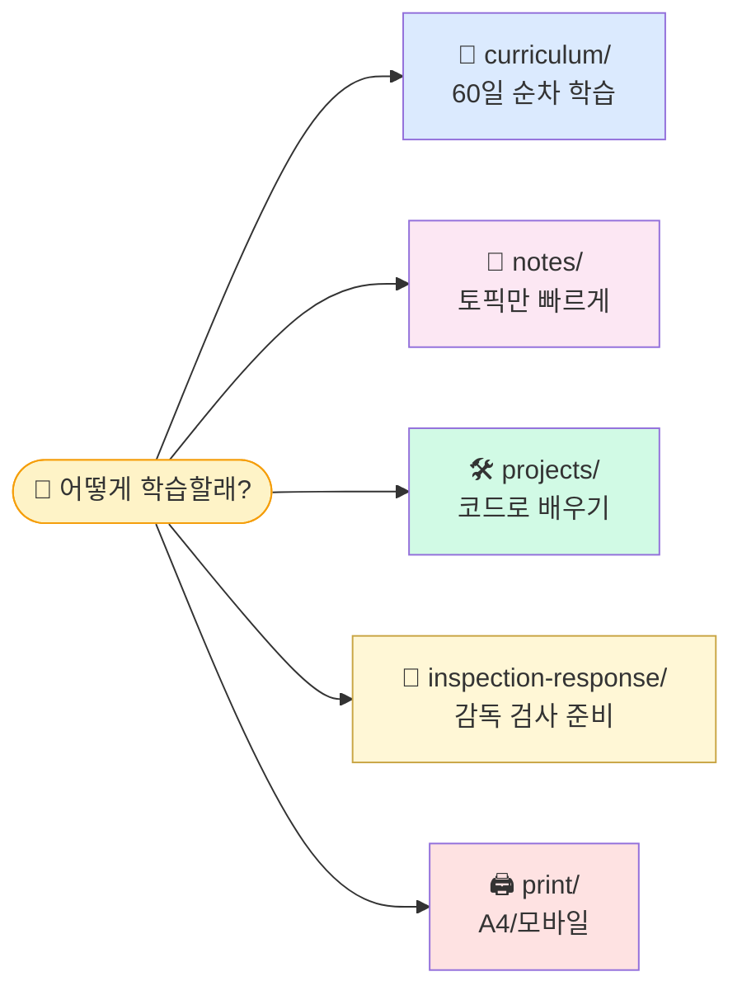

# 🛡️ AML Notes — 가상자산 자금세탁방지 학습

> **60일 데일리 챌린지 + 토픽별 산문 교재 + 감독 검사 대응 워크북**. 치트시트가 아니라 **이해 → 구현 → 감독 검사 대응**까지 끌고 가는 한국어 AML 교재.


---

## 👋 5초 진입



> 🚀 **처음이면** → [`curriculum/day_01.md`](curriculum/day_01.md)

---

## ✨ 왜 이 노트인가

- **산문 교재** — bullet 치트시트 아닌, 위에서 아래로 읽히는 구조
- **구현 가능 수준** — Exposure Score 공식·CIOH pseudocode·IVMS101 Validator 등 엔지니어가 코딩할 수 있는 rigor
- **💼 실무 현장 95 파일** — 한국 VASP(Upbit·빗썸) + 글로벌(Coinbase·Binance) 조직도·일과·스택
- **🧭 감독 검사 워크북** — FIU/FSS 검사 4주 타임라인 + 40 체크리스트 + 이의제기 3단계
- **2026 최신 규제** — 특금법 2026-01 대주주 심사 · FATF R.16 2025-06 · Tornado 2025-03 해제 · Bybit $1.46B

---

## 📁 폴더

| 폴더 | 누가 봐야 |
|---|---|
| 📅 [`curriculum/`](curriculum/README.md) | "처음부터 끝까지 끌고 가줘" — 60일 데일리 |
| 📖 [`notes/`](notes/README.md) | "특정 주제 빨리" — 7카테고리 + 용어집 |
| 🛠️ [`projects/`](projects/README.md) | "손으로 만들어야" — 6개 자동화 사양 |
| 🎓 [`deep/`](deep/README.md) | "논문·리포트 더" — 학술·산업 큐레이션 |
| 🖨 [`print/`](print/index.html) | "종이/모바일로" — A4 HTML 패킷 |

---

## 🎯 60일 한눈에

```mermaid
gantt
    title 60일 AML 데일리 챌린지
    dateFormat X
    axisFormat D%d

    section W1 기초
    AML 기초 (D1-7)    :w1, 0, 7d
    section W2 한국
    특금법·이용자법    :w2, 7, 7d
    section W3 글로벌
    FATF·US·EU         :w3, 14, 7d
    section W4 🛠️
    Travel Rule        :w4, 21, 7d
    section W5 🛠️
    온체인 분석        :w5, 28, 7d
    section W6 🛠️
    자금세탁 유형      :w6, 35, 7d
    section W7 🛠️
    컴플 운영          :w7, 42, 7d
    section W8 🛠️
    사례·리서치        :w8, 49, 7d
    section 🎓
    캡스톤 설계        :cap, 56, 4d
```



하루 60~120분 × 60일. 각 day에 **🗺 지도 + 💼 실무 + 🧮 알고리즘**.

→ [`curriculum/README.md`](curriculum/README.md)

---

## 🧭 주요 자원

| 영역 | 파일 |
|---|---|
| 🧮 **Exposure Score 공식** | [`notes/4-technology/blockchain-analytics.md`](notes/4-technology/blockchain-analytics.md#4-exposure-score) |
| 🧮 **CIOH + CoinJoin Fingerprint** | [`blockchain-analytics.md §2`](notes/4-technology/blockchain-analytics.md) |
| 🧮 **IVMS101 Validator + Protocol Interop** | [`travel-rule-protocols.md`](notes/4-technology/travel-rule-protocols.md) |
| 🧮 **Korean Fuzzy Matching** (FP 90→12%) | [`sanctions-screening.md`](notes/5-compliance/sanctions-screening.md) |
| 🧮 **RBA Risk Score 5 Factor** | [`cdd-edd.md §8`](notes/5-compliance/cdd-edd.md) |
| 🧭 **감독 검사 대응 워크북** (771줄) | [`inspection-response.md`](notes/5-compliance/inspection-response.md) |
| 🧭 **STR 실무 템플릿 FIU-TIS 7섹션** | [`str-ctr.md`](notes/5-compliance/str-ctr.md) |
| 🌏 **아시아 4개 관할** (SG·UAE·JP·HK) | [`asia-regs.md`](notes/2-regulations/asia-regs.md) |
| 📚 **용어 사전** (200+ · 짝 비교) | [`glossary.md`](notes/glossary.md) |

---

## 🗺️ 학습 경로

| 대상 | 출발점 |
|---|---|
| 🟢 **AML 처음** | [`day_01.md`](curriculum/day_01.md) → 순차 60일 |
| 🟡 **한국 규제만** | [`korea-fiu-act.md`](notes/2-regulations/korea-fiu-act.md) |
| 🔵 **기술·분석가** | [`kyc-kyt.md`](notes/4-technology/kyc-kyt.md) → [`blockchain-analytics.md`](notes/4-technology/blockchain-analytics.md) |
| 🟣 **솔루션·사업** | [`notes/7-vendors/`](notes/7-vendors/README.md) |
| 🔴 **AMLO·컴플** | [`inspection-response.md`](notes/5-compliance/inspection-response.md) |
| 🌏 **글로벌 진출** | [`asia-regs.md`](notes/2-regulations/asia-regs.md) |

---

## 🖨 A4 + 모바일

`print/index.html` 열기 → Day 클릭 → `Ctrl+P` / `⌘+P`. 모바일 반응형 (`@media max-width: 768px`) 포함.

재생성:
```bash
pip install markdown && cd charts && npm install && cd ..
python print/generator.py all
```

→ [`print/README.md`](print/README.md)

---

## 📊 규모

**22,000+ 줄** · Mermaid **120** · 내부 링크 **469** · 외부 참조 **150+**

상세 이력 → [`CHANGELOG.md`](CHANGELOG.md)
기여 → [`CONTRIBUTING.md`](CONTRIBUTING.md)
거버넌스 → [`GOVERNANCE.md`](GOVERNANCE.md) · 규제 추적 → [`meta/regulatory-watch.md`](meta/regulatory-watch.md) · 공식 검수 요청 → [`meta/official-review-request.md`](meta/official-review-request.md)
라이선스 → 문서 [CC BY 4.0](https://creativecommons.org/licenses/by/4.0/) · 코드 [MIT](LICENSE)

---

## ⚠️ 면책

학습·참조용. **법률 자문 아님**. 가상자산 규제는 빠르게 변동 — 실무 적용 시 원문(법령정보센터·FATF·FSC·OFAC) 재확인 필수.

---

<div align="center">

### 🚀 [Day 1 시작하기 →](curriculum/day_01.md)

</div>
