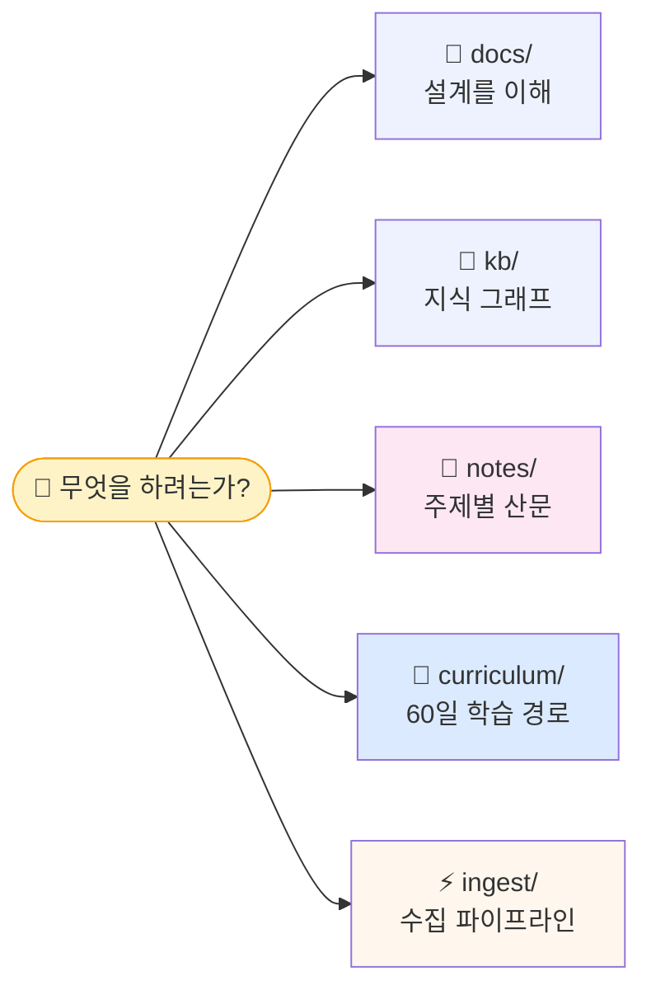
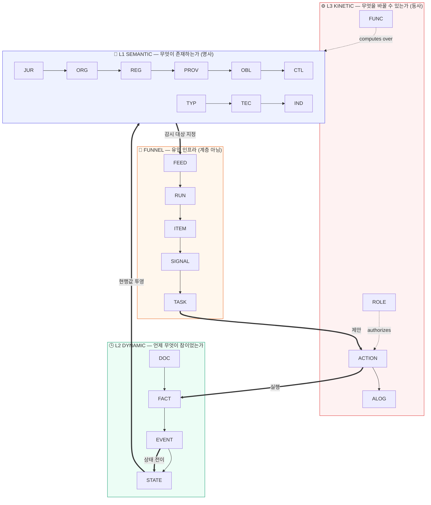

# 🛡️ 가상자산 AML 지식베이스

> **질의 가능한 규제 지식 그래프 + 매일 갱신되는 수집 파이프라인.**
> 산문 교재가 아니라, 산문 아래에 시점 질의가 되는 그래프를 깐 지식 저장소.


---

## 무엇이 다른가

기존 AML 자료는 "지금 규제가 이렇다"를 문장으로 적습니다. 6개월 뒤 자동으로 틀린 문서가 됩니다.

이 저장소는 **모든 사실에 유효기간과 출처를 붙이고, 관계를 그래프로 표현**합니다. 그래서 이런 질문에 답할 수 있습니다.

| 질문 | 답하는 방식 |
|---|---|
| "2024-12-30 시점 EU CASP 규제 지형은?" | `as_of(2024-12-30)` 시점 질의 |
| "이 의무의 국제적 뿌리는?" | 조문 → 규범 → `IMPLEMENTS` → 국제기준 경로 탐색 |
| "관할별 트래블룰 임계값 비교" | 추상 의무 하나에 걸린 각국 조문의 한정자를 모아 **표를 생성** |
| "규제가 바뀌면 어느 문서를 고쳐야 하나?" | 사실 ID 역참조로 영향 문서 자동 표시 |
| "그때 우리는 무엇을 근거로 판단했나?" | 이중시간(bitemporal) — 기록시간 축 질의 |

마지막 질문이 감독 검사 대응의 핵심입니다. 과거 판단의 정당성은 *당시 알 수 있었던 정보*로 평가되기 때문입니다.

---

## 🧭 5초 진입


```mermaid
flowchart LR
    S([🙋 무엇을 하려는가?]) --> A["📘 docs/<br/>설계를 이해"]
    S --> B["🧠 kb/<br/>지식 그래프"]
    S --> C["📖 notes/<br/>주제별 산문"]
    S --> D["📅 curriculum/<br/>60일 학습 경로"]
    S --> E["⚡ ingest/<br/>수집 파이프라인"]

    style S fill:#fef3c7,stroke:#f59e0b
    style A fill:#eef2ff
    style B fill:#eef2ff
    style C fill:#fce7f3
    style D fill:#dbeafe
    style E fill:#fff7ed
```

- **설계부터** → [`docs/README.md`](docs/README.md) · [`docs/PLAN.md`](docs/PLAN.md)
- **AML 처음** → [`curriculum/day_01.md`](curriculum/day_01.md)
- **주제만 빠르게** → [`notes/README.md`](notes/README.md)

---

## 🏗 3계층 온톨로지


```mermaid
flowchart TB
    subgraph FN["🔻 FUNNEL — 유입 인프라 (계층 아님)"]
        direction LR
        F["FEED"] --> R["RUN"] --> I["ITEM"] --> SG["SIGNAL"] --> T["TASK"]
    end
    subgraph L3["⚙️ L3 KINETIC — 무엇을 바꿀 수 있는가 (동사)"]
        direction LR
        AC["ACTION"] --> AL["ALOG"]
        RO["ROLE"] -.authorizes.-> AC
        FU["FUNC"]
    end
    subgraph L2["🕒 L2 DYNAMIC — 언제 무엇이 참이었는가"]
        direction LR
        D["DOC"] --> FA["FACT"] --> EV["EVENT"] --> ST["STATE"]
    end
    subgraph L1["🧠 L1 SEMANTIC — 무엇이 존재하는가 (명사)"]
        direction LR
        JU["JUR"] --> OR["ORG"] --> RE["REG"] --> PR["PROV"] --> OB["OBL"] --> CT["CTL"]
        TY["TYP"] --> TE["TEC"] --> IN["IND"]
    end
    T ==>|제안| AC
    AC ==>|실행| FA
    EV ==>|상태 전이| ST
    ST ==>|현행값 투영| L1
    L1 ==>|감시 대상 지정| F
    FU -.computes over.-> L1

    style L1 fill:#eef2ff,stroke:#4f46e5
    style L2 fill:#ecfdf5,stroke:#059669
    style L3 fill:#fef2f2,stroke:#dc2626
    style FN fill:#fff7ed,stroke:#ea580c
```

계층은 단방향이 아니라 **순환**합니다. 이것이 지식베이스가 스스로 갱신되는 메커니즘입니다.

| 계층 | 역할 | 변경 빈도 | 변경 주체 |
|---|---|---|---|
| **L1 의미** (명사) | 무엇이 존재하고 어떤 관계인가 | 월~분기 | 사람 (PR 리뷰 필수) |
| **L2 동적** (시간) | 언제 무엇이 참이었는가 — 이중시간 | 일~주 | 자동 제안 + 사람 승인 |
| **L3 운동** (동사) | 무엇을 바꿀 수 있고 누가 바꿨는가 | 명세는 분기 | 실행은 권한 통제 |
| *Funnel* (인프라) | 수집·정규화·변화탐지 — **사실 후보까지만** | 일 | 자동 |

**Funnel 은 계층이 아닙니다.** 수집한 것이 곧 지식이 되면 검증 게이트가 무력화됩니다.
후보가 지식이 되는 것은 `ACTION` 을 통해서입니다.

→ [`docs/ontology/04-node-edge-spec.md`](docs/ontology/04-node-edge-spec.md) (38 클래스 · 60+ 술어)

Semantics/Kinetics 이분은 Palantir Foundry 온톨로지 모델에서 차용했고, L2 이중시간은
규제 도메인을 위해 추가했습니다. 저작자 표시와 채택·확장 범위 → [`docs/references.md`](docs/references.md)

---

## 📁 저장소 구조

```
├── 📘 docs/          설계 문서 — 여기서 시작
│   ├── PLAN.md          마스터 계획
│   ├── architecture/    3계층 총론 · 저장소 위상 · 사이트(보류)
│   ├── ontology/        의미·동적·운동 계층 · 노드/엣지 명세 · 타임라인
│   ├── governance/      데이터 품질 · 출처·확신도 · 검증 워크플로
│   ├── ingestion/       소스 레지스트리 · 일일 파이프라인
│   └── adr/             아키텍처 결정 기록
│
├── 🧠 kb/            지식 그래프 — SSOT · 커밋·리뷰 대상 → [kb/README.md](kb/README.md)
│   ├── schema/          온톨로지 기계판 · JSON Schema
│   ├── entities/        노드 인스턴스 (1 노드 = 1 YAML)
│   │   ├── jurisdictions/ regulators/ regulations/{reg}/provisions/
│   │   ├── obligations/ controls/ concepts/ risks/
│   │   ├── typologies/ techniques/ indicators/
│   │   ├── chains/ assets/ protocols/ vasps/ vendors/ threat-actors/
│   │   ├── events/ eras/ incidents/ enforcement/ cases/
│   │   └── actions/ functions/ roles/     ← L3 운동 계층
│   ├── facts/           원자적 사실 + 상충 레지스트리 (JSONL)
│   ├── states/          구간 상태 — 이중시간 (JSONL)
│   ├── metrics/         관측 수치 시계열 (JSONL)
│   ├── alog/            액션 로그 — append-only (JSONL)
│   ├── sources/         출처(SRC)·문서(DOC) 레지스트리
│   └── derived/         🤖 생성물 — 직접 편집 금지
│
├── ⚡ ingest/         수집 파이프라인 (Funnel)
│   ├── config/          소스 레지스트리 (실측 검증 필수)
│   ├── collectors/      수집기 구현
│   └── legacy/          전환 대상 구 워처
│
├── 📦 data/           데이터 레이크 (raw·staging 은 gitignore)
├── ✅ quality/        검증기 · 규칙 · 품질 리포트
├── 📰 intel/          분석 산출물 — 브리프 · 평가서 · 워치리스트
│
├── 📖 notes/          주제별 산문 (7 카테고리)
├── 📅 curriculum/     60일 학습 경로
├── 🌐 en/             영문
├── 🛠 projects/       구현 사양
├── 🎓 deep/           논문·리포트 큐레이션
├── 📊 charts/         다이어그램 툴체인
└── 🖨 print/          A4·모바일 패킷
```

`_research/`(검증 전 리서치 원시 산출물)와 `_private/`(비공개 레이어)는 커밋되지 않습니다.

---

## 🔬 데이터 규율

지식베이스가 죽는 유일한 이유는 **검증되지 않은 지식이 누적되는 것**입니다. 그래서 다음을 기계가 강제합니다.

| 원칙 | 강제 수단 |
|---|---|
| AI 는 제안만, 확정은 사람 | `ROLE:x-agent` 의 `can_execute` 를 스키마가 빈 배열로 강제 (K-7) |
| 변경 경로는 모델 안에 | `ACTION.change_set.never_touches` — 임의 필드 변경 차단 |
| 증거 없는 노드 금지 | 불변식 I-1 — 모든 노드가 최소 1개 출처 문서에 결속 |
| 시점 없는 주장 금지 | 모든 사실에 유효기간. 상대 시간 표현("현재", "최근") 검출 |
| 제안 ≠ 시행 | 상태기계 9단계 고정. `proposed`/`enacted`/`in_force` 혼동 차단 |
| 덮어쓰기 금지 | 정정은 항상 폐기 표시 + 새 레코드 |
| 상충은 지우지 않고 기록 | `kb/facts/contradictions.jsonl` |
| 인과는 근거 없이 주장 금지 | `basis: temporal_only` 를 validator 가 거부 |
| 강등은 자동, 승격은 사람 | 확신도 인플레이션 방지 |
| 미검증 부채 상한 5% | 초과 시 신규 저확신도 유입 차단 |

### 출처 등급과 확신도

| 등급 | 출처 | | 확신도 | 기준 |
|---|---|---|---|---|
| **T1** | 법령 원문·관보·감독기관 발간물 | | **A** | T1/T2 원문 직접 확인 |
| **T2** | 감독기관 보도자료·국제기구 보고서 | | **B** | T3 복수 일치 또는 T2 간접 |
| **T3** | 분석업체 연례보고서·동료심사 논문 | | **C** | T4 단일 출처 |
| **T4** | 전문 매체 | | **D** | T5 또는 상충 존재 |
| **T5** | 블로그·SNS (단독 근거 금지) | | | |

→ [`docs/governance/02-provenance-confidence.md`](docs/governance/02-provenance-confidence.md)

---

## ⚡ 매일 갱신

```
07:00 KST  수집(P0→P1→P2) → 정규화·중복제거 → 노드 매칭 → 변화 탐지
           → 검증 큐 갱신 → 일일 브리프 → 품질 스코어카드
19:00 KST  제재 명단 2차 (SLA 1일)
```

**검증 게이트가 유일한 사람 개입 지점이자 유일한 관문입니다.** 자동화는 변화를 *제안*까지만 합니다.

소스는 **실측 검증된 것만** 등재합니다. 추측 URL은 넣지 않고, 열어보지 않은 소스는 `enabled: false` 로 둡니다.

→ [`ingest/config/sources.yaml`](ingest/config/sources.yaml) · [`docs/ingestion/02-daily-pipeline.md`](docs/ingestion/02-daily-pipeline.md)

---

## 🕰 역사 타임라인

제도·기술·시장을 **3트랙**으로 분리하고 트랙 간 인과로 잇습니다. 조문만 읽으면 규정의 취지를 알 수 없고, 취지를 모르면 회색지대에서 판단할 수 없습니다.

| 트랙 | 범위 |
|---|---|
| **A · 제도** | 1970~ 국제기준·주요국 입법·감독체계 형성 |
| **B · 기술·시장** | 2008~ 프로토콜·사고·세탁 기법 진화 |
| **C · 한국** | 2001~ 국내 법제·시장·집행 |

→ [`docs/ontology/06-timeline-model.md`](docs/ontology/06-timeline-model.md)

---

## 🚀 사용법

```bash
pip install -r quality/requirements.txt

# 지식 그래프 무결성 검증 (차단 위반 시 exit 1)
python quality/validate_kb.py

# 관할 비교표 생성
python scripts/build_crosswalk.py

# 시점 질의 — 2020-01-01 기준 규제 지형
python scripts/build_crosswalk.py --stdout --as-of 2020-01-01

# 산문 계층 검증
python quality/validate_links.py
python quality/validate_mermaid.py
```

A4·모바일 패킷 재생성:
```bash
pip install markdown && cd charts && npm install && cd ..
python print/generator.py all
```

---

## 🔍 검증이 무엇을 잡아냈나

설계가 장식이 아니라는 증거입니다. 규율이 실제로 오류를 걸러냈습니다.

| 발견 | 내용 |
|---|---|
| **FATF 근거 규범 오류** | 가상자산 트래블룰의 근거는 R.16 이 **아니라** INR.15 §7(b). R.16 Explanatory Note §54 가 VASP 직접 적용을 명시적으로 배제한다 — 업계 통설이 부정확 |
| **임계값 오귀속 2건** | INR.15 §7(b) 에 §7(a) 의 CDD 기준을, 특금법 제5조의3 에 시행령의 100만원을 붙였다. **"의무를 부과하는 조문"과 "수치를 정하는 조문"은 다르다** |
| **관보가 철회를 안 보여준다** | 미국 규칙 철회 2건이 연방관보 공고 없이 통합의제에서만 종결. 관보만 감시하면 철회된 제안이 영원히 `proposed` 로 남는다 |
| **한국 R.15 등급 상충** | 국가페이지 C vs 부속표 N/A 는 상충이 아니라 **적용기준 차이**. 한국은 개정 R.15 로 평가받은 적이 없다 |
| **식별자 규격 버그** | 문서에 예시로 적은 `JUR:kr` 이 자기 정규식을 위반. validator 가 잡았다 |
| **폐기된 소스 사용 중** | 영국 OFSI Consolidated List 는 2026-01-28 철회 — 갱신 안 되는 파일을 계속 받고 있었다 |

상충 5건은 전부 판정 완료했습니다 (`a_correct` 3 · `both_valid_different_scope` 2).
어느 쪽도 삭제하지 않고 [`kb/facts/contradictions.jsonl`](kb/facts/contradictions.jsonl) 에 판정과 근거를 남겼습니다.

---

## 📊 현황

| 항목 | 수 |
|---|---:|
| **KB 노드** | **109** *(목표 1,200)* |
| ├ semantic (명사) | 98 |
| ├ kinetic (동사) | 10 |
| └ dynamic (시간) | 1 |
| 원자적 사실 · 구간 상태 | 19 · 3 |
| 상충 레지스트리 | 5 *(전부 판정 완료)* |
| 액션 로그 | 11 |
| 온톨로지 클래스 / 술어 / 불변식 | 38 / 59 / 22 |
| 설계 문서 · ADR | 21 · 4 |
| 수집 소스 (가동 / 전체) | 33 / 50 *(실측 88 후보)* |
| 산문 | 123 파일 · 27,446 줄 |

> ⚠️ **KB 는 구축 초기입니다.** 온톨로지·파이프라인·검증 체계는 완성되었고
> 노드 대량 등재가 다음 단계입니다.
> `techniques/`(62기법) · `indicators/` · `protocols/` · `vasps/` · `threat-actors/` 는
> 리서치 자료는 확보했으나 아직 비어 있습니다.
>
> 알려진 부채와 진행 상황 → [`kb/README.md`](kb/README.md) · [`docs/PLAN.md`](docs/PLAN.md)

이력 → [`CHANGELOG.md`](CHANGELOG.md) · 기여 → [`CONTRIBUTING.md`](CONTRIBUTING.md) · 거버넌스 → [`GOVERNANCE.md`](GOVERNANCE.md)
라이선스 → 문서 [CC BY 4.0](https://creativecommons.org/licenses/by/4.0/) · 코드 [MIT](LICENSE)

---

## ⚠️ 면책

학습·참조용이며 **법률 자문이 아닙니다.** 가상자산 규제는 빠르게 변동합니다.

이 저장소는 확신도 등급을 명시하지만, **실무 적용 시 원문 재확인은 반드시 필요합니다.** 특히 확신도 `C`/`D` 항목과 `proposed` 상태 규범은 그대로 인용하지 마십시오.

---

<div align="center">

**[📘 설계 문서 →](docs/README.md)** · **[📅 Day 1 시작 →](curriculum/day_01.md)**

</div>
