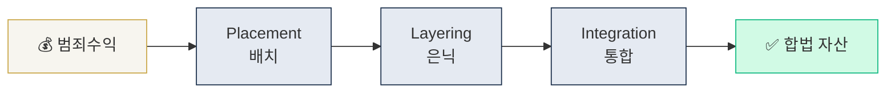

# Day 1 — AML이 뭔가 + 자금세탁 3단계

> 자금세탁(ML)의 본질과 고전 3단계 모델을 머릿속에 박는다. ⏱️ ~75분.

<!-- MAP-START -->
## 🗺 오늘의 지도

<!-- MAP-END -->

## 🎯 핵심 질문
1. 자금세탁의 목적 3가지는?
2. Placement / Layering / Integration 각 단계 예시 1개씩?
3. AML과 CFT의 결정적 차이는?

## 📖 읽기 (~45분)
- 메인: [`../notes/1-foundations/what-is-aml.md`](../notes/1-foundations/what-is-aml.md)

## 🌐 외부 자료 (선택, ~15분)
- [FATF — Money Laundering 페이지](https://www.fatf-gafi.org/en/topics/money-laundering)
- [UNODC — Money Laundering Overview](https://www.unodc.org/unodc/en/money-laundering/overview.html)

## 🛠️ 미니 챌린지 (~15분)
- 종이 또는 메모장에 **3단계 모델을 직접 그려라** (박스 + 화살표)
- 각 단계에 **가상자산 예시 1개씩** 적기
- 예: Placement = OTC desk에서 현금→BTC 매수

## ✅ 체크포인트
- [ ] 자금세탁의 3단계 이름을 외운다
- [ ] AML 9대 의무 (신고/KYC/EDD/TM/제재/STR/CTR/Travel Rule/기록보관/내부통제) 중 5개 이상 떠올린다
- [ ] AML vs CFT 차이를 한 문장으로 설명할 수 있다
- [ ] 한국 AML 감독기관 이름을 말할 수 있다 (FIU, KoFIU)

## 💭 오늘의 한 줄
> _직접 작성: 오늘 가장 의외였던 것 한 줄_

## 더 깊이 (선택)
- [`../notes/1-foundations/key-concepts.md`](../notes/1-foundations/key-concepts.md) — 내일 다룰 용어 미리보기
