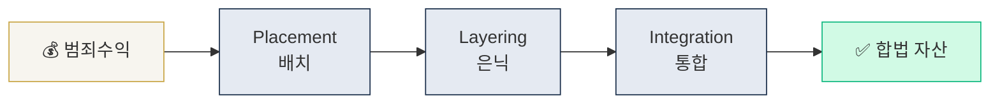

# Day 1 — AML이 뭔가 + 자금세탁 3단계

> 자금세탁(ML)의 본질과 고전 3단계 모델을 머릿속에 박는다. ⏱️ ~75분.


<!-- MAP-START -->
## 🗺 오늘의 지도


<!-- MAP-END -->

## 🎯 핵심 질문
1. 자금세탁의 목적 3가지는?
2. Placement / Layering / Integration 각 단계 예시 1개씩?
3. AML과 CFT의 결정적 차이는?

## 📖 읽기 (~45분)
- 메인: [`../notes/1-foundations/what-is-aml.md`](../notes/1-foundations/what-is-aml.md)

## 🌐 외부 자료 (선택, ~15분)
- [FATF — Money Laundering 페이지](https://www.fatf-gafi.org/en/topics/money-laundering)
- [UNODC — Money Laundering Overview](https://www.unodc.org/unodc/en/money-laundering/overview.html)

## 🛠️ 미니 챌린지 (~15분)
- 종이 또는 메모장에 **3단계 모델을 직접 그려라** (박스 + 화살표)
- 각 단계에 **가상자산 예시 1개씩** 적기
- 예: Placement = OTC desk에서 현금→BTC 매수

## ✅ 체크포인트
- [ ] 자금세탁의 3단계 이름을 외운다
- [ ] AML 9대 의무 (신고/KYC/EDD/TM/제재/STR/CTR/Travel Rule/기록보관/내부통제) 중 5개 이상 떠올린다
- [ ] AML vs CFT 차이를 한 문장으로 설명할 수 있다
- [ ] 한국 AML 감독기관 이름을 말할 수 있다 (FIU, KoFIU)

## 💭 오늘의 한 줄
> _직접 작성: 오늘 가장 의외였던 것 한 줄_

## 💼 실무 현장 (Industry Reality)

### 한국 VASP에서는

**Upbit(두나무) 기준**. AML 조직은 통상 **AMLO(자금세탁방지책임자, 임원급) 1명 + 분석가(Analyst) 6~12명 + KYT 엔지니어 2~4명 + 정책팀 2~3명** 규모. Placement 방어선은 **본인확인기관**(PASS·NICE) API로 실명확인 + **법인 실명계좌**(Upbit=K뱅크) 단일화로 타 명의 입금 원천 차단. Layering 탐지는 **람다256 VerifyVASP + Chainalysis KYT** 2중 운영 — 입출금 주소에 mixer·Lazarus 노출 ≥ 특정 %면 자동 **차단 큐(frozen queue)**로 떨어짐. Integration은 고액 원화 출금에서 잡힘: **1일 누적 1억원 초과 또는 월 3억원 초과 시 자금원천 증빙(EDD)** 요구가 사실상의 표준.

### 글로벌 거래소에서는

**Coinbase**는 컴플라이언스를 **3개 팀으로 분리** — FCI(Financial Crimes Investigations, STR 작성), Sanctions Operations(OFAC 제재), AML Advisory(정책·감사 대응). 2024년 말 기준 전체 컴플라이언스 ~500명 중 AML·STR 라인만 200명+. **Binance**는 2023 DOJ 합의($4.3B) 이후 AML을 완전 재편 — Chief Compliance Officer 신규 지정, 5개 지역 hub(두바이·런던·싱가포르·아부다비·바하마)에 독립 AMLO 배치, **DOJ·FinCEN 모니터 5년 상주**.

### 기술 스택 (실제 도구)

- **이벤트 스트림**: Kafka → Flink(또는 Spark Streaming)로 실시간 거래 → 룰 엔진
- **그래프 DB**: Neo4j 또는 TigerGraph — 지갑 간 관계·카운터파티 2~6 hop
- **KYT API**: Chainalysis KYT(REST, webhook 기반 alert) / Elliptic Navigator / TRM Labs API
- **피처 스토어**: Feast 또는 자체. "24h 거래빈도·지갑연령·mixer 노출률" 등 모델 입력
- **모델**: XGBoost(룰-based FP 감축) → 최근 Graph Neural Network(Coinbase "Lynx" 2024 발표) 쪽으로 이동

### 룰/코드 예시

실제 KYT 룰 pseudocode — 한국 거래소 공통 패턴:
```
RULE: mixer_proximity_high
WHEN incoming_tx AND
     chainalysis.exposure.mixer_direct > 0.05 AND
     customer.kyc_tier < 3
THEN action = FREEZE_AND_REVIEW
     sla = 24h
     notify = ["AMLO", "FCI_QUEUE"]
```

Chainalysis KYT 응답 JSON 샘플(실제 필드 이름):
```json
{
  "address": "0xabc...",
  "risk": "Severe",
  "exposure": {
    "direct": [{"category": "mixing", "percentage": 7.3}],
    "indirect": [{"category": "sanctions", "percentage": 1.1}]
  }
}
```

### AML Analyst 하루 루틴 (주니어 기준)

- **09:00~10:00** — 전날 밤 KYT Alert 큐 리뷰 (보통 30~80건, 80%가 False Positive)
- **10:00~11:30** — EDD 케이스 처리 (자금원천 증빙 서류 심사)
- **11:30~12:00** — Sanctions list refresh 검증 (OFAC SDN 일일 diff)
- **13:00~15:00** — STR 초안 작성 (팀장 리뷰 후 KoFIU FIU-TIS 시스템 제출)
- **15:00~16:30** — Weekly FP 분석 + 룰 튜닝 제안 (월 1회 룰 위원회)
- **16:30~18:00** — 고위험 거래 수동 모니터링 + 이상 패턴 브리핑

### 자주 나오는 오해

- **"AML은 법무 업무"** — 한국은 준법(Compliance)이지만 미국은 Financial Crimes로 별도 부서. 데이터·엔지니어링 역량이 법적 지식만큼 중요
- **"룰만 많이 쌓으면 된다"** — 룰 간 충돌·FP 폭증이 오히려 탐지 품질을 떨어뜨림. "룰 10개 튜닝된 것 > 룰 100개 기계 생성"이 현장 원칙

## 더 깊이 (선택)
- [`../notes/1-foundations/key-concepts.md`](../notes/1-foundations/key-concepts.md) — 내일 다룰 용어 미리보기
