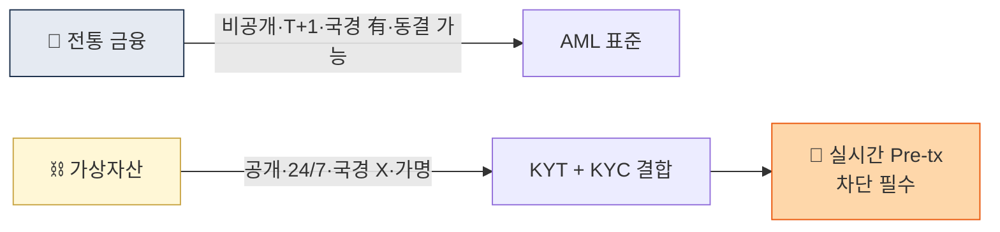

# Day 2 — 왜 가상자산 AML은 다른가

> 전통금융 AML과 가상자산 AML의 본질적 차이 + 투명성의 역설. ⏱️ ~75분.

## 📖 오늘 뭘 배우나

블록체인은 **공개 원장**이라 이론상 추적이 쉽지만, 실제 AML 실무는 훨씬 어렵습니다. 왜 그런가라는 역설이 오늘의 핵심 주제. 주소와 사람의 분리, Mixer·Bridge·DEX 같은 **가상자산 고유 layering 도구**, 그리고 이를 다루는 KYT 산업의 존재 이유까지 연결해서 봅니다.


<!-- MAP-START -->
## 🗺 오늘의 지도


<!-- MAP-END -->

## 🎯 핵심 질문
1. 가상자산 원장이 공개인데 왜 추적이 어려운가?
2. 2025년 불법거래의 84%를 차지한 자산은?
3. Cross-chain laundering이 왜 2025-2026 트렌드 1위인가?

## 📖 읽기 (~45분)
- 메인: [`../notes/1-foundations/why-crypto-different.md`](../notes/1-foundations/why-crypto-different.md)

## 🌐 외부 자료 (선택, ~20분)
- [Chainalysis 2026 Crypto Crime Report Intro](https://www.chainalysis.com/blog/2026-crypto-crime-report-introduction/)

## 🛠️ 미니 챌린지 (~10분)
- 전통금융 AML vs 가상자산 AML **차이 5개**를 한 줄씩 적어라
- 그중 가장 까다로워 보이는 1개에 별표 + 이유

## ✅ 체크포인트
- [ ] "투명성의 역설" 을 한 문장으로 설명할 수 있다
- [ ] 가상자산 layering 도구 5개 이름 댈 수 있다 (mixer/bridge/DEX/peel/privacy coin)
- [ ] 스테이블코인이 자금세탁에서 차지하는 비중 (84%) 기억
- [ ] DPRK Lazarus의 2025년 탈취 규모를 안다 ($2B)

## 💭 오늘의 한 줄

## 💼 실무 현장 (Industry Reality)

### 한국 VASP에서는

공개 원장이 "이론상 투명"해도 실제 한국 거래소에서는 **지갑 주소 → 사람** 매핑이 사업의 승패를 가릅니다. Upbit·Bithumb·Coinone·Korbit 모두 **Chainalysis KYT** 기반 **입금 주소 사전 스크리닝(pre-deposit screening)**을 운영 — 입금 전 주소를 먼저 API로 조회해 mixer·Lazarus·제재 익스포저가 임계 초과면 입금 자체를 차단. 한국 거래소의 **트래블룰 허브**는 Upbit=**람다256 VerifyVASP**, 나머지(Bithumb·Coinone·Korbit)=**CODE(코드)** 로 분리되어 있어 서로 다른 허브 간 상호운용은 여전히 실무 과제.

### 글로벌에서는

**Chainalysis 2025 Crypto Crime Report** 기준 불법거래의 약 60% 이상이 **스테이블코인**(USDT·USDC)으로 이동 — 이 때문에 Coinbase·Kraken은 USDT 입출금에 **별도 룰 세트**를 두고 일반 자산보다 강한 임계로 모니터링. **Coinbase "Lynx"**(Graph Neural Network) 2024 발표 논문에서 "cross-chain laundering 탐지 FP 40% 감축" 주장 — 2026년 현재 업계는 **룰 + GNN 이중 구조**로 이동 중.

### 기술 스택 또는 도구

| 역할 | 한국 주류 | 글로벌 |
|---|---|---|
| 온체인 분석 | Chainalysis Reactor | Chainalysis · Elliptic · TRM Labs 3중 |
| KYT API | Chainalysis KYT | 동일 + 자체 인하우스 |
| Cross-chain 추적 | Chainalysis Storyline | Elliptic Lens · TRM Phoenix |
| 주소 클러스터링 | 벤더 휴리스틱 의존 | 자체 GNN(Coinbase Lynx) |

Chainalysis API 응답 실제 필드:
```json
{
  "address": "bc1q...",
  "cluster": "Lazarus Group",
  "riskScore": 95,
  "exposure": {
    "direct": {"mixer": 0.31, "sanctioned": 0.12},
    "indirect": {"hack": 0.08}
  }
}
```

### 자주 나오는 오해

- **"블록체인이 공개라 추적이 쉽다"** — 주소와 사람이 분리돼 있고, mixer·bridge·DEX는 휴리스틱을 깨뜨리도록 설계됨. "공개 원장 = 자동 추적"이 아니라 **"공개 원장 + 분석 회사의 수십억 달러 데이터셋"**이 있어야 가능
- **"한국은 트래블룰이 통일돼 있다"** — Upbit(VerifyVASP) vs 4사(CODE)로 **실질 2분화**. 허브 간 상호운용은 2026년에도 완전 해결 안 됨

## 더 깊이 (선택)
- [`../notes/3-crypto-aml/onchain-typology.md`](../notes/3-crypto-aml/onchain-typology.md) — 7유형 미리보기
