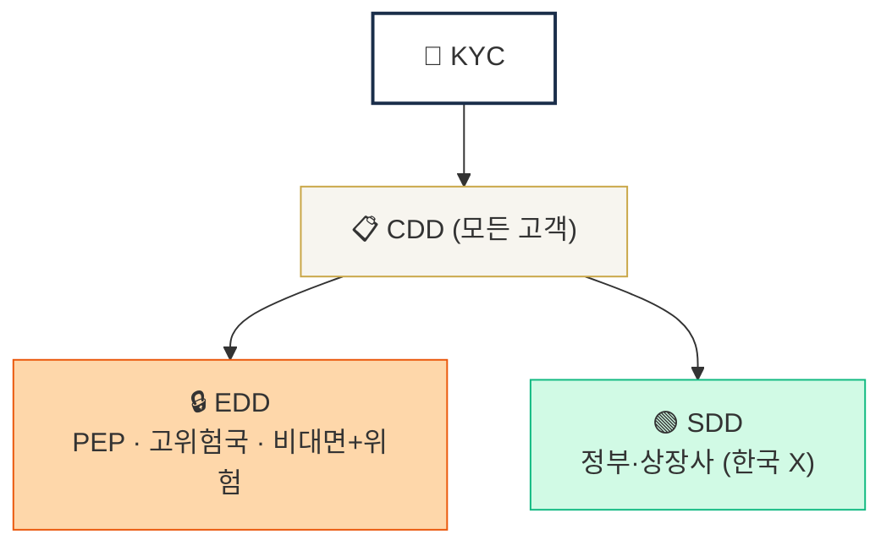
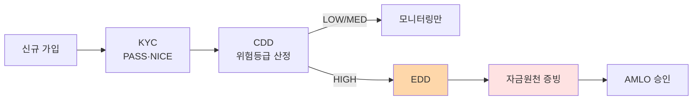

# Day 3 — 핵심 용어 1 (KYC / CDD / EDD / SDD)

> 동심원 4용어를 정확히 구분. ⏱️ ~60분.

## 📖 오늘 뭘 배우나

KYC·CDD·EDD·SDD는 모두 "고객을 확인한다"는 비슷한 말처럼 들리지만 **적용 대상과 강도**가 다릅니다. 동심원 구조로 한번 정리해 두면 이후 모든 실무 판단(누구에게 어느 수준의 확인을 적용할 것인가)의 기반이 됩니다. 특히 EDD 트리거 6가지는 반드시 외워둬야 하는 **운영 체크리스트**.

<!-- MAP-START -->
## 🗺 오늘의 지도

<!-- MAP-END -->

## 🎯 핵심 질문
1. KYC와 CDD는 어떻게 다른가?
2. EDD가 트리거되는 6가지 상황은?
3. SDD가 가상자산에서 거의 안 쓰이는 이유?

## 📖 읽기 (~30분)
- 메인: [`../notes/1-foundations/key-concepts.md`](../notes/1-foundations/key-concepts.md) — 1~3절
- 보조: [`../notes/5-compliance/cdd-edd.md`](../notes/5-compliance/cdd-edd.md) — 1~2절만

## 🛠️ 미니 챌린지 (~20분)
- 동심원 그림 직접 그리기 (KYC > CDD > EDD/SDD)
- **자기 EDD 트리거 시나리오 2개 만들기** (예: "한국 거주 PEP 임원이 ETH 거래 신청")

## ✅ 체크포인트
- [ ] KYC vs CDD vs EDD 차이를 30초 만에 설명 가능
- [ ] EDD 트리거 6가지 중 4개 이상 댈 수 있다
- [ ] CDD 4단계 (식별 → BO → 목적 → 모니터링) 외운다
- [ ] Beneficial Owner 25% 기준 알고 있다

## 💭 오늘의 한 줄

## 💼 실무 현장 (Industry Reality)

### 한국 VASP에서는

**KYC는 "실명확인 API"로 시작**. 한국 VASP는 **PASS(통신사 3사 본인확인)** · **NICE평가정보** · **KCB(코리아크레딧뷰로)** 3개 본인확인기관 API를 통해 주민번호 실명 일치·휴대폰 소유 확인을 처리. 법인 고객은 **금융결제원 계좌실명조회** + **사업자등록번호 국세청 API**로 검증. 비대면 거래가 100%이므로 **실명계좌 + 본인확인기관 2FA**가 사실상 국내 KYC의 표준 프로파일.

### CDD/EDD 실무 플로우

### EDD 자금원천 증빙 — 한국 거래소 실제 요구 서류

고액(일누적 1억원+ 또는 월 3억원+) 거래자에게 요구되는 문서 패턴:
- **직장인**: 급여명세서 3개월 + 근로소득원천징수영수증
- **사업자**: 사업자등록증 + 부가세 신고서 + 최근 1년 거래내역
- **자산가**: 부동산 매매계약서 · 주식 매도내역 · 상속·증여 신고서
- **해외 소득**: 해외 송금 외환신고 영수증 + 은행 거래내역 영문

### SDD가 한국에서 거의 없는 이유

특금법·FIU 업무규정은 **모든 VASP 고객에게 CDD 의무** 부과. **SDD(간소화 실사)**는 글로벌에선 "정부기관·상장사·타 금융기관" 같은 저위험 카테고리에 허용되지만 한국 VASP는 **자연인 고객 중심**이라 SDD 유형이 거의 성립하지 않음 — 기관 고객도 법인용 **Full CDD**로 처리하는 게 현업 관행.

### 자주 나오는 오해

- **"KYC만 하면 끝"** — KYC는 "누구인지 확인"이고 CDD는 "위험등급 부여 + 지속 모니터링". 실무에서는 CDD가 훨씬 많은 시간을 잡아먹음
- **"EDD는 예외적 케이스"** — 한국 원화거래소에서 **전체 고객의 5~15%가 EDD 대상**이 되는 게 일반적. "예외"가 아니라 일상 업무

## 더 깊이 (선택)
- D43 (CDD 운영 deep) 미리보기
