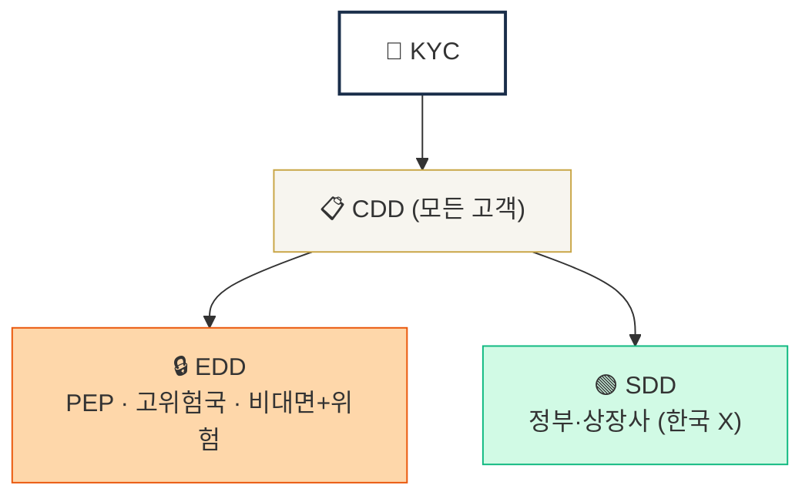

# Day 3 — 핵심 용어 1 (KYC / CDD / EDD / SDD)

> 동심원 4용어를 정확히 구분. ⏱️ ~60분.

## 📖 오늘 뭘 배우나

KYC·CDD·EDD·SDD는 모두 "고객을 확인한다"는 비슷한 말처럼 들리지만 **적용 대상과 강도**가 다릅니다. 동심원 구조로 한번 정리해 두면 이후 모든 실무 판단(누구에게 어느 수준의 확인을 적용할 것인가)의 기반이 됩니다. 특히 EDD 트리거 6가지는 반드시 외워둬야 하는 **운영 체크리스트**.

<!-- MAP-START -->
## 🗺 오늘의 지도

<!-- MAP-END -->

## 🎯 핵심 질문
1. KYC와 CDD는 어떻게 다른가?
2. EDD가 트리거되는 6가지 상황은?
3. SDD가 가상자산에서 거의 안 쓰이는 이유?

## 📖 읽기 (~30분)
- 메인: [`../notes/1-foundations/key-concepts.md`](../notes/1-foundations/key-concepts.md) — 1~3절
- 보조: [`../notes/5-compliance/cdd-edd.md`](../notes/5-compliance/cdd-edd.md) — 1~2절만

## 🛠️ 미니 챌린지 (~20분)
- 동심원 그림 직접 그리기 (KYC > CDD > EDD/SDD)
- **자기 EDD 트리거 시나리오 2개 만들기** (예: "한국 거주 PEP 임원이 ETH 거래 신청")

## ✅ 체크포인트
- [ ] KYC vs CDD vs EDD 차이를 30초 만에 설명 가능
- [ ] EDD 트리거 6가지 중 4개 이상 댈 수 있다
- [ ] CDD 4단계 (식별 → BO → 목적 → 모니터링) 외운다
- [ ] Beneficial Owner 25% 기준 알고 있다

## 💭 오늘의 한 줄

## 더 깊이 (선택)
- D43 (CDD 운영 deep) 미리보기
