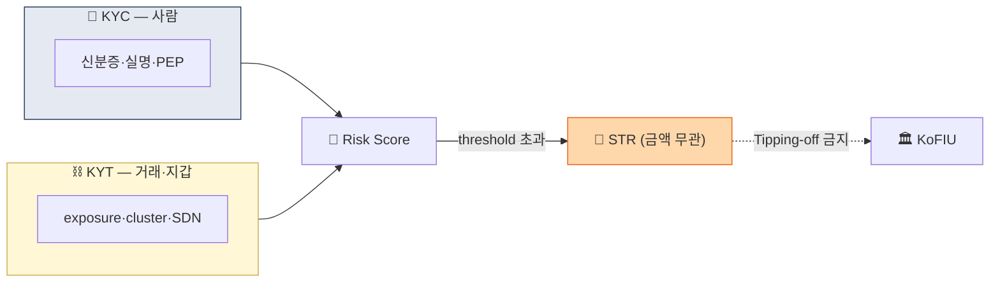

# Day 4 — 핵심 용어 2 (KYT / STR / CTR / PEP / BO)

> 가상자산 특화 용어 + 보고 의무 + PEP/BO. ⏱️ ~75분.

## 📖 오늘 뭘 배우나

어제 배운 KYC·CDD·EDD 위에 **가상자산 고유의 한 층**을 얹습니다 — **KYT(거래·지갑을 안다)**. 여기에 AML 시스템의 최종 출구인 STR·CTR, 자동 고위험인 PEP, 법인고객의 핵심인 Beneficial Owner 25% 원칙까지. 이 5개 용어는 내일부터의 모든 규제·운영 문서에 반복 등장합니다.

<!-- MAP-START -->
## 🗺 오늘의 지도

<!-- MAP-END -->

## 🎯 핵심 질문
1. KYC와 KYT는 무엇이 다른가? (한 문장)
2. STR과 CTR이 둘 다 트리거되면 어떻게 하나?
3. Tipping-off 위반의 처벌은?

## 📖 읽기 (~40분)
- 메인: [`../notes/1-foundations/key-concepts.md`](../notes/1-foundations/key-concepts.md) — 4~10절
- 보조: [`../notes/4-technology/kyc-kyt.md`](../notes/4-technology/kyc-kyt.md) — 5절 (KYC vs KYT 표)

## 🛠️ 미니 챌린지 (~20분)
- KYC vs KYT 비교표를 직접 작성 (대상/시점/데이터/도구 각 행)
- 자기 회사가 STR을 보내야 할 가상 시나리오 1개 만들기 (3줄)

## ✅ 체크포인트
- [ ] KYC vs KYT 비교 즉답 가능
- [ ] STR 임계금액 (없음) vs CTR 임계금액 (한국 1천만원) 안다
- [ ] PEP 3종류 (Foreign/Domestic/IO) 안다
- [ ] Tipping-off 정의 + 처벌 안다
- [ ] 한국 자금세탁방지 보고책임자 임원급 의무 안다

## 💭 오늘의 한 줄

## 더 깊이 (선택)
- [`../notes/5-compliance/str-ctr.md`](../notes/5-compliance/str-ctr.md) — STR 운영
