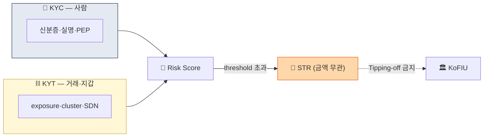

# Day 4 — 핵심 용어 2 (KYT / STR / CTR / PEP / BO)

> 가상자산 특화 용어 + 보고 의무 + PEP/BO. ⏱️ ~75분.

## 📖 오늘 뭘 배우나

어제 배운 KYC·CDD·EDD 위에 **가상자산 고유의 한 층**을 얹습니다 — **KYT(거래·지갑을 안다)**. 여기에 AML 시스템의 최종 출구인 STR·CTR, 자동 고위험인 PEP, 법인고객의 핵심인 Beneficial Owner 25% 원칙까지. 이 5개 용어는 내일부터의 모든 규제·운영 문서에 반복 등장합니다.


<!-- MAP-START -->
## 🗺 오늘의 지도


<!-- MAP-END -->

## 🎯 핵심 질문
1. KYC와 KYT는 무엇이 다른가? (한 문장)
2. STR과 CTR이 둘 다 트리거되면 어떻게 하나?
3. Tipping-off 위반의 처벌은?

## 📖 읽기 (~40분)
- 메인: [`../notes/1-foundations/key-concepts.md`](../notes/1-foundations/key-concepts.md) — 4~10절
- 보조: [`../notes/4-technology/kyc-kyt.md`](../notes/4-technology/kyc-kyt.md) — 5절 (KYC vs KYT 표)

## 🛠️ 미니 챌린지 (~20분)
- KYC vs KYT 비교표를 직접 작성 (대상/시점/데이터/도구 각 행)
- 자기 회사가 STR을 보내야 할 가상 시나리오 1개 만들기 (3줄)

## ✅ 체크포인트
- [ ] KYC vs KYT 비교 즉답 가능
- [ ] STR 임계금액 (없음) vs CTR 임계금액 (한국 1천만원) 안다
- [ ] PEP 3종류 (Foreign/Domestic/IO) 안다
- [ ] Tipping-off 정의 + 처벌 안다
- [ ] 한국 자금세탁방지 보고책임자 임원급 의무 안다

## 💭 오늘의 한 줄

## 💼 실무 현장 (Industry Reality)

### 한국 VASP에서는

**KYT는 사실상 Chainalysis 단일 지배**. Upbit·Bithumb·Coinone·Korbit 모두 **Chainalysis KYT** 계약 + 내부 자체 룰을 얹는 2중 구조. STR은 **KoFIU FIU-TIS(FIU Transaction Information System)** 포털에 **수기 업로드**(엑셀/PDF)로 제출 — 미국 FinCEN의 BSA E-Filing이 API 기반인 것과 대조적. **CTR 1천만원 이상 현금거래 보고**는 원화 입출금이 은행에서 이뤄지기 때문에 거래소보다 **제휴은행(K뱅크·NH농협·카카오뱅크·신한)**이 1차 CTR 제출 주체가 되는 경우가 많음.

### PEP 스크리닝 실무

- **한국 거래소는 Dow Jones RiskCenter 또는 Refinitiv World-Check를 구독** — 전세계 PEP/제재 리스트를 일일 diff로 수신
- **가입 단계 자동 매칭**: 이름·생년월일·주소로 fuzzy matching → 일치 시 EDD 큐로 라우팅
- **Domestic PEP(국회의원·4급 이상 공무원·그 가족)**도 의무 대상 — 실무에서는 Foreign PEP보다 **Domestic PEP 식별이 더 까다로움**(공식 명단 부재)

### 실제 STR 구조 (한국)

```
[STR 기본 필드]
1. 보고자 정보 — VASP 명·AMLO·보고일시
2. 거래자 정보 — 성명·주민번호·지갑주소
3. 의심거래 내역 — 거래일시·금액·카운터파티 주소
4. 의심사유 (핵심) — "왜 의심되는가" 서술 (500~2000자)
5. 증빙자료 — 거래내역·KYT 스크린샷·자금흐름도
```

**"의심사유" 작성 팁**: KoFIU가 가장 중요하게 보는 필드. "단순히 고액이라" 같은 서술은 반려 대상. **"Chainalysis Risk=Severe, mixer direct exposure 7.3%, 카운터파티 클러스터가 Lazarus Group으로 식별됨"** 같은 **구체적 근거 + 수치**가 핵심.

### Tipping-off 실무 함정

특금법 §9 — STR 제출 사실을 거래자에게 알리면 **1년 이하 징역 또는 1천만원 이하 벌금**. 실제 걸리는 흔한 패턴:
- **"계정이 자금세탁 조사 대상이라 동결됐다"**고 고객센터에서 고지 → 위반
- **"내부 준법 검토 중"** 같은 **우회 표현**이 국내 실무 표준

### 자주 나오는 오해

- **"STR은 금액이 커야 제출"** — STR은 **금액 무관**. 10만원짜리 거래도 의심되면 보고
- **"CTR 1천만원은 가상자산에도 적용"** — CTR은 현금거래 기준이라 **가상자산은 해석 모호**. 실무에서는 원화 입출금(은행) 단에서 걸림

## 더 깊이 (선택)
- [`../notes/5-compliance/str-ctr.md`](../notes/5-compliance/str-ctr.md) — STR 운영
