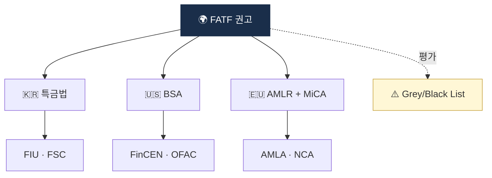

# Day 5 — AML 글로벌 거버넌스 지도

> FATF가 한국/미국/EU에 어떻게 영향을 미치는가. ⏱️ ~75분.

## 📖 오늘 뭘 배우나

한국 특금법 조항을 읽다 보면 "왜 이런 구조인가" 의문이 생기는데, 답은 거의 **FATF 권고**에 있습니다. 오늘은 FATF → 각국법 → 감독기구라는 **규제의 흘러내림 구조**를 머릿속에 심는 날. 이 지도가 있으면 다음 2주간의 법령 학습이 훨씬 입체적으로 보입니다.

<!-- MAP-START -->
## 🗺 오늘의 지도

<!-- MAP-END -->

## 🎯 핵심 질문
1. FATF는 법을 만드는가? (아니라면 무엇을 하는가?)
2. FATF Grey/Black List에 오르면 회원국에 어떤 영향?
3. 한국 AML 감독 체계 (FIU + 금융위 + 외교부) 역할 분담?

## 📖 읽기 (~45분)
- 메인: [`../notes/1-foundations/what-is-aml.md`](../notes/1-foundations/what-is-aml.md) — 5절 (글로벌 거버넌스)
- 보조: [`../notes/2-regulations/README.md`](../notes/2-regulations/README.md)

## 🌐 외부 자료 (선택, ~15분)
- [FATF 공식](https://www.fatf-gafi.org/)
- [FATF Black/Grey List 현행](https://www.fatf-gafi.org/en/publications/High-risk-and-other-monitored-jurisdictions.html)

## 🛠️ 미니 챌린지 (~15분)
- 한 장 그림: **FATF → 각국법 → 감독기구 → 의무자(VASP)** 흐름도
- 한국 / 미국 / EU 라인을 각각 한 줄씩

## ✅ 체크포인트
- [ ] FATF 회원국 수 (39+2) 알고 있다
- [ ] 한국이 FATF/APG 가입국임을 안다
- [ ] FATF 권고 → 국내법화 메커니즘 이해
- [ ] 미국 OFAC의 2차 제재 개념 안다

## 💭 오늘의 한 줄

## 💼 실무 현장 (Industry Reality)

### 한국 AML 감독 체계 실제 분담

- **KoFIU(금융정보분석원)** — 금융위 산하. STR·CTR 수집 → 경찰·검찰·국세청·관세청·국정원·금감원 6곳에 분배. **연간 STR 제출 건수 ~100만 건** 규모(전체 금융 합산, 가상자산 분은 수 만 건).
- **FSC(금융위원회)** — VASP 신고 수리, 2단계 입법 주도. **2026-01 특금법 개정**으로 대주주 자격심사 도입.
- **FSS(금융감독원)** — 현장 검사. Upbit·Bithumb 등 정기 AML 검사 시 **검사역 3~5명이 2~4주 상주**.
- **외교부 제재 담당** — 유엔 안보리 제재 국내 이행.

### 글로벌 감독 — 실제 집행력 비교

- **미국 OFAC** — 2차 제재(Secondary Sanctions) 무기 보유. 외국 VASP도 미국 달러 청산망 접근 위해 OFAC SDN 준수 불가피. **Tornado Cash 2022-08 지정**이 전환점 — 코드 자체가 제재된 초유의 사례.
- **FinCEN** — BSA 집행 + MSB 등록. **Binance $4.3B(2023)**, **OKX $504M(2025)** 등 대형 집행.
- **EU AMLA(2025-07 출범)** — 독일 프랑크푸르트 본부. VASP·고위험 은행 **직접 감독** 권한(기존 NCA 분산 감독 통합).
- **영국 FCA** — VASP 등록 심사 엄격. 2024년 기준 신청건 중 **수리율 ~15%**.

### FATF Grey List의 실제 타격 (2024~2026 사례)

| 국가 | 등재 | 임팩트 |
|---|---|---|
| 튀르키예 | 2021~2024 | 코르레스 은행 계약 축소, 외국인 투자 감소 |
| 남아공 | 2023~2025 | 국가 신용등급 영향, 은행간 KYC 강화 |
| 필리핀 | 2021~2025 | 해외 송금 코스트 증가 |
| 나이지리아 | 2023~ | Binance 임원 현지 구금(2024) 등 규제 강경화 |

### 하루 루틴 — 한국 AMLO의 감독 대응

- 월 1회 **FSS·FSC 정기 공문 대응**(자료 제출, 개정 사항 의견서)
- 분기 1회 **DAXA 컴플라이언스 협의회**(원화거래소 5사)
- 연 1회 **FSS 현장 검사**(2~4주, 검사관 상주)
- 3년 주기 **VASP 갱신 신고**(ISMS 재인증 동반)

### 자주 나오는 오해

- **"FATF가 법을 만든다"** — FATF는 권고기구. 법은 회원국이 만듬. 하지만 Grey List 리스크가 실질적으로 입법을 강제
- **"KoFIU = 금감원"** — 다름. KoFIU는 **금융위 산하 정보분석 기구**, 금감원은 **현장 검사 집행기관**

## 더 깊이 (선택)
- [`../notes/2-regulations/fatf.md`](../notes/2-regulations/fatf.md) — Day 15에 deep
