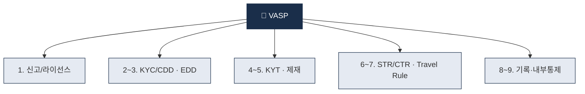
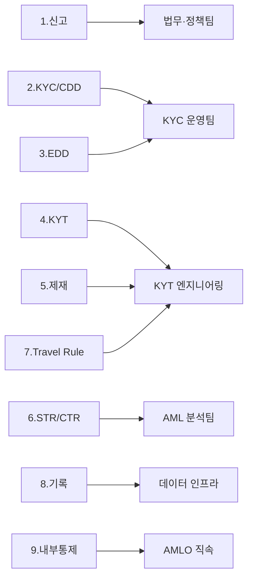

# Day 6 — VASP 정의 + 9 의무

> 가상자산사업자가 떠안는 9가지 의무를 한 장에. ⏱️ ~75분.

## 📖 오늘 뭘 배우나

어제 본 거버넌스 구조가 각 VASP에 구체적으로 **어떤 9가지 의무**로 내려오는지 정리합니다. 신고/라이선스부터 KYC·EDD·KYT·제재·STR·Travel Rule·기록보관·내부통제까지 — 이 9개가 Week 1의 종합 정리이자, Week 2~8 전체의 목차 역할을 합니다.

<!-- MAP-START -->
## 🗺 오늘의 지도

<!-- MAP-END -->

## 🎯 핵심 질문
1. FATF VASP 정의의 5가지 행위는?
2. 한국·미국·EU의 VASP 용어가 다른가?
3. 9 의무 중 가상자산만의 특화 의무는?

## 📖 읽기 (~45분)
- 메인: [`../notes/3-crypto-aml/vasp-obligations.md`](../notes/3-crypto-aml/vasp-obligations.md)

## 🛠️ 미니 챌린지 (~15분)
- **사업유형별 의무 강도 표** 직접 다시 그리기 (거래소 / 수탁 / OTC / DeFi)
- 자기 흥미 있는 사업유형 1개 선택 + "내가 만든다면 어디부터" 메모

## ✅ 체크포인트
- [ ] VASP 9 의무 모두 외운다
- [ ] FATF VASP 정의 5가지 행위 외운다
- [ ] 한국 VASP = 미국 MSB = EU CASP 대응 안다
- [ ] 수탁업과 거래소의 의무 강도 차이 이해

## 💭 오늘의 한 줄

## 💼 실무 현장 (Industry Reality)

### VASP 사업유형별 의무 강도 (한국 현장)

| 사업유형 | 대표 | 의무 강도 | 특이점 |
|---|---|---|---|
| 원화 거래소 | Upbit·Bithumb·Coinone·Korbit | 매우 높음 | 실명계좌·ISMS·AMLO 풀세트 |
| 코인마켓 거래소 | 10여개 중소 | 높음 | 실명계좌 없음 → BTC 마켓만 |
| 수탁(Custody) | KODA·BDA·Korbit Custody | 높음 | 콜드월렛 중심, KYT 독립 필요 |
| OTC 데스크 | 없음(공식) | — | 한국은 OTC 단독 신고 사례 극소 |
| DeFi 프런트 | 해외 사례만 | 미정 | FATF 2025 해석지침 논의 중 |

**한국 VASP 신고 현황(2026-Q1)**: 원화거래소 5(업·빗·코·코빗·고팍스) + 코인마켓 20+ + 수탁 3곳. **FIU 신고 수리는 누적 ~30건 내외**.

### 9 의무가 실제로 어떻게 "운영 팀"으로 연결되나

한 사람이 다 하는 게 아니라 **팀이 쪼개져 있음** — 주니어가 가장 많이 배정되는 곳은 **O2·O3·O6(KYC·EDD·STR)**.

### Travel Rule (R.16) 한국 현장

- **임계금액 100만원** (미국 $3,000, EU 1유로)
- **2개 허브 병존** — VerifyVASP(Upbit) vs CODE(Bithumb·Coinone·Korbit·고팍스)
- **개인지갑(unhosted wallet) 규칙**: 한국은 **100만원 초과 송금 시 지갑 소유 증명**(서명 메시지 등) 요구. EU MiCA/TFR은 **1유로부터 적용**이라 한국보다 더 엄격
- **글로벌 허브**: Notabene Gateway(300+ VASP), TRP(TRUST 미국), Sygna Bridge(아시아)

### VASP vs CASP vs MSB 실제 용어 대응

| 관할 | 용어 | 법 |
|---|---|---|
| 한국 | VASP (가상자산사업자) | 특금법 §2.1.하 |
| 미국 | MSB (Money Services Business) | BSA / FinCEN |
| EU | CASP (Crypto-Asset Service Provider) | MiCA |
| FATF | VASP | Recommendation 15 |

### 자주 나오는 오해

- **"VASP 신고는 신고만 하면 되는 것"** — 실질은 인허가. 수리율 전체 약 30% 수준으로 매우 깐깐
- **"수탁업은 KYT 필요 없다"** — 고객 자산을 보관만 해도 **입출금 트랜잭션에 대한 KYT** 필요. 수탁 특화 벤더(Fireblocks·BitGo)가 KYT 기능 내장 중

## 더 깊이 (선택)
- 한국 특금법 §2.1.하 원문 검색해보기
