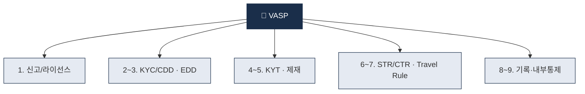

# Day 6 — VASP 정의 + 9 의무

> 가상자산사업자가 떠안는 9가지 의무를 한 장에. ⏱️ ~75분.

## 📖 오늘 뭘 배우나

어제 본 거버넌스 구조가 각 VASP에 구체적으로 **어떤 9가지 의무**로 내려오는지 정리합니다. 신고/라이선스부터 KYC·EDD·KYT·제재·STR·Travel Rule·기록보관·내부통제까지 — 이 9개가 Week 1의 종합 정리이자, Week 2~8 전체의 목차 역할을 합니다.

<!-- MAP-START -->
## 🗺 오늘의 지도

<!-- MAP-END -->

## 🎯 핵심 질문
1. FATF VASP 정의의 5가지 행위는?
2. 한국·미국·EU의 VASP 용어가 다른가?
3. 9 의무 중 가상자산만의 특화 의무는?

## 📖 읽기 (~45분)
- 메인: [`../notes/3-crypto-aml/vasp-obligations.md`](../notes/3-crypto-aml/vasp-obligations.md)

## 🛠️ 미니 챌린지 (~15분)
- **사업유형별 의무 강도 표** 직접 다시 그리기 (거래소 / 수탁 / OTC / DeFi)
- 자기 흥미 있는 사업유형 1개 선택 + "내가 만든다면 어디부터" 메모

## ✅ 체크포인트
- [ ] VASP 9 의무 모두 외운다
- [ ] FATF VASP 정의 5가지 행위 외운다
- [ ] 한국 VASP = 미국 MSB = EU CASP 대응 안다
- [ ] 수탁업과 거래소의 의무 강도 차이 이해

## 💭 오늘의 한 줄

## 더 깊이 (선택)
- 한국 특금법 §2.1.하 원문 검색해보기
