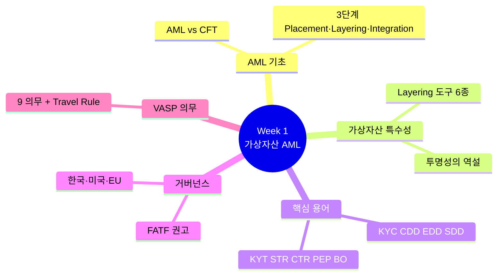

# Day 7 — 🔁 Week 1 리뷰 + 마인드맵

> 1주일 학습을 한 장에 시각화. ⏱️ ~90분.

## 📖 오늘 뭘 배우나

6일 동안 AML 기초·가상자산 특수성·핵심 용어·글로벌 거버넌스·VASP 9의무를 배웠습니다. 오늘은 **마인드맵**으로 이 전부를 시각화하고, 헷갈리는 용어 짝을 솔직히 체크합니다. 이 과정에서 남은 구멍을 발견하는 게 Week 2(한국 규제 deep) 진입 전의 마지막 정비.

<!-- MAP-START -->
## 🗺 오늘의 지도

<!-- MAP-END -->

## 🎯 회고 질문
1. Week 1에서 가장 중요한 개념 3개?
2. 가장 헷갈렸던 짝 (예: KYC vs KYT)?
3. Week 2에서 가장 궁금한 점?

## 📖 빠른 복습 (~30분)
- [`../README.md`](../README.md) — 우선순위 Top 5 다시 보기
- [`../notes/glossary.md`](../notes/glossary.md) — 11~Z 빠른 스캔

## 🛠️ 미니 챌린지 (~50분)
**1. AML 마인드맵 그리기** (40분, 종이 권장)
- 중심: "가상자산 AML"
- 1차 가지: AML 기본 / 가상자산 특수성 / 핵심 용어 / 글로벌 거버넌스 / VASP 의무
- 2차 가지: 각각 3~5개 키워드

**2. 자기 평가 퀴즈** (10분)
다음 중 헷갈리는 것 솔직히 체크:
- [ ] Placement vs Layering vs Integration 구분
- [ ] KYC vs CDD vs EDD vs SDD
- [ ] KYC vs KYT
- [ ] STR vs CTR
- [ ] AMLO vs MLRO vs CCO
- [ ] FATF vs FIU
- [ ] VASP vs CASP vs MSB
- [ ] PEP 3종

→ 체크된 항목 다시 [`../notes/glossary.md`](../notes/glossary.md) 에서 보기

## ✅ 체크포인트
- [ ] 마인드맵 산출
- [ ] 퀴즈 항목 모두 OK
- [ ] [`progress.md`](progress.md) Week 1 7개 모두 체크

## 💭 1주차 회고

가장 의외:
가장 어려움:
다음주 기대:

## 💼 실무 현장 (Industry Reality)

### Week 1 용어를 실제 채용공고에서 어떻게 보게 되나

**Upbit·Bithumb·Coinone 최근 1년 AML 채용공고 실제 JD 요약**:

- **AML Analyst (주니어, 1~3년)**: "KYT Alert 1차 처리, EDD 고객 인터뷰, STR 초안 작성" → Week 1 전 용어 등장
- **KYT Engineer (2~5년)**: "Chainalysis API 연동, 룰 엔진 운영, FP 튜닝" → **KYT·exposure·cluster** 용어 필수
- **AMLO 보좌역 (3~7년)**: "Travel Rule·Tipping-off·FIU 감독 대응" → **제재·STR·BO·PEP** 전체 커버
- **Compliance Lead (5년+)**: "AMLO 임명 요건 충족 + ISMS·RBA·내부통제" → Week 2 특금법까지 다 필요

### 주요 거래소 조직 규모 스냅샷 (2026-Q1)

| 거래소 | 전사 | 컴플라이언스 | 비율 |
|---|---|---|---|
| Upbit | ~650 | ~45 | 7% |
| Bithumb | ~400 | ~25 | 6% |
| Coinbase | ~3,500 | ~500 | 14% |
| Kraken | ~2,000 | ~200 | 10% |

### Week 1 용어 → 실무 시스템 매핑

- **KYC/CDD** → PASS·NICE·KCB API + 사내 CRM
- **KYT** → Chainalysis KYT + 내부 룰 엔진(Kafka+Flink)
- **Sanctions** → OFAC SDN 일일 diff + Dow Jones RiskCenter
- **STR** → KoFIU FIU-TIS 포털(수기) / FinCEN BSA E-Filing(API)
- **Travel Rule** → VerifyVASP 또는 CODE
- **기록보관** → Snowflake/Databricks 장기 아카이브

### Week 2 진입 전 현실 체크

한국 특금법은 "법조문 → 시행령 → 감독규정 → FIU 가이드라인"의 **4층 규범**. 실무는 조문보다 **FIU 신고매뉴얼 + RBA 처리기준**을 더 자주 봄. Week 2에서 조항 번호에 너무 매달리지 말고 **"이 의무가 어느 팀의 어느 시스템에서 돌아가는가"**를 함께 보면 오래 기억됨.

### 자주 나오는 오해

- **"Week 1은 용어만 외우면 끝"** — 용어는 **실제 시스템·벤더·팀**과 연결돼야 쓸 수 있는 지식이 됨
- **"컴플라이언스는 비-기술"** — 한국·글로벌 모두 **데이터·엔지니어링 역량**이 법적 지식만큼 요구됨. KYT Engineer 라는 명시적 직군 존재
