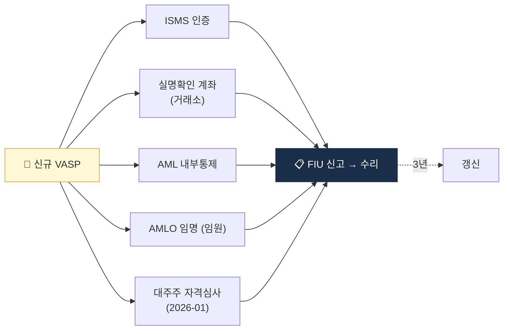

# Day 8 — 한국 특금법 1: VASP 신고제

> 한국 가상자산 AML의 헌법, 신고제 메커니즘. ⏱️ ~75분.

## 📖 오늘 뭘 배우나

한국 가상자산 산업의 **사실상 진입 규제**인 특금법의 VASP 신고제. "신고"라는 이름이지만 실질은 **인허가**이며, ISMS·실명계좌·AMLO 등 5가지 요건을 갖춰야 통과합니다. 2026-01 개정으로 **대주주 자격심사**까지 확대됐다는 점이 한국에서 M&A·투자 유치 시 절대적 고려사항.

<!-- MAP-START -->
## 🗺 오늘의 지도

<!-- MAP-END -->

## 🎯 핵심 질문
1. 특금법 정식 명칭과 약칭은?
2. VASP 신고에 필요한 5가지 요건은?
3. 미신고 영업 시 처벌은?

## 📖 읽기 (~50분)
- 메인: [`../notes/2-regulations/korea-fiu-act.md`](../notes/2-regulations/korea-fiu-act.md) — 1~5절

## 🌐 외부 자료 (선택, ~15분)
- [국가법령정보센터 — 특금법](https://www.law.go.kr/법령/특정금융거래정보의보고및이용등에관한법률) — §2(정의), §7(신고)만
- [FSC — 신고매뉴얼 PDF](https://www.fsc.go.kr/comm/getFile?srvcId=BBSTY1&upperNo=75409&fileTy=ATTACH&fileNo=6) — 표지 + 목차만

## 🏛 특금법 2026-01-29 개정 — 대주주 자격심사 강화

### 변화의 핵심

**기존 (2021-03 시행)**: VASP 신고 시 **대주주는 "결격사유 없음" 확인만 필요** (형사 이력·제재 이력 등)

**개정 (2026-01-29 시행)**: 신고 + **대주주 변경 시 재심사 의무**. 5대 요건:

1. **재정 건전성** — 자본·부채 비율·상환 능력
2. **사회적 신용** — 최근 5년 법령 위반·행정처분·형사 이력
3. **적격 인력 확보** — AML·IT 보안 임원 경력 3년+ 필수
4. **지배구조 투명성** — 실소유자(BO) 공개·이해관계자 거래 기준
5. **AML 체제 통합** — 모회사·계열사 전체의 AML 프로그램 일관성

### 실무 영향

- **M&A 지연**: VASP 인수 시 **신규 대주주 심사 ~3~6개월** — 2026년 중 한국 VASP M&A는 사실상 모두 이 과정 통과
- **투자 유치 허들**: 대형 투자(지분 10%+ 변경) 시 사전 심사 필수
- **기존 VASP 재심사**: 2026-01-29 이후 신규 변경 건만 적용 (소급 적용 아님)

### 체크리스트

- [ ] 대주주 현황·BO 추적 문서 업데이트
- [ ] 재무건전성·신용 자료 정기 갱신
- [ ] AML·IT 보안 임원 이력 확인
- [ ] 모회사·계열사 AML 통합 여부 검토
- [ ] M&A/투자 계획 시 FIU 사전 협의 체계

**상세 근거**: [`../notes/2-regulations/korea-fiu-act.md`](../notes/2-regulations/korea-fiu-act.md) 대주주 심사 섹션 참조.

## 🛠️ 미니 챌린지 (~10분)
- VASP 신고 5요건을 메모로 정리 (ISMS / 실명계정 / AML 통제 / 보고책임자 / 결격사유)
- 각 요건의 "왜 필요한가" 한 줄 설명

## ✅ 체크포인트
- [ ] 특금법 정식명 외운다
- [ ] VASP 정의 5+1 행위 외운다
- [ ] 신고 5 요건 외운다
- [ ] 3년 갱신 + 2026-01 대주주 자격심사 강화 안다

## 💭 오늘의 한 줄

## 💼 실무 현장 (Industry Reality)

### VASP 신고 5요건 — 실제 갖추는 비용·기간

| 요건 | 준비 기간 | 비용(추정) | 비고 |
|---|---|---|---|
| ISMS 인증 | 6~12개월 | 1.5~3억원 | KISA 심사, 매년 갱신 |
| 실명확인 계좌 | 3~12개월 | 은행 심사 | 은행이 최대 장벽 |
| AML 내부통제 | 3~6개월 | 컨설팅 0.5~1억원 | 정책서·절차서 수십 건 |
| AMLO 임명 | 1~2개월 | 연봉 1.5~3억원 | 임원급 경력자 희소 |
| 대주주 자격심사(2026~) | — | — | 2026-01 개정 적용 |

**실무 현실**: 신규 VASP가 준비부터 신고 수리까지 **총 12~24개월**. 실명계좌 발급이 가장 큰 장벽 — **은행이 VASP를 안 받으면 원화거래소 진입 자체 불가**.

### 한국 VASP 실명계좌 파트너 은행 (2026-Q1)

| 거래소 | 파트너 은행 | 체결 시기 |
|---|---|---|
| Upbit | K뱅크 | 2020-06 |
| Bithumb | NH농협 → 2024년 국민은행 검토 | 2018~ |
| Coinone | 카카오뱅크 | 2022-08 |
| Korbit | 신한은행 | 2020-09 |
| 고팍스 | 전북은행 | 2023-02 |

은행은 **실명계좌 제휴 자체에 막대한 AML 리스크**를 부담 — 그래서 은행 내부 VASP 심사 기준이 FIU 신고 요건보다 더 깐깐한 경우가 흔함.

### FIU 신고 수리 실무

- **FIU 신고 접수** → 검토 90일 + 보완요구 여러 차례 → **평균 수리 기간 6~12개월**
- **반려 주요 사유**: ISMS 미비·실명계좌 확보 실패·AMLO 경력 부족·대주주 결격
- **갱신 주기**: 3년(2024 개정 전엔 5년) — 갱신 때도 동일 심사 반복

### 미신고 영업 처벌 (특금법 §17)

- **5년 이하 징역 또는 5천만원 이하 벌금**
- 2022~2024년 실제 **해외 VASP(Kucoin·MEXC·Phemex 등) 미신고 영업 적발** → FSS가 **사이트 차단 + 경찰 고발** → 국내 IP 접속 제한 사례 다수
- **2024-10 기준 22개 해외 거래소 차단 리스트 확정** (FIU·경찰청 공조)

### 자주 나오는 오해

- **"신고는 형식 절차"** — 실질은 인허가. ISMS·실명계좌·AMLO 중 하나라도 빠지면 자동 반려
- **"개정 전 등록된 VASP는 영원히 안전"** — 3년마다 갱신 심사, 2026-01 대주주 자격심사도 소급 적용되는 구조
