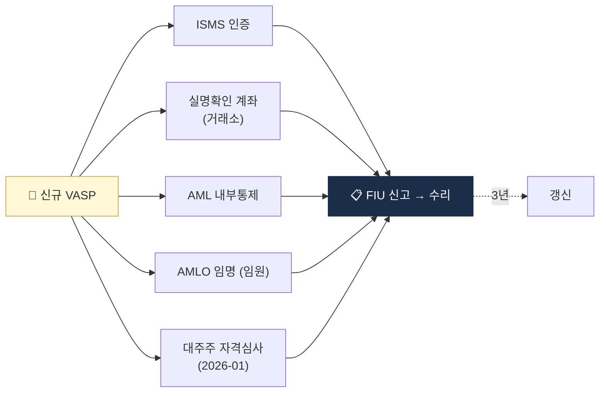

# Day 8 — 한국 특금법 1: VASP 신고제

> 한국 가상자산 AML의 헌법, 신고제 메커니즘. ⏱️ ~75분.

## 📖 오늘 뭘 배우나

한국 가상자산 산업의 **사실상 진입 규제**인 특금법의 VASP 신고제. "신고"라는 이름이지만 실질은 **인허가**이며, ISMS·실명계좌·AMLO 등 5가지 요건을 갖춰야 통과합니다. 2026-01 개정으로 **대주주 자격심사**까지 확대됐다는 점이 한국에서 M&A·투자 유치 시 절대적 고려사항.

<!-- MAP-START -->
## 🗺 오늘의 지도

<!-- MAP-END -->

## 🎯 핵심 질문
1. 특금법 정식 명칭과 약칭은?
2. VASP 신고에 필요한 5가지 요건은?
3. 미신고 영업 시 처벌은?

## 📖 읽기 (~50분)
- 메인: [`../notes/2-regulations/korea-fiu-act.md`](../notes/2-regulations/korea-fiu-act.md) — 1~5절

## 🌐 외부 자료 (선택, ~15분)
- [국가법령정보센터 — 특금법](https://www.law.go.kr/법령/특정금융거래정보의보고및이용등에관한법률) — §2(정의), §7(신고)만
- [FSC — 신고매뉴얼 PDF](https://www.fsc.go.kr/comm/getFile?srvcId=BBSTY1&upperNo=75409&fileTy=ATTACH&fileNo=6) — 표지 + 목차만

## 🛠️ 미니 챌린지 (~10분)
- VASP 신고 5요건을 메모로 정리 (ISMS / 실명계정 / AML 통제 / 보고책임자 / 결격사유)
- 각 요건의 "왜 필요한가" 한 줄 설명

## ✅ 체크포인트
- [ ] 특금법 정식명 외운다
- [ ] VASP 정의 5+1 행위 외운다
- [ ] 신고 5 요건 외운다
- [ ] 3년 갱신 + 2026-01 대주주 자격심사 강화 안다

## 💭 오늘의 한 줄
