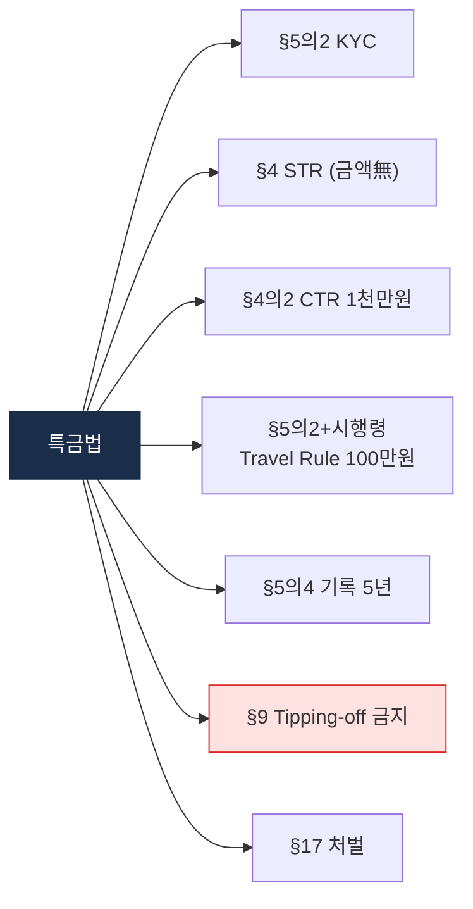

# Day 9 — 한국 특금법 2: AML 의무 + 2026 개정

> KYC/STR/Travel Rule + 최근 개정. ⏱️ ~75분.

## 📖 오늘 뭘 배우나

특금법은 진입 규제(§7 신고)만이 아니라 **운영 규제**도 함께 담고 있습니다 — §5의2(KYC), §4(STR), §5의2 + 시행령 §10의10(Travel Rule 100만원), §5의4(기록 5년). 각 조항이 실무의 어느 프로세스에 매핑되는지 연결 짓는 것이 오늘의 핵심. 2026-01 개정의 대주주 확대도 다시 정리.

<!-- MAP-START -->
## 🗺 오늘의 지도

<!-- MAP-END -->

## 🎯 핵심 질문
1. 특금법상 KYC + EDD 트리거는?
2. Travel Rule 한국 임계금액은?
3. 2026-01 개정의 핵심 변화 한 가지?

## 📖 읽기 (~50분)
- 메인: [`../notes/2-regulations/korea-fiu-act.md`](../notes/2-regulations/korea-fiu-act.md) — 4~10절

## 🌐 외부 자료 (선택, ~15분)
- [블록미디어 — 2026-01 특금법 개정안 통과](https://www.blockmedia.co.kr/archives/1038007)
- [법률신문 — 자금세탁·트래블룰 칼럼](https://m.lawtimes.co.kr)

## 🛠️ 미니 챌린지 (~10분)
- 특금법 9 의무 (Day 6 9의무) → 특금법 § 매핑 시도 (틀려도 OK, 다음 시간 D14에 보완)

## ✅ 체크포인트
- [ ] 한국 Travel Rule 임계 100만원 외운다
- [ ] 거래기록 보관: 특금법 5년 + 이용자보호법 15년 → 더 긴 쪽 적용
- [ ] STR 보고 채널 (KoFIU 전자보고) 안다
- [ ] 2026-01 대주주 자격심사 변경 안다

## 💭 오늘의 한 줄
