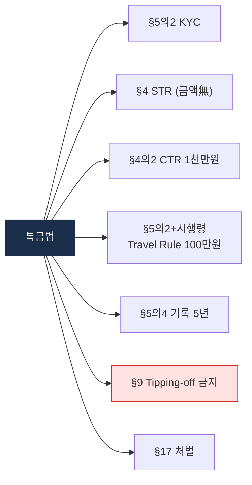

# Day 9 — 한국 특금법 2: AML 의무 + 2026 개정

> KYC/STR/Travel Rule + 최근 개정. ⏱️ ~75분.

## 📖 오늘 뭘 배우나

특금법은 진입 규제(§7 신고)만이 아니라 **운영 규제**도 함께 담고 있습니다 — §5의2(KYC), §4(STR), §5의2 + 시행령 §10의10(Travel Rule 100만원), §5의4(기록 5년). 각 조항이 실무의 어느 프로세스에 매핑되는지 연결 짓는 것이 오늘의 핵심. 2026-01 개정의 대주주 확대도 다시 정리.


<!-- MAP-START -->
## 🗺 오늘의 지도


<!-- MAP-END -->

## 🎯 핵심 질문
1. 특금법상 KYC + EDD 트리거는?
2. Travel Rule 한국 임계금액은?
3. 2026-01 개정의 핵심 변화 한 가지?

## 📖 읽기 (~50분)
- 메인: [`../notes/2-regulations/korea-fiu-act.md`](../notes/2-regulations/korea-fiu-act.md) — 4~10절

## 🌐 외부 자료 (선택, ~15분)
- [블록미디어 — 2026-01 특금법 개정안 통과](https://www.blockmedia.co.kr/archives/1038007)
- [법률신문 — 자금세탁·트래블룰 칼럼](https://m.lawtimes.co.kr)

## 🛠️ 미니 챌린지 (~10분)
- 특금법 9 의무 (Day 6 9의무) → 특금법 § 매핑 시도 (틀려도 OK, 다음 시간 D14에 보완)

## ✅ 체크포인트
- [ ] 한국 Travel Rule 임계 100만원 외운다
- [ ] 거래기록 보관: 특금법 5년 + 이용자보호법 15년 → 더 긴 쪽 적용
- [ ] STR 보고 채널 (KoFIU 전자보고) 안다
- [ ] 2026-01 대주주 자격심사 변경 안다

## 💭 오늘의 한 줄

## 💼 실무 현장 (Industry Reality)

### 특금법 § → 팀 → 시스템 매핑 (한국 거래소 공통)

| § | 의무 | 담당 팀 | 시스템·벤더 |
|---|---|---|---|
| §4 | STR | AML 분석팀 | 사내 케이스매니지먼트 → FIU-TIS 업로드 |
| §4의2 | CTR 1천만원 | 은행 + VASP | 제휴은행 CTR 시스템 (K뱅크 등) |
| §5의2 | KYC | KYC 운영팀 | PASS·NICE·KCB API |
| §5의2 + 시행령 §10의10 | Travel Rule 100만원 | KYT 엔지니어링 | VerifyVASP or CODE |
| §5의4 | 기록 5년 | 데이터 인프라 | Snowflake·S3 장기 아카이브 |
| §7 | VASP 신고 | 법무·정책팀 | ISMS + 제휴은행 |
| §9 | Tipping-off 금지 | 전사(교육) | — |

### 2026-01 개정 — 실무에서 체감되는 변화

- **대주주 자격심사 확대**: 기존 "최대주주·10% 이상 주요주주"에 더해 **사실상 지배력 있는 자**까지. M&A·투자유치 시 **실사 범위 확장** — 사모펀드·외국계 VC 투자 받을 때 실사관행 급변
- **결격 범위 확대**: 금융·형사·특경법 관련 확정판결 범위 조정 → 임원 재직 중 결격 발생 시 **즉시 교체 의무**
- **과태료 신설**: 변경 신고 지연 등 경미 위반에 과태료 도입 → **행정 부담 경감(형사 처벌 대신)**

### Travel Rule 100만원 — 실제 운영 헷갈리는 포인트

- **누구의 100만원?**: 단일 거래 100만원 초과. **1일 누적 합산 아님** (한국 해석)
- **unhosted wallet(개인지갑)**: 100만원 초과 송금 시 **지갑 소유 증명** 요구 → 실무에서는 "지정 메시지 서명" 방식 많이 사용
- **해외 VASP 송금**: 상대방이 Travel Rule 허브 가입 안 된 "Sunrise Issue" VASP면 → **송금 차단** 또는 **내부 고위험 처리**
- **EU와 충돌**: EU TFR은 1유로부터. EU 고객이 한국 거래소로 500만원 보낼 때, 한국 쪽에서도 수신 정보 수용 의무 발생

### 실제 룰 예시 — Travel Rule 자동화

```
RULE: travel_rule_outgoing
WHEN withdrawal.amount_krw > 1_000_000 AND
     destination.is_vasp == true
THEN require_travel_rule_message(sender, recipient)
     if hub_match_failed: hold_and_alert(AMLO)

RULE: travel_rule_unhosted
WHEN withdrawal.amount_krw > 1_000_000 AND
     destination.is_vasp == false
THEN require_wallet_ownership_proof
     method = "signed_message"
```

### 자주 나오는 오해

- **"특금법 개정은 신규 VASP만 적용"** — 기존 VASP도 **3년 갱신 시 신규 요건 적용**
- **"Travel Rule은 송금만"** — 송수신 양방향. 수신 측도 정보 수용·보관 의무
