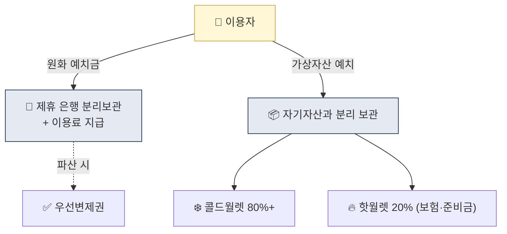
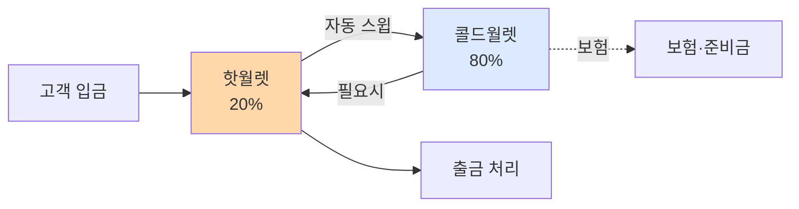

# Day 10 — 가상자산이용자보호법 1: 자산 분리 보관

> 한국 첫 가상자산 전용 법, 이용자 자산 보호. ⏱️ ~75분.

## 📖 오늘 뭘 배우나

특금법이 AML 중심이라면 가상자산이용자보호법(2024-07-19 시행)은 **이용자 자산 보호 중심**. 오늘은 예치금 은행 분리·가상자산 분리 보관·콜드월렛 80%·보험 의무를 정리합니다. FTX 사태 이후 "거래소가 고객 돈을 마음대로 쓸 수 없게" 만든 구조적 장치가 이 법의 본질.

<!-- MAP-START -->
## 🗺 오늘의 지도

<!-- MAP-END -->

## 🎯 핵심 질문
1. 가상자산이용자보호법 시행일은?
2. 예치금 분리 보관 기관은?
3. 콜드월렛 비율 의무는?

## 📖 읽기 (~50분)
- 메인: [`../notes/2-regulations/korea-user-protection.md`](../notes/2-regulations/korea-user-protection.md) — 1~4절

## 🌐 외부 자료 (선택, ~15분)
- [국가법령정보센터 — 가상자산이용자보호법](https://www.law.go.kr/법령/가상자산이용자보호등에관한법률)
- [FSC — 시행 보도자료](https://www.fsc.go.kr/po010101/82682)

## 🛠️ 미니 챌린지 (~10분)
- "자기 자산 vs 고객 자산 분리"를 고객 입장에서 왜 중요한지 3줄 정리
- 콜드월렛 80% 의무가 회사에 미치는 운영 영향 1가지 적기

## ✅ 체크포인트
- [ ] 시행일 2024-07-19 안다
- [ ] 예치금 → 은행 분리 + 이용료 지급 의무 안다
- [ ] 가상자산 → 동종·동량 실질 보유 의무 안다
- [ ] 거래기록 15년 보존 안다

## 💭 오늘의 한 줄

## 💼 실무 현장 (Industry Reality)

### 예치금 분리보관 — 한국 거래소 실제 파트너

| 거래소 | 예치금 은행 | 가상자산 수탁 |
|---|---|---|
| Upbit | K뱅크 | 자체 + 외부 수탁 일부 |
| Bithumb | NH농협(→ 국민은행 검토) | 자체 + BDA(Bithumb) |
| Coinone | 카카오뱅크 | KODA 일부 |
| Korbit | 신한은행 | Korbit Custody |
| 고팍스 | 전북은행 | 자체 |

**예치금 이용료**: 이용자보호법상 거래소는 **고객 예치금에 이용료(이자) 지급** 의무. 2024~2026년 한국 거래소들 연 **1.0~2.1% 수준**으로 지급(시중 MMF 금리 대비 경쟁력 있음) — 고객 유치의 무기화.

### 콜드월렛 80% — 실제 운영 구조

**실무 도구**: Fireblocks·BitGo·Ledger Vault 등 MPC·HSM 기반 수탁 솔루션. 한국 거래소는 대부분 **자체 콜드월렛 + 벤더 MPC 혼합**. **KODA(국민은행+해시드)·BDA(Bithumb)·Korbit Custody** 3곳이 대표 수탁 법인.

### 보험·준비금 의무 — 실제 규모

- **보험**: 해킹·시스템장애 대비. Marsh·AON 등이 Crypto Insurance 브로커리지
- **준비금**: 보험 외 자기자본 성격. 업계 평균 **핫월렛 총액의 1~5%** 수준
- **비교 사례**: 2022 FTX 파산에서 고객 자산 혼합 사용이 드러났고, 한국 이용자보호법이 이 구조를 원천 차단하도록 설계됨

### 하루 루틴 — Treasury/수탁팀

- **매일 개장 전**: 핫월렛 잔고 점검, 입금 예측 기반 리밸런싱
- **매일 마감 후**: 콜드월렛 스윕 실행, 20:80 비율 회복 확인
- **주 1회**: 보험 한도 대비 보관량 리뷰, 필요 시 증액 요청
- **월 1회**: 외부 감사·FSS 보고용 잔고 증빙 스냅샷

### 자주 나오는 오해

- **"콜드월렛 80%는 권장"** — 아님. **법적 의무**. 위반 시 5년/5천만원
- **"예치금 우선변제권은 파산 시에만"** — 파산뿐만 아니라 **회생·구조조정 절차 전반**에서 작동. 고객 원화는 거래소 파산 재산에서 분리됨
- **"가상자산 분리보관 = 같은 코인을 그대로"** — 정확히는 **"동종·동량"**. 콜드/핫 이동은 허용되나 **자기자산과 섞이면 불법**
