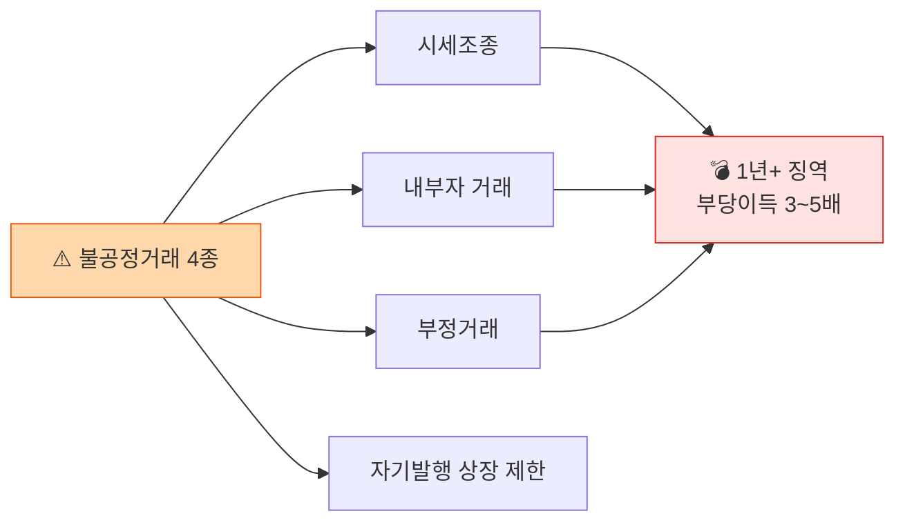

# Day 11 — 가상자산이용자보호법 2: 시세조종 + 2단계 입법

> 시장 건전성 + 향후 입법 방향. ⏱️ ~70분.

## 📖 오늘 뭘 배우나

어제의 자산 보호에 이어, 오늘은 이용자보호법의 **시장 규제**인 시세조종·미공개정보·부정거래 금지. 가상자산판 자본시장법이라 부르는 이유를 조항으로 확인하고, **2단계 입법**에서 예고된 5대 영역(발행·유통 분리, 스테이블코인, 평가업, 외국 VASP, DeFi)까지 전망합니다. 시장 건전성의 무게가 어느 정도인지 처벌 양정으로 실감.

<!-- MAP-START -->
## 🗺 오늘의 지도

<!-- MAP-END -->

## 🎯 핵심 질문
1. 가상자산판 시세조종 처벌 수준은?
2. 자기발행 토큰 상장 제한의 의미?
3. 2단계 입법 5대 영역은?

## 📖 읽기 (~45분)
- 메인: [`../notes/2-regulations/korea-user-protection.md`](../notes/2-regulations/korea-user-protection.md) — 5~10절

## 🌐 외부 자료 (선택, ~15분)
- [KISO 저널 — 주요 내용과 쟁점](https://journal.kiso.or.kr/?p=12709)
- [김·장 — 법안 분석](https://www.kimchang.com/ko/insights/detail.kc?sch_section=4&idx=27420)

## 🛠️ 미니 챌린지 (~10분)
- 특금법 vs 이용자보호법 분담 표 한 페이지 정리 (목적/감독/주요의무)
- 2단계 입법 5영역 중 가장 임팩트 클 것 선택 + 이유

## ✅ 체크포인트
- [ ] 시세조종 처벌 (1년 이상 + 부당이득 3~5배) 안다
- [ ] 미공개정보·부정거래 금지 알다
- [ ] 자기발행 상장 제한 이슈 이해
- [ ] 2단계 5영역 (발행유통분리/스테이블코인/평가업/외국 VASP/DeFi) 안다

## 💭 오늘의 한 줄
