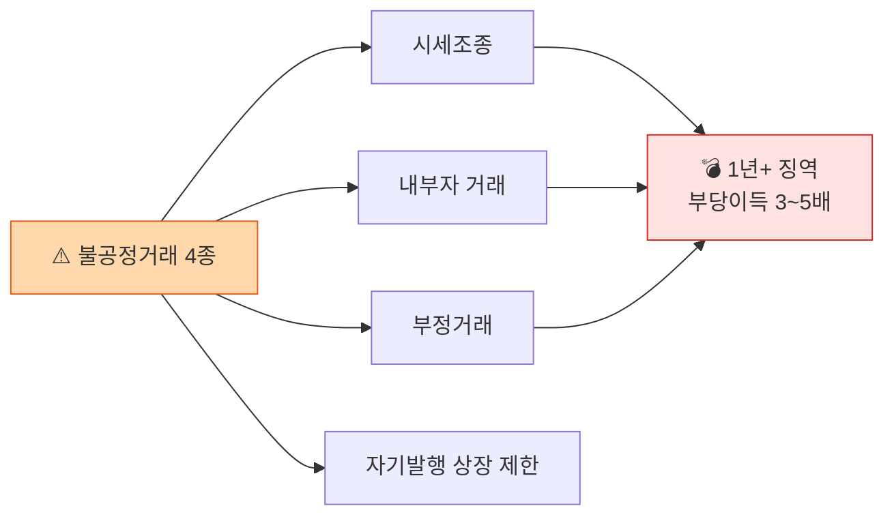

# Day 11 — 가상자산이용자보호법 2: 시세조종 + 2단계 입법

> 시장 건전성 + 향후 입법 방향. ⏱️ ~70분.

## 📖 오늘 뭘 배우나

어제의 자산 보호에 이어, 오늘은 이용자보호법의 **시장 규제**인 시세조종·미공개정보·부정거래 금지. 가상자산판 자본시장법이라 부르는 이유를 조항으로 확인하고, **2단계 입법**에서 예고된 5대 영역(발행·유통 분리, 스테이블코인, 평가업, 외국 VASP, DeFi)까지 전망합니다. 시장 건전성의 무게가 어느 정도인지 처벌 양정으로 실감.

<!-- MAP-START -->
## 🗺 오늘의 지도

<!-- MAP-END -->

## 🎯 핵심 질문
1. 가상자산판 시세조종 처벌 수준은?
2. 자기발행 토큰 상장 제한의 의미?
3. 2단계 입법 5대 영역은?

## 📖 읽기 (~45분)
- 메인: [`../notes/2-regulations/korea-user-protection.md`](../notes/2-regulations/korea-user-protection.md) — 5~10절

## 🌐 외부 자료 (선택, ~15분)
- [KISO 저널 — 주요 내용과 쟁점](https://journal.kiso.or.kr/?p=12709)
- [김·장 — 법안 분석](https://www.kimchang.com/ko/insights/detail.kc?sch_section=4&idx=27420)

## 🛠️ 미니 챌린지 (~10분)
- 특금법 vs 이용자보호법 분담 표 한 페이지 정리 (목적/감독/주요의무)
- 2단계 입법 5영역 중 가장 임팩트 클 것 선택 + 이유

## ✅ 체크포인트
- [ ] 시세조종 처벌 (1년 이상 + 부당이득 3~5배) 안다
- [ ] 미공개정보·부정거래 금지 알다
- [ ] 자기발행 상장 제한 이슈 이해
- [ ] 2단계 5영역 (발행유통분리/스테이블코인/평가업/외국 VASP/DeFi) 안다

## 💭 오늘의 한 줄

## 💼 실무 현장 (Industry Reality)

### 시세조종 감시 — 실제 어떻게 돌리나

한국 원화거래소는 **자체 Market Surveillance(MS) 팀**을 운영 — 인원 5~15명 규모. 시스템은:

- **실시간 주문·체결 이상탐지** — Kafka 스트림에서 주문 패턴 분석 (wash trade·spoofing·layering)
- **알고리즘 대표 룰**:
  - `self-trading`: 동일 계정/연관 계정 간 매수·매도 매칭
  - `layering`: 허수호가 대량 걸고 체결 직전 취소
  - `spoofing`: 한 방향 체결 후 반대 방향 급청산
  - `pump&dump`: 소형 알트에서 짧은 시간 내 거래량·가격 급등

**실제 벤더**: **Nasdaq SMARTS**(글로벌 표준) · **Eventus Validus** · **Trading Hub THEIA** 일부 도입. 국내 자체 개발 사례도 다수.

### 2024~2025 실제 처벌 사례

- **자기발행 상장 제한** — 업계 내 자율규제(DAXA)에서 먼저 시행 → 이용자보호법에서 **법정화 검토**
- **자전거래 적발**: 2024년 1호 처벌 사례는 상장 대가 연계 펌핑 → **부당이득 환수 + 징역** 판결
- **차명계정 이용 시세조종**: KYC 우회 차명 → 형량 가중 (특금법·이용자보호법 병합 기소)

### 2단계 입법 5대 영역 — 2026~2027년 입법 전망

| 영역 | 현 상태 | 전망 임팩트 |
|---|---|---|
| 발행·유통 분리 | 자율규제 수준 | 공시·심사 의무화 → 상장팀 워크로드 폭증 |
| 스테이블코인 | 미규제 | 발행사 라이선스·준비자산 공시 도입 예상 |
| 평가업 | 미규제 | 신용평가사 모델 — 신규 시장 형성 |
| 외국 VASP | 차단 중심 | 역외 적용 명문화, 등록제 검토 |
| DeFi | 논의 중 | FATF 2025 해석지침 따라 "관리 주체" 기준 도입 |

### Market Surveillance 하루 루틴

- **09:00~10:00** — 전일 장마감 이후 이상거래 리포트 리뷰(알고리즘 plot + top volatility coin)
- **10:00~12:00** — 의심 건 상세 분석(주문장 재구성, 동일IP·기기지문 조회)
- **13:00~15:00** — 분석 결과 → 준법팀·법무팀에 이관, 필요 시 거래정지·계정동결
- **15:00~17:00** — 룰 파라미터 튜닝(FP·FN 비율 검토)
- **17:00~18:00** — 금융위·거래소협의회 제보 공유 또는 경찰 공조 요청

### 자주 나오는 오해

- **"시세조종은 주식에만"** — 이용자보호법이 **자본시장법과 동급 처벌**로 가상자산에 이식
- **"MS와 AML은 같은 팀"** — 다름. AML은 **자금흐름** 감시, MS는 **주문·체결 패턴** 감시. 최근엔 데이터 공유해 통합 분석하는 추세
