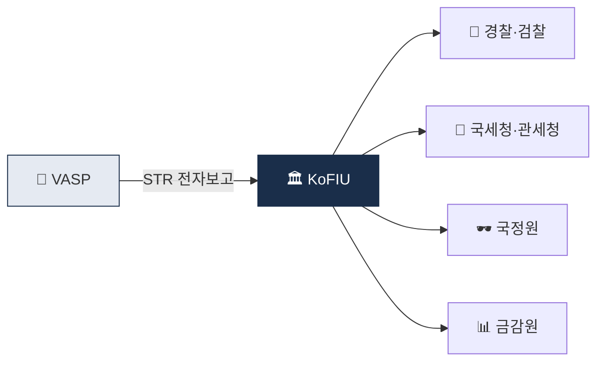

# Day 12 — KoFIU 시스템 + 보고 절차

> STR이 어디로 가는가, 누가 받아 무엇을 하는가. ⏱️ ~70분.

## 📖 오늘 뭘 배우나

회사가 제출한 STR은 **KoFIU를 거쳐 경찰·검찰·국세청 등에 분배**되어 실제 수사로 이어집니다. 오늘은 이 사후 흐름과 **좋은 STR vs 나쁜 STR**의 차이를 정리합니다. 감독당국이 STR 건수가 적은 회사를 오히려 의심하는 이유, 그리고 Tipping-off 금지가 왜 별도 처벌인지도 다시 한번 확인.

<!-- MAP-START -->
## 🗺 오늘의 지도

<!-- MAP-END -->

## 🎯 핵심 질문
1. STR이 KoFIU에 가면 어디로 분배되나?
2. KoFIU와 금감원의 관계는?
3. 압수수색영장과 특금법 §10 자료 요청의 차이는?

## 📖 읽기 (~45분)
- 메인: [`../notes/5-compliance/str-ctr.md`](../notes/5-compliance/str-ctr.md) — 1~5절

## 🌐 외부 자료 (선택, ~15분)
- [KoFIU 공식](https://www.kofiu.go.kr/) — 연차보고서 검색
- [한국 FIU 연차보고서 검색](https://www.kofiu.go.kr/) (사이트 내 자료실)

## 🛠️ 미니 챌린지 (~10분)
- STR 사후 흐름 그림 그리기 (VASP → KoFIU → 경찰/검찰/국세청/관세청/국정원/금감원)
- "좋은 STR vs 나쁜 STR" 핵심 차이 3가지 정리

## ✅ 체크포인트
- [ ] KoFIU = 한국 FIU = 금융위 산하 안다
- [ ] STR 작성 4요소 (사실/의심사유/증빙/유관거래) 안다
- [ ] Tipping-off 위반 = 별도 처벌 다시 확인
- [ ] CTR 1천만원 + 가상자산 적용 모호 안다

## 💭 오늘의 한 줄
