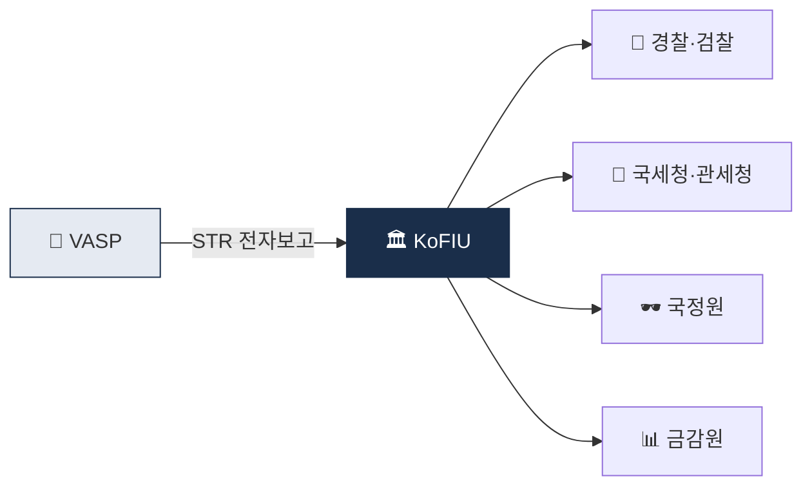

# Day 12 — KoFIU 시스템 + 보고 절차

> STR이 어디로 가는가, 누가 받아 무엇을 하는가. ⏱️ ~70분.

## 📖 오늘 뭘 배우나

회사가 제출한 STR은 **KoFIU를 거쳐 경찰·검찰·국세청 등에 분배**되어 실제 수사로 이어집니다. 오늘은 이 사후 흐름과 **좋은 STR vs 나쁜 STR**의 차이를 정리합니다. 감독당국이 STR 건수가 적은 회사를 오히려 의심하는 이유, 그리고 Tipping-off 금지가 왜 별도 처벌인지도 다시 한번 확인.

<!-- MAP-START -->
## 🗺 오늘의 지도

<!-- MAP-END -->

## 🎯 핵심 질문
1. STR이 KoFIU에 가면 어디로 분배되나?
2. KoFIU와 금감원의 관계는?
3. 압수수색영장과 특금법 §10 자료 요청의 차이는?

## 📖 읽기 (~45분)
- 메인: [`../notes/5-compliance/str-ctr.md`](../notes/5-compliance/str-ctr.md) — 1~5절

### ⚠️ 2025-06 FATF R.16 개정

2025년 6월 FATF R.16 Interpretive Note 개정으로 다음 변화가 발생:
- Self-hosted wallet 처리 강화 (KYC 확장)
- Protocol Interop 명시 요구 (Sunrise Issue 관리)
- PII 암호화 전송·GDPR·PIPA 준수 명시

한국은 100만원 임계 유지(R.16 허용 범위 내)이나, **self-hosted wallet 처리**는 2026년 FIU 가이드라인 개정 예정.

**상세**: [`day_17.md`](day_17.md) "FATF R.16 2025-06 개정" 참조.

## 🌐 외부 자료 (선택, ~15분)
- [KoFIU 공식](https://www.kofiu.go.kr/) — 연차보고서 검색
- [한국 FIU 연차보고서 검색](https://www.kofiu.go.kr/) (사이트 내 자료실)

## 🛠️ 미니 챌린지 (~10분)
- STR 사후 흐름 그림 그리기 (VASP → KoFIU → 경찰/검찰/국세청/관세청/국정원/금감원)
- "좋은 STR vs 나쁜 STR" 핵심 차이 3가지 정리

## ✅ 체크포인트
- [ ] KoFIU = 한국 FIU = 금융위 산하 안다
- [ ] STR 작성 4요소 (사실/의심사유/증빙/유관거래) 안다
- [ ] Tipping-off 위반 = 별도 처벌 다시 확인
- [ ] CTR 1천만원 + 가상자산 적용 모호 안다

## 💭 오늘의 한 줄

## 💼 실무 현장 (Industry Reality)

### KoFIU FIU-TIS 포털 — 실제 제출 프로세스

1. **VASP 담당자 공인인증서 로그인** (금융결제원 GPKI)
2. **STR 템플릿(엑셀·PDF) 업로드**
3. **첨부 증빙**: Chainalysis 리포트·거래내역 엑셀·KYC 자료
4. **AMLO 최종 승인 → 전자 서명 → 접수번호 발급**
5. **보완 요구 시 피드백 15일 이내 응답**

**실제 SLA**: 제출 후 **7~30일** 내 경찰·검찰 등 법집행기관 이첩. KoFIU 내부 분석 인원 ~70명 선(2026 기준, 금융위 산하).

### 좋은 STR vs 나쁜 STR — KoFIU 실제 피드백 패턴

| 좋은 STR | 나쁜 STR |
|---|---|
| 구체적 수치 (exposure 7.3%) | "고액 거래라 의심" |
| 카운터파티 클러스터 이름 명시 | "수상한 지갑" |
| 타임라인 재구성 (T-30일) | 단일 거래만 언급 |
| 대체 해석 배제 논리 | 일방적 단정 |
| 증빙 5~10건 동반 | 거래내역 1건만 |

**KoFIU는 품질로 VASP를 평가** — 동일 VASP의 STR 반려율이 높으면 **FSS 현장검사 대상 선정 우선순위**로 올라감.

### STR 제출 건수 현실 감각

- **전세계 Alert 중 STR로 올라가는 비율**: 일반적으로 **1~5%**
- **한국 AML Analyst 1인당 월간 STR**: **3~10건** (원화거래소 기준)
- **연간 제출 건수**: Upbit·Bithumb 급은 **연 수천 건** 추정 (비공개)
- **글로벌 비교**: Binance가 2023 DOJ 합의 전 "SAR 제출 사실상 0건"이었다는 게 $4.3B 벌금의 핵심 근거

### 압수수색영장 vs 특금법 §10 자료요청

| 구분 | 영장 | §10 자료요청 |
|---|---|---|
| 주체 | 법원 발부, 수사기관 집행 | KoFIU 직접 요청 |
| 범위 | 범죄혐의자 특정 | 의심거래 관련 광범위 |
| 즉시성 | 당일 집행 | 3~30일 응답 |
| 빈도 | 낮음 (수사 단계) | 높음 (상시) |

한국 거래소 준법팀은 **월 수십~수백 건의 §10 자료요청**을 처리 — 이 대응 자체가 별도 팀 업무.

### 자주 나오는 오해

- **"STR 많이 내면 실적"** — 아님. **품질·정확성**이 평가 기준. 남발 시 오히려 검사 대상
- **"Tipping-off는 직접 말할 때만"** — "계정 이용 일시정지 사유" 같은 우회 안내도 위반 가능. 고객센터 안내문까지 **AMLO가 사전 승인**하는 게 표준
- **"KoFIU가 직접 수사"** — KoFIU는 분석·배분 기구. **수사는 경찰·검찰·국세청**이 담당
