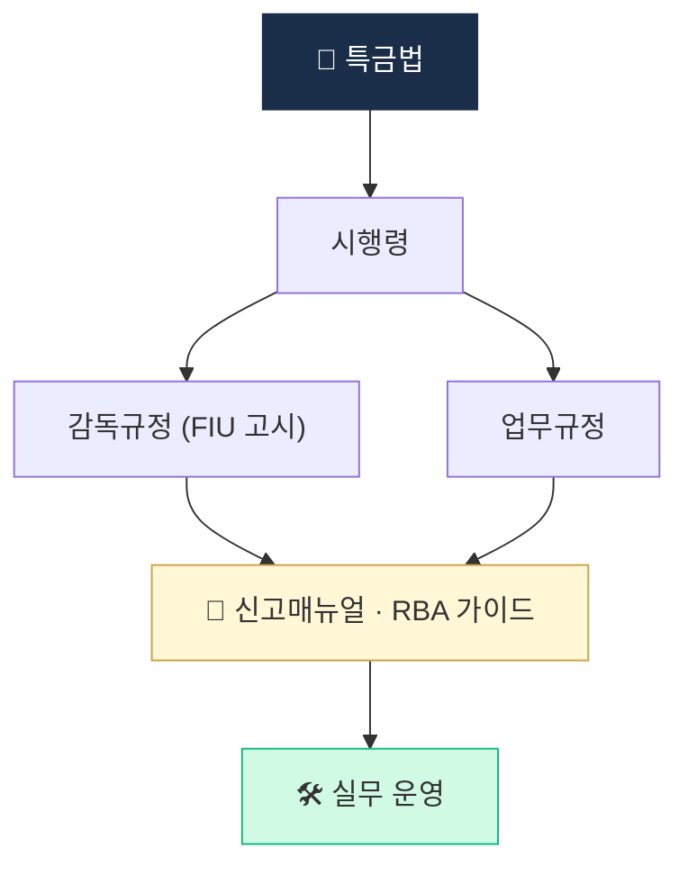

# Day 13 — 한국 가이드라인 정독 (RBA + 신고매뉴얼)

> 법조문 위에 깔린 운영 바이블. ⏱️ ~90분.

## 📖 오늘 뭘 배우나

특금법·이용자보호법의 조문만 읽어서는 실무가 안 됩니다. 실무는 그 위의 **시행령·감독규정·FIU 가이드라인(RBA 처리기준·신고매뉴얼)** 이라는 **4층 규범** 을 봐야 돌아갑니다. 오늘은 이 가이드라인이 고객 위험등급·재실사 주기·EDD 트리거를 어떻게 구체화하는지 확인.

<!-- MAP-START -->
## 🗺 오늘의 지도

<!-- MAP-END -->

## 🎯 핵심 질문
1. 위험기반접근법(RBA)의 4가지 위험 차원은?
2. 위험등급 3종 (LOW/MED/HIGH) 각 통제 차이는?
3. FIU 신고매뉴얼에서 가장 까다로운 항목은?

## 📖 읽기 (~60분)
- 메인: [`../notes/5-compliance/cdd-edd.md`](../notes/5-compliance/cdd-edd.md) — 3절 (RBA)
- 보조: [`../notes/5-compliance/internal-controls.md`](../notes/5-compliance/internal-controls.md) — 6절 (ERA)

## 🌐 외부 자료 (~20분)
- [FSC 신고매뉴얼 PDF](https://www.fsc.go.kr/comm/getFile?srvcId=BBSTY1&upperNo=75409&fileTy=ATTACH&fileNo=6) — 핵심 챕터 목차 + 1개 챕터 정독
- [KoFIU](https://www.kofiu.go.kr/) — 자금세탁방지 업무규정 문서 검색

## 🛠️ 미니 챌린지 (~10분)
- 가상의 신규 고객 1명에 대해 RBA 4차원 위험점수 부여 시뮬레이션 (각 1~5점, 총 20점 만점)
- 점수 → 등급 매핑

## ✅ 체크포인트
- [ ] RBA 4차원 (고객/상품/거래/지역) 외운다
- [ ] 등급별 재실사 주기 (저5/중3/고1년) 안다
- [ ] 신고매뉴얼 목차 한눈에 본 적 있다

## 💭 오늘의 한 줄
