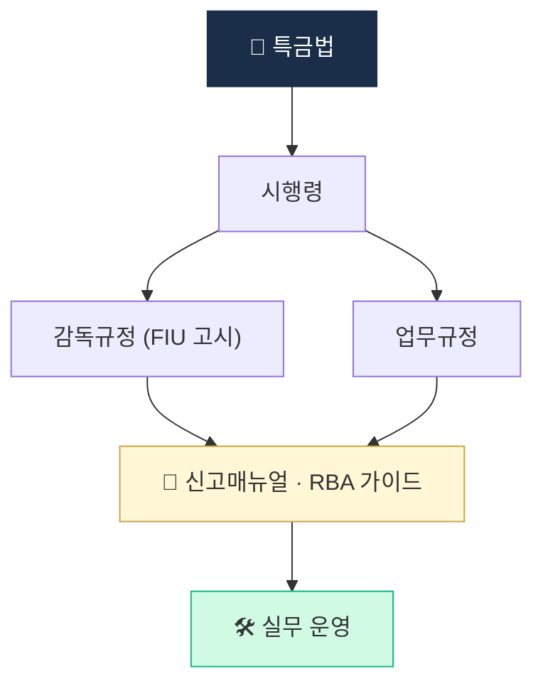

# Day 13 — 한국 가이드라인 정독 (RBA + 신고매뉴얼)

> 법조문 위에 깔린 운영 바이블. ⏱️ ~90분.

## 📖 오늘 뭘 배우나

특금법·이용자보호법의 조문만 읽어서는 실무가 안 됩니다. 실무는 그 위의 **시행령·감독규정·FIU 가이드라인(RBA 처리기준·신고매뉴얼)** 이라는 **4층 규범** 을 봐야 돌아갑니다. 오늘은 이 가이드라인이 고객 위험등급·재실사 주기·EDD 트리거를 어떻게 구체화하는지 확인.


<!-- MAP-START -->
## 🗺 오늘의 지도


<!-- MAP-END -->

## 🎯 핵심 질문
1. 위험기반접근법(RBA)의 4가지 위험 차원은?
2. 위험등급 3종 (LOW/MED/HIGH) 각 통제 차이는?
3. FIU 신고매뉴얼에서 가장 까다로운 항목은?

## 📖 읽기 (~60분)
- 메인: [`../notes/5-compliance/cdd-edd.md`](../notes/5-compliance/cdd-edd.md) — 3절 (RBA)
- 보조: [`../notes/5-compliance/internal-controls.md`](../notes/5-compliance/internal-controls.md) — 6절 (ERA)

## 🌐 외부 자료 (~20분)
- [FSC 신고매뉴얼 PDF](https://www.fsc.go.kr/comm/getFile?srvcId=BBSTY1&upperNo=75409&fileTy=ATTACH&fileNo=6) — 핵심 챕터 목차 + 1개 챕터 정독
- [KoFIU](https://www.kofiu.go.kr/) — 자금세탁방지 업무규정 문서 검색

## 🛠️ 미니 챌린지 (~10분)
- 가상의 신규 고객 1명에 대해 RBA 4차원 위험점수 부여 시뮬레이션 (각 1~5점, 총 20점 만점)
- 점수 → 등급 매핑

## ✅ 체크포인트
- [ ] RBA 4차원 (고객/상품/거래/지역) 외운다
- [ ] 등급별 재실사 주기 (저5/중3/고1년) 안다
- [ ] 신고매뉴얼 목차 한눈에 본 적 있다

## 💭 오늘의 한 줄

## 💼 실무 현장 (Industry Reality)

### 4층 규범의 현실 — 실무에서 가장 많이 보는 문서

1. **특금법·이용자보호법 조문** — 법무팀 근거 문서. 분쟁·감독 대응 기본
2. **시행령** — 임계금액·정의 구체화 (Travel Rule 100만원 등)
3. **감독규정(FIU 고시)·업무규정** — 실무 룰의 뼈대
4. **FIU 신고매뉴얼 + RBA 가이드** — 실무가 **매일 참조하는 바이블**

**실무 현실**: Analyst는 법 조문보다 **신고매뉴얼·RBA 가이드**를 더 자주 본다. 법무팀도 외부 공문 회신 때만 법·시행령을 인용하고, 내부 정책서는 업무규정·가이드라인 기준으로 쓰임.

### RBA 4차원 점수화 — 한국 거래소 실제 구현 예시

```
customer_risk_score =
    0.3 * customer_dimension    # PEP·국적·직업·소득
  + 0.3 * product_dimension     # 원화마켓·BTC·알트·레버리지
  + 0.2 * transaction_dimension # 규모·빈도·패턴
  + 0.2 * geography_dimension   # 거주지·거래상대국·고위험국

# 등급 매핑
if score >= 70: HIGH → EDD + 연 1회 재실사
elif score >= 40: MEDIUM → 표준 모니터링 + 3년 주기
else: LOW → 간소 모니터링 + 5년 주기
```

### 위험등급별 재실사 주기 (한국 업계 관행)

| 등급 | 주기 | 재실사 트리거 |
|---|---|---|
| HIGH | 1년 | 고액거래·PEP 지위 변동·SDN 매칭 변동 |
| MEDIUM | 3년 | 거래 패턴 급변·주소 변경 |
| LOW | 5년 | 기본 주기 도래 |

### FIU 신고매뉴얼 — 가장 까다로운 항목 3개

1. **대주주 자격심사 자료** — 2026-01 개정 후 **특수관계인까지 포함**한 조직도·지분구조 제출. 외국계 주주 포함 시 **영문 공증 + 아포스티유** 필요
2. **AMLO 경력 증빙** — 금융·컴플라이언스 5년 이상 실무 경력 인정 기준이 모호. FIU가 **개별 케이스 판단**
3. **내부통제 정책서 체계** — 정책·절차·매뉴얼 3층 구조로 수십 개 문서. 각 문서에 **버전·승인자·개정이력** 필수

### ERA(Enterprise Risk Assessment) — 전사 위험 평가

- **연 1회** 전사 차원의 AML/CFT 위험 평가 수행 의무
- **감독규정 +  FIU 가이드라인** 기준 4분면 평가: 고객·상품·거래·지역
- **산출물**: ERA 리포트 → 이사회 승인 → FSS 검사 시 1차 확인 문서
- **외부 전문가(법무법인·회계법인) 검증** 병행이 업계 관행

### 하루 루틴 — 준법 정책팀

- **주 2~3회** FSS·FIU 공문 대응(자료 제출, 설명자료)
- **월 1회** 룰 위원회 — 신규 룰 제안·기존 룰 튜닝 승인
- **분기 1회** RBA 가이드 업데이트 검토, 내부 매뉴얼 개정
- **연 1회** ERA 수행, 이사회 보고
- **3년 1회** VASP 갱신 신고, ISMS 재인증

### 자주 나오는 오해

- **"법 조문만 보면 된다"** — 조문은 시작점. **업무규정·가이드라인**이 실제 운영 기준
- **"RBA는 개인고객만"** — 법인·기관 고객도 동일 RBA 적용. 기관은 오히려 **BO 식별** 때문에 더 복잡
