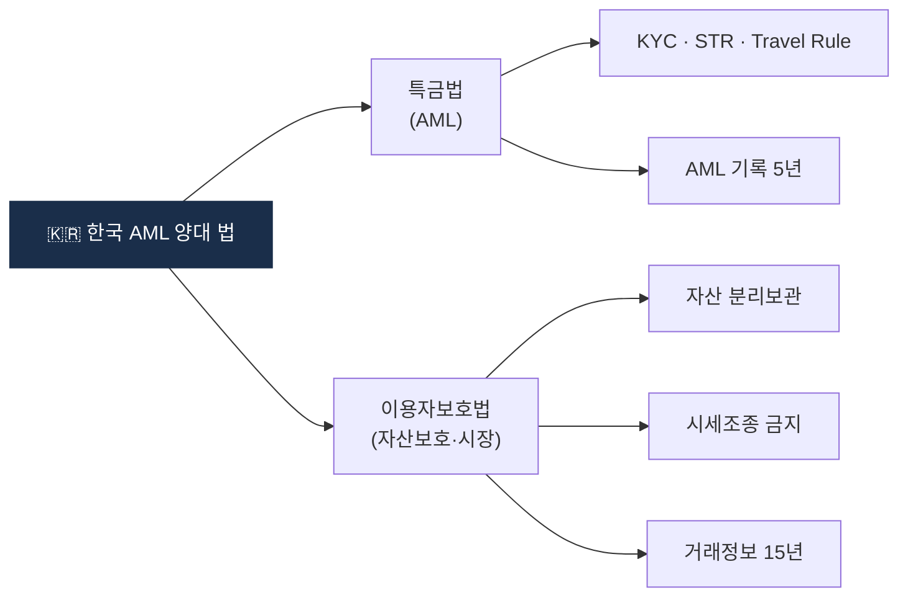

# Day 14 — 🛠️ 한국법 §단위 정리표 + 1주 리뷰

> 특금법 + 이용자보호법을 §단위로 자기만의 표로. ⏱️ ~120분.

## 📖 오늘 뭘 배우나

Week 2 전체의 결산. 머릿속 조각들을 **§ 번호 단위 한 장 표**로 재구성해서, 이후 어떤 실무 이슈를 만나도 "이건 특금법 §5의2" 같은 반사적 대응이 가능한 상태를 만드는 날. 조문 번호를 외우는 게 목표가 아니라 **의무 흐름이 § 번호와 함께 기억**되도록.


<!-- MAP-START -->
## 🗺 오늘의 지도


<!-- MAP-END -->

## 🎯 회고 질문
1. 한국 가상자산 AML의 양대 법 + 분담?
2. 가장 까다로워 보이는 의무 1개?
3. 다음주 (FATF + 글로벌) 어떻게 접근할까?

## 🛠️ 메인 미니 프로젝트 (~90분)

**목표**: 한국법 §단위 정리표 작성 (마크다운 또는 Excel/Notion)

### 형식 (예시)
| 법 | § | 제목 | 핵심 의무 (한 줄) | 위반 시 |
|---|---|---|---|---|
| 특금법 | §4 | STR | 의심거래 금액무관 보고 | 1년/1천만원 |
| 특금법 | §4의2 | CTR | 1천만원+ 현금 보고 | 1년/1천만원 |
| 특금법 | §5의2 | KYC | 신원/실소유자/목적 | 1년/1천만원 |
| 특금법 | §7 | VASP 신고 | FIU 신고 + 3년 갱신 | 5년/5천만원 |
| 특금법 | §9 | Tipping-off 금지 | STR 사실 누설 금지 | 1년/1천만원 |
| 특금법 | §17 | 양벌규정/처벌 | — | 위 합산 |
| 이용자보호법 | §6~9 | 예치금 분리 | 은행 보관 + 이용료 | 5년/5천만원 |
| 이용자보호법 | §10 | 가상자산 분리 | 자기/고객 분리 + 동종동량 | 5년/5천만원 |
| 이용자보호법 | §10~19 | 시세조종 | 자본시장법급 처벌 | 1년+/3~5배 |
| 이용자보호법 | §11 | 거래기록 15년 | 추적·검색·정정 가능 | 과태료 |
| 이용자보호법 | §13~17 | 감독·검사 | 금융위/금감원 권한 | — |

→ 위 표를 **자기 손으로 다시 작성** (조항 번호 정확치 않아도, 의무 흐름이 머리에 박히는 게 목표)

→ 결과물 저장: `aml/curriculum/_artifacts/d14_korea_law_table.md` (자율)

## ✅ 체크포인트
- [ ] 정리표 산출
- [ ] [`progress.md`](progress.md) Week 2 7개 모두 체크
- [ ] 헷갈리는 § 5개 미만

## 💭 2주차 회고

가장 어려웠던 §:
가장 흥미로웠던 §:
실무에서 직접 부딪힐 것 같은 §:

## 💼 실무 현장 (Industry Reality)

### 한국 §은 실무에서 어떻게 인용되는가

현업 AMLO·Analyst·법무팀이 **매주 인용하는 § 빈도 Top 5** (체감):

1. **특금법 §5의2 (KYC)** — EDD 케이스, 고객 상담 응대, 내부 정책서 근거
2. **특금법 §4 (STR)** — STR 작성 시 근거 조항, FIU 보고
3. **특금법 §9 (Tipping-off)** — 고객센터 응대 가이드라인, 임직원 교육
4. **이용자보호법 §10 (자산 분리)** — 재무·Treasury 팀 의사결정 근거
5. **특금법 §5의4 (기록 5년)** — 데이터 인프라 파기 정책의 근거

### 일정표: 2026 한국 VASP가 놓치면 안 되는 규제 캘린더

| 월 | 이벤트 |
|---|---|
| 2026-01 | 특금법 개정(대주주 자격심사 확대) 시행 |
| 2026-02 | 연간 ERA 이사회 보고 (대부분 VASP) |
| 2026-03 | 전년도 STR 통계 내부 결산, FIU 연례 자료 회신 |
| 2026-06 | FSS 정기 검사 시즌 시작 (일부) |
| 2026-07 | 이용자보호법 시행 2주년, 개정안 논의 |
| 2026-Q3 | 2단계 입법 국회 논의 본격화 (스테이블코인 등) |
| 2026-Q4 | ISMS 갱신 시즌, 내년 예산 수립 |

### AML/준법 팀의 § 단위 KPI 예시 (한국 대형 VASP)

- **§4 STR** — 월간 제출 건수, KoFIU 반려율 10% 미만
- **§5의2 KYC** — 실명확인 실패율, EDD 평균 처리시간 5영업일 내
- **§5의4 기록** — 백업 무결성 검증, 복원 테스트 분기 1회
- **§9 Tipping-off** — 전사 교육 이수율 95% 이상
- **§7 신고** — 변경신고 기한 준수율 100%

### 특금법 vs 이용자보호법 분담 (한 장 요약)

```
특금법 = AML/CFT "입구·출구" 감시
  └─ 누가 고객인가 (KYC·EDD)
  └─ 무엇이 의심 거래인가 (KYT·STR·CTR)
  └─ 어디로 가는가 (Travel Rule)
  └─ 얼마나 보관하는가 (기록 5년)

이용자보호법 = 고객 자산·시장 "건전성" 보호
  └─ 자산 분리 (예치금·콜드월렛)
  └─ 시세조종·미공개정보 금지
  └─ 거래기록 15년
  └─ 감독·검사 (금융위·금감원)
```

**중첩 지점**: 기록보관 의무 — 특금법 5년 vs 이용자보호법 15년. 실무는 **더 긴 쪽(15년)** 준수.

### 자주 나오는 오해

- **"§ 번호를 외워야 AML 실무"** — 번호보다 **의무 흐름과 담당 팀 매핑**이 중요. § 번호는 법무 대응 때 찾아보면 됨
- **"특금법만 알면 한국 AML 완성"** — 이용자보호법·FIU 업무규정·개인정보보호법·외환거래법까지 엮여 있음. **입체적 이해** 필요
