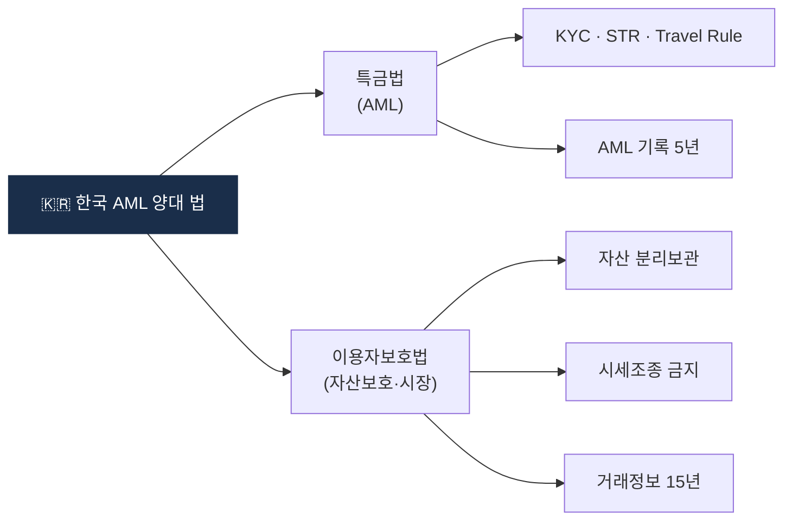

# Day 14 — 🛠️ 한국법 §단위 정리표 + 1주 리뷰

> 특금법 + 이용자보호법을 §단위로 자기만의 표로. ⏱️ ~120분.

## 📖 오늘 뭘 배우나

Week 2 전체의 결산. 머릿속 조각들을 **§ 번호 단위 한 장 표**로 재구성해서, 이후 어떤 실무 이슈를 만나도 "이건 특금법 §5의2" 같은 반사적 대응이 가능한 상태를 만드는 날. 조문 번호를 외우는 게 목표가 아니라 **의무 흐름이 § 번호와 함께 기억**되도록.

<!-- MAP-START -->
## 🗺 오늘의 지도

<!-- MAP-END -->

## 🎯 회고 질문
1. 한국 가상자산 AML의 양대 법 + 분담?
2. 가장 까다로워 보이는 의무 1개?
3. 다음주 (FATF + 글로벌) 어떻게 접근할까?

## 🛠️ 메인 미니 프로젝트 (~90분)

**목표**: 한국법 §단위 정리표 작성 (마크다운 또는 Excel/Notion)

### 형식 (예시)
| 법 | § | 제목 | 핵심 의무 (한 줄) | 위반 시 |
|---|---|---|---|---|
| 특금법 | §4 | STR | 의심거래 금액무관 보고 | 1년/1천만원 |
| 특금법 | §4의2 | CTR | 1천만원+ 현금 보고 | 1년/1천만원 |
| 특금법 | §5의2 | KYC | 신원/실소유자/목적 | 1년/1천만원 |
| 특금법 | §7 | VASP 신고 | FIU 신고 + 3년 갱신 | 5년/5천만원 |
| 특금법 | §9 | Tipping-off 금지 | STR 사실 누설 금지 | 1년/1천만원 |
| 특금법 | §17 | 양벌규정/처벌 | — | 위 합산 |
| 이용자보호법 | §6~9 | 예치금 분리 | 은행 보관 + 이용료 | 5년/5천만원 |
| 이용자보호법 | §10 | 가상자산 분리 | 자기/고객 분리 + 동종동량 | 5년/5천만원 |
| 이용자보호법 | §10~19 | 시세조종 | 자본시장법급 처벌 | 1년+/3~5배 |
| 이용자보호법 | §11 | 거래기록 15년 | 추적·검색·정정 가능 | 과태료 |
| 이용자보호법 | §13~17 | 감독·검사 | 금융위/금감원 권한 | — |

→ 위 표를 **자기 손으로 다시 작성** (조항 번호 정확치 않아도, 의무 흐름이 머리에 박히는 게 목표)

→ 결과물 저장: `aml/curriculum/_artifacts/d14_korea_law_table.md` (자율)

## ✅ 체크포인트
- [ ] 정리표 산출
- [ ] [`progress.md`](progress.md) Week 2 7개 모두 체크
- [ ] 헷갈리는 § 5개 미만

## 💭 2주차 회고

가장 어려웠던 §:
가장 흥미로웠던 §:
실무에서 직접 부딪힐 것 같은 §:
