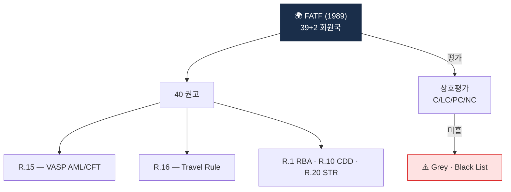

# Day 15 — FATF 구조 + 40 권고안

> 모든 가상자산 AML 룰의 출발점. ⏱️ ~75분.

## 📖 오늘 뭘 배우나

한국 규제 2주를 마쳤으니 이제 그 **원형**인 FATF로 올라갑니다. FATF는 법을 만들지 않지만 **Mutual Evaluation과 Grey·Black List**라는 소프트파워로 각국을 움직입니다. 이 메커니즘을 이해하면 한국이 왜 FATF 권고에 민감한지, 앞으로 2027~2028년 다음 ME에서 가상자산이 주요 평가 영역이 되는 이유가 명확해집니다.

<!-- MAP-START -->
## 🗺 오늘의 지도

<!-- MAP-END -->

## 🎯 핵심 질문
1. FATF 회원국 수 + 한국 가입연도?
2. Mutual Evaluation의 두 평가축은?
3. Grey/Black List 등재 시 회원국에 미치는 임팩트?

## 📖 읽기 (~50분)
- 메인: [`../notes/2-regulations/fatf.md`](../notes/2-regulations/fatf.md) — 1~3절, 6~7절

## 🌐 외부 자료 (선택, ~15분)
- [FATF 공식](https://www.fatf-gafi.org/)
- [40 Recommendations 페이지](https://www.fatf-gafi.org/en/publications/Fatfrecommendations/Fatf-recommendations.html)

## 🛠️ 미니 챌린지 (~10분)
- 가상자산 핵심 권고 (R.1, R.10~12, R.15, R.16, R.20, R.22) 의 짧은 한 줄 정리
- 40개 중 5개만 골라 본 뒤 "내 회사가 영향받는 정도" 1~5점 매김

## ✅ 체크포인트
- [ ] FATF 39+2 회원, 한국 2009 가입 안다
- [ ] Mutual Evaluation 2축 (Technical + Effectiveness) 안다
- [ ] C/LC/PC/NC 등급 안다
- [ ] R.15, R.16이 가상자산 핵심임을 안다

## 💭 오늘의 한 줄

## 💼 실무 현장 (Industry Reality)

### FATF 권고가 실제로 한국 거래소에 미친 연혁

| FATF 사건 | 한국 대응 |
|---|---|
| 2019-06 R.15·R.16 가상자산 확장 | 2020-03 특금법 개정 통과 |
| 2021-10 Virtual Asset Guidance 업데이트 | 2021-03 특금법 시행 + VASP 신고제 개시 |
| 2023-06 Travel Rule 강화 해석 | 2022-03 Travel Rule 100만원 시행 |
| 2025-06 R.16 해석지침 업데이트 | 2026-01 특금법 개정(대주주 자격심사) |
| 2027 예상 Mutual Evaluation | 준비 단계 진입 (2025~) |

한국은 2008년 APG(Asia/Pacific Group, FATF 유형기구) 가입 → 2009년 FATF 정회원. **차기 상호평가(ME)**는 2027~2028년 예상되며, **가상자산이 주요 평가 영역**으로 들어가는 첫 ME가 됨.

### Mutual Evaluation 실제 어떻게 진행되나

1. **자국 이행 보고서(Self-Assessment)** 작성 — 400+ 항목 체크리스트
2. **현지 평가단(Assessors) 방문** — 관계부처·감독기관·민간(VASP 포함) 인터뷰 2주
3. **평가 초안 → 국가 회신 → 전원회의 채택**
4. **등급**: Technical Compliance (C/LC/PC/NC) + Effectiveness (High/Substantial/Moderate/Low)
5. **Follow-up**: 미흡 시 1년 후 재보고, 최악은 Grey List 등재

### 가상자산 관련 R.15·R.16 — 한국 현장 체크리스트

**R.15 (VASP AML/CFT)**:
- [ ] VASP 신고·등록 의무화 → 특금법 §7
- [ ] 9 AML 의무 전면 적용 → 특금법 여러 조항
- [ ] 해외 VASP 차단 실효성 → 2024-10 22개 차단 리스트

**R.16 (Travel Rule)**:
- [ ] 임계금액 설정 → 100만원 (한국), $3,000 (미국), 1€ (EU)
- [ ] 송수신인 정보 동반 → VerifyVASP·CODE 허브
- [ ] unhosted wallet 처리 → 소유 증명 요구
- [ ] Sunrise Issue 대응 → 아직 완전 해결 안 됨

### 글로벌 주요국 FATF 이행 현황 비교

| 국가 | 마지막 ME | R.15 | R.16 | 특징 |
|---|---|---|---|---|
| 미국 | 2016 | LC | LC | 2024년 FSAP 업데이트 진행 |
| EU | 회원국별 | 평균 LC | 평균 PC | MiCA·TFR로 2024 대폭 상향 |
| 싱가포르 | 2016 | LC | LC | MAS 엄격 집행 |
| 일본 | 2021 | LC | PC | Travel Rule 2023 도입 |
| 한국 | 2020 | PC→예상 LC | PC→예상 LC | 2027 차기 ME 대비 |

### 하루 루틴 — FATF 대응 담당자 (법무·정책팀)

- **주 1회** FATF Plenary·APG 회의 결과 모니터링
- **월 1회** 해외 감독 동향 브리핑 (FSS·FIU 업무 회의)
- **분기 1회** 내부 FATF 이행 체크리스트 갱신
- **연 1회** APG 실무그룹 자료 제출
- **3~5년 1회** 상호평가 대응 (태스크포스 구성, 전사 동원)

### 자주 나오는 오해

- **"FATF는 유엔 산하"** — 아님. 1989년 G7 설립 독립 기구. UN과 협력은 하지만 별도
- **"Grey List는 개발도상국만"** — 2020년대 들어 튀르키예·남아공 등 G20급 국가도 등재
- **"한국은 Grey List 위험 없다"** — **위험은 낮지만 가상자산 이행 미흡 시 2027 ME에서 경고 받을 가능성** 존재
