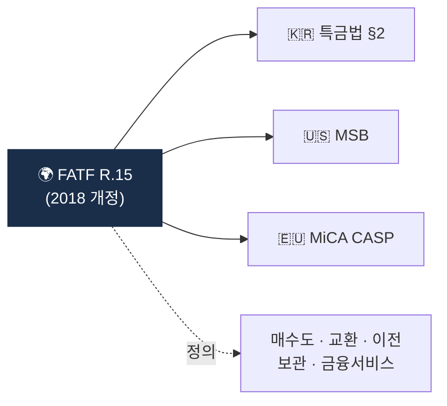

# Day 16 — FATF Recommendation 15 (VASP에 AML/CFT)

> 가상자산을 AML 체계에 끌어들인 결정적 권고. ⏱️ ~70분.

## 📖 오늘 뭘 배우나

2018년 FATF R.15 개정으로 VASP가 전통 금융기관과 동일한 AML 의무자가 됐고, 이게 한국 특금법 2020 개정·EU MiCA·미국 FinCEN 가이던스의 **공통 모태**입니다. 오늘은 R.15의 VASP 정의를 한국 특금법 §2.1.하와 1:1 매핑해보면서, 두 문서가 얼마나 닮았는지 체감합니다.

<!-- MAP-START -->
## 🗺 오늘의 지도

<!-- MAP-END -->

## 🎯 핵심 질문
1. R.15는 언제 가상자산을 포함했는가?
2. R.15가 한국 특금법 § 어디에 반영되었나?
3. R.15에서 정의하는 VASP 5가지 행위?

## 📖 읽기 (~45분)
- 메인: [`../notes/2-regulations/fatf.md`](../notes/2-regulations/fatf.md) — 2~3절
- 보조: [`../notes/3-crypto-aml/vasp-obligations.md`](../notes/3-crypto-aml/vasp-obligations.md) — 1절

## 🌐 외부 자료 (선택, ~15분)
- [FATF — Updated Guidance for RBA on VAs and VASPs (2021)](https://www.fatf-gafi.org/en/publications/Virtualassets/Updated-guidance-rba-virtual-assets.html)
- [FATF Virtual Assets 페이지](https://www.fatf-gafi.org/en/topics/virtual-assets.html)

## 🛠️ 미니 챌린지 (~10분)
- R.15 VASP 정의 5가지 행위 → 한국 특금법 §2.1.하의 행위와 1:1 매핑
- 차이점이 있다면 메모

## ✅ 체크포인트
- [ ] R.15의 2018년 가상자산 포섭 안다
- [ ] FATF-한국 특금법 매핑 가능
- [ ] FATF가 stablecoin도 다룬다는 점 안다

## 💭 오늘의 한 줄

## 💼 실무 현장 (Industry Reality)

### 한국 VASP에서는

R.15의 VASP 정의 **5가지 행위**는 한국 특금법 §2.1.하에 거의 1:1로 복붙됨 — 이게 한국 컴플라이언스팀이 R.15 원문을 **정책서 첫 페이지**에 명시적으로 인용하는 이유. Upbit·Bithumb·Coinone·Korbit는 FIU 신고서 제출 시 "당사 사업 범위가 R.15 VASP 정의 5개 행위에 해당한다"는 사업범위 매핑표를 첨부한다. 신규 **커스터디 전용 사업자**(예: 한국 금융권 합작법인)는 "보관(Safekeeping)" 하나만 해당해도 특금법 §7 신고 의무 발생 → 이걸 몰라 신고 지연하다 과징금 맞는 게 흔한 패턴.

### 글로벌에서는

**Coinbase**는 FATF R.15 이행 관점에서 각국 사업권 확보를 **"R.15 기반 규제 vs 기타"**로 내부 분류한다. R.15가 국내법화된 관할(한국·EU·일본·싱가포르)은 표준 컴플라이언스 템플릿을 재활용할 수 있지만, 미이행국은 별도 법률 자문이 필요. **Binance**가 2019~2023 여러 관할에서 사업권을 잃은 주요 이유가 바로 R.15 불이행 — FATF가 해당국에 "Binance 감독 부재"를 지적하면 해당국이 인가 거절 또는 영업 중단 명령.

### 규제 mapping 체크리스트

R.15 정의 5개 행위 → 한국 특금법 매핑 (AMLO가 실제 쓰는 표):

| R.15 행위 (영문) | 한국 특금법 §2.1.하 |
|---|---|
| exchange between VA and fiat | 가상자산↔법정화폐 교환 |
| exchange between VAs | 가상자산 간 교환 |
| transfer of VAs | 가상자산 이전 |
| safekeeping/administration of VAs | 가상자산 보관·관리 |
| financial services for VA issuance | 가상자산 발행 관련 금융서비스 |

### FATF 평가 캘린더 (실무자가 챙기는 것)

- FATF **Mutual Evaluation 보고서**: 한국 4차 평가 2020-04, 다음 평가 2026~2027 예정 → 한국 VASP는 평가 대비 **"R.15 이행 증빙 패키지"**를 선제 준비
- FATF **Plenary** 연 3회(2월·6월·10월) → 여기서 Grey List 등재·해제 결정 → 한국 VASP 해외 송금 정책에 즉시 영향

### 자주 나오는 오해

- **"R.15가 법이다"** — FATF는 법을 만들지 않는다. **권고 → 국내법화**가 있어야 강제력. 한국은 2020-03 특금법 개정으로 국내법화됨
- **"커스터디는 AML 의무 없다"** — R.15 5개 행위에 "Safekeeping" 포함, 커스터디 단독 사업도 VASP
