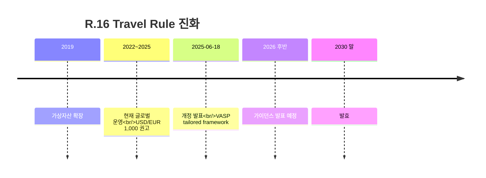

# Day 17 — FATF R.16 (Travel Rule) + 2025-06 개정

> Travel Rule의 글로벌 헌법. ⏱️ ~80분.

## 📖 오늘 뭘 배우나

R.16은 가상자산 AML의 **운영 난이도 1순위** 주제. 2019년 가상자산까지 확장됐고, 2025-06 다시 개정돼 2030년 말 발효됩니다. 오늘은 R.16의 정보 항목·임계금액·**Sunrise Issue**를 잡아두고, 2025-06 개정이 왜 "VASP는 별도 tailored framework"로 분리되는지 이해합니다.

<!-- MAP-START -->
## 🗺 오늘의 지도

<!-- MAP-END -->

## 🎯 핵심 질문
1. R.16 임계금액 권고는?
2. 2025-06 개정의 핵심 변화 + 발효일?
3. 2026 후반에 발표되는 것은?

## 📖 읽기 (~50분)
- 메인: [`../notes/2-regulations/fatf.md`](../notes/2-regulations/fatf.md) — 4~5절
- 보조: [`../notes/3-crypto-aml/travel-rule.md`](../notes/3-crypto-aml/travel-rule.md) — 1~3절

## 🧭 FATF R.16 2025-06 개정 — 핵심 변화 5개

2025년 6월 FATF는 R.16 Interpretive Note를 개정, Travel Rule 이행 권고를 세분화했다. 주요 변화:

### 1. Self-hosted Wallet 처리 강화

기존: "카운터파티가 self-hosted wallet이면 Travel Rule 적용 의무 없음" (불명확)
개정: **VASP가 송수신 상대가 self-hosted wallet임을 인지한 경우, 여전히 고객 정보 수집·기록하고 의심 시 STR 보고** (메시지 전송 의무는 없지만 KYC 확장)

### 2. 임계값 권고 명확화

기존: "$/€1,000 이상 권고"
개정: **임계값 결정은 각 관할 재량이나, €1 ~ $3,000 내 선택. EU TFR은 임계 0 (1 EUR부터), 한국은 100만원, 미국 FinCEN 제안 $1,000**

### 3. Protocol Interop 명시 요구

개정: **VASP는 카운터파티의 TR 프로토콜이 다를 경우에도 메시지 교환 의무. Sunrise Issue(미연결)는 "최대한 연결 시도" 후 자체 정책 결정**

### 4. PII 보호 표준 강화

개정: **IVMS101 메시지는 암호화 전송 + 수신 후 필요 기간만 보관. 국가 간 개인정보 이동 규제(GDPR·PIPA·CCPA) 준수 명시**

### 5. 지속적 Supervision 강화

개정: **각국 FIU는 VASP의 Travel Rule 이행 현황을 분기별 보고 + 미흡 VASP는 FATF Mutual Evaluation에서 Non-Compliant 등급**

### 한국 영향

- 한국 특금법·FIU 고시는 **100만원 임계 유지** (R.16 허용 범위 내)
- **Self-hosted wallet 처리 강화** — 2026년 FIU 가이드라인 개정 예정
- DAXA가 Protocol Interop 공동 표준 개발 중

### 실무 대응 체크리스트

- [ ] Self-hosted wallet 감지 룰 구현 여부
- [ ] 카운터파티 TR 프로토콜 식별·자동 라우팅 여부
- [ ] Sunrise Issue 정책 문서화 여부
- [ ] IVMS101 암호화 전송·보관 기간 정책
- [ ] 분기별 FIU 보고 체계

### 1차 자료

- [FATF R.16 Interpretive Note (2025-06 개정)](https://www.fatf-gafi.org/en/publications/Fatfrecommendations/R16-virtual-assets-update-2025.html)
- [FATF VASP Sector Update June 2025](https://www.fatf-gafi.org/en/publications/)

## 🌐 외부 자료 (~20분)
- [FATF — Updated R.16 Explanatory Note (PDF)](https://www.fatf-gafi.org/content/dam/fatf-gafi/recommendations/Explanatory%20note%20for%20revised%20R.16.pdf.coredownload.pdf)
- [Mayer Brown — FATF revises AML standards](https://www.mayerbrown.com/en/insights/publications/2025/08/fatf-revises-aml-standards-for-certain-funds-transfers)

## 🛠️ 미니 챌린지 (~10분)
- 송신인/수신인 정보 항목을 종이에 두 칼럼으로 정리
- 한·미·EU 임계금액 (100만원 / $3K / 없음) 표 작성

## ✅ 체크포인트
- [ ] R.16 임계 USD/EUR 1,000 권고 안다
- [ ] 2025-06-18 개정, 2030 말 발효 안다
- [ ] VASP는 별도 tailored framework 적용 안다
- [ ] Sunrise Issue 정의 안다

## 💭 오늘의 한 줄

## 💼 실무 현장 (Industry Reality)

### 한국 VASP에서는

R.16은 한국 VASP **운영 난이도 1순위** 주제. 2022-03-25 시행 이후 4대 거래소 Travel Rule 팀은 **상시 2~4명 전담** 편성 — 카운터파티 VASP 연결 상태 모니터링·IVMS101 필드 매핑 오류 대응·미연결 VASP 고객 대상 **출금 차단 정책 운영**이 핵심 업무. 2025-06 FATF 개정은 한국 실무자에게 "드디어 임계 내려간다"는 신호로 읽힘 — 현재 100만원(약 $750) 임계가 FATF 권고 USD/EUR 1,000에 맞춰 향후 상향 가능성 검토 중(금융위 2026 TF 주제).

### 글로벌에서는

**Notabene 2024 Q4 State of Crypto Travel Rule 리포트** 기준 글로벌 VASP 중 R.16 **완전 이행 비율 ~40%**. 나머지는 부분 이행·미이행. 이 격차가 **Sunrise Issue**의 본질. Coinbase·Kraken은 미이행국 VASP와의 거래를 **일괄 차단**이 아니라 **"enhanced due diligence + 수동 심사"**로 처리 — 사업 기회 손실을 최소화하면서 리스크 관리하는 중도 전략.

### 2025-06 R.16 개정 핵심

2025-06-18 FATF가 발표한 R.16 개정의 핵심은 "VASP를 전통 송금과 분리해 **tailored framework** 적용" — 배경:

- 전통 송금은 SWIFT MT103 구조 고정, VASP는 온체인 즉시성·pseudonymity 등 다른 특성
- 2026 후반 구체 가이던스 발표 예정, **2030 말 발효**
- 한국 금융위는 2026~2027 TF에서 국내 반영 여부 검토

### 임계금액 비교 (실무에서 매일 참조)

| 관할 | 임계 | 비고 |
|---|---|---|
| FATF 권고 | USD/EUR 1,000 | 2019~현행 |
| 한국 | 100만원 | 특금법 §5의2 (2022-03-25) |
| 미국 | $3,000 | BSA Travel Rule (1996) |
| EU | 없음 (1유로부터) | TFR (2024-12-30) |
| 싱가포르 | SGD 1,500 | MAS PSA |

### 자주 나오는 오해

- **"Travel Rule은 송금인 정보만"** — 송신·수신 양쪽 VASP 모두 정보 수집·교환 의무. 일방 의무가 아님
- **"임계 이하는 무시"** — EU TFR은 임계 0이라 1유로 거래도 대상, 글로벌 베이스라인으로 EU 기준 맞추는 VASP 증가
