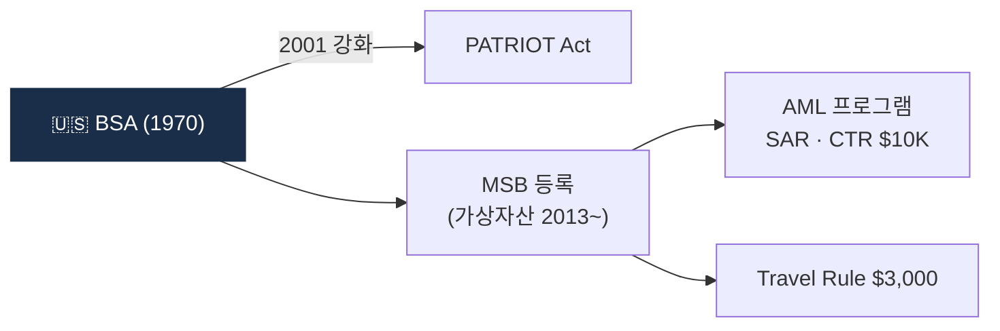

# Day 18 — 미국 BSA + FinCEN

> 미국 AML의 모법 + 가상자산 적용. ⏱️ ~75분.

## 📖 오늘 뭘 배우나

1970년 BSA는 현금 다발 추적으로 시작했고, 2001 USA PATRIOT Act로 확장되며 오늘의 AML 표준이 됐습니다. 이 미국 원형이 FATF 권고로, 다시 한국 특금법으로 내려왔다는 구조를 오늘 체감. **MSB**(Money Services Business)로 가상자산을 포섭한 2013년 FinCEN 가이던스가 결정적 순간.

<!-- MAP-START -->
## 🗺 오늘의 지도

<!-- MAP-END -->

## 🎯 핵심 질문
1. BSA는 언제 제정?
2. 가상자산이 BSA 적용받는 메커니즘 (MSB)?
3. FinCEN의 가상자산 핵심 가이던스 2개?

## 📖 읽기 (~50분)
- 메인: [`../notes/2-regulations/us-bsa-fincen.md`](../notes/2-regulations/us-bsa-fincen.md) — 1~3절

## 🌐 외부 자료 (선택, ~15분)
- [FinCEN 공식](https://www.fincen.gov/)
- [FinCEN 2013 가상통화 가이던스 검색](https://www.fincen.gov/resources/statutes-regulations/guidance/application-fincens-regulations-persons-administering)

## 🛠️ 미니 챌린지 (~10분)
- "한국 특금법 vs 미국 BSA + MSB" 비교표 (적용대상/감독/임계금액/처벌)
- "한국에만 영업 vs 미국 진출" 시 추가 의무 메모

## ✅ 체크포인트
- [ ] BSA 1970 + USA PATRIOT 2001 안다
- [ ] MSB = Money Services Business 정의 안다
- [ ] 미국 Travel Rule 임계 $3,000 안다
- [ ] FinCEN = 미국 FIU 안다

## 💭 오늘의 한 줄

## 💼 실무 현장 (Industry Reality)

### 한국 VASP에서는

한국 거래소는 미국 소비자를 **직접 서비스하지 않아도** BSA/FinCEN을 항상 의식. 이유:

- **USD 결제망 의존**: 원화 출금 대부분 K뱅크·NH농협·카카오뱅크·신한이 **correspondent banking**으로 연결된 JPMorgan·BNY 라인을 타므로 FinCEN이 간접 압박 가능
- **스테이블코인 입출금**: USDC·USDT는 발행사(Circle·Tether)가 미국 관할 → 한국 거래소가 mixer 접촉 USDT 이체 시 FinCEN 조사 협조 요청 대응
- **클라우드**: AWS·GCP 미국 본사 data subpoena 협조

### 글로벌에서는

**FinCEN MSB 등록**은 온라인 무료지만 **주별 MTL**(Money Transmitter License)은 주 48개 × 수수료 $5K~$100K × 2~3년 소요로 실제 진입장벽. Coinbase·Kraken은 **전 주 MTL 완비**에 수년·수백만 달러 투자. Binance US는 MTL 불완전 상태로 영업하다 2023 DOJ 합의에서 이 부분도 시정. **FinCEN BSA E-Filing System**은 API 제출 지원 → 대형 VASP는 STR·CTR **자동 제출 파이프라인** 구축(한국 FIU-TIS는 수기 업로드뿐).

### 실제 임계와 서식

- **CTR (FinCEN Form 104)**: 현금 **$10,000 초과**, 영업일 +15일 내
- **SAR (FinCEN Form 111)**: 의심거래. 가상자산 경우 임계 없고 판단 기준
- **Travel Rule**: **$3,000 이상** 송금 시 송수신인 정보 동반 (1996부터)
- **8300 Form**: 사업상 현금 $10,000 초과 수취 시 (일부 VASP 해당)

### FinCEN 2026-04 AML Overhaul

2026-04 FinCEN이 발표한 AML 프레임워크 재편 제안 — 핵심:

- RBA 강화, "의미 있는(meaningful)" AML 프로그램 요구
- SAR 품질 중심 평가, 수량 중심 탈피
- 국가전략우선순위(NPF) 반영 의무화
- 가상자산 섹터 별도 섹션 강화 예상

### MSB로 가상자산 포섭한 2013년 가이던스 의미

FinCEN 2013-03-18 가이던스 "Application of FinCEN's Regulations to Persons Administering, Exchanging, or Using Virtual Currencies"가 결정적 순간. 이 가이던스 한 장으로 **가상자산 교환·송금 사업자 = MSB**로 분류 → BSA 전체 적용. 2019-05 추가 가이던스에서 DeFi·P2P·mixer 범위 구체화.

### 자주 나오는 오해

- **"한국에서만 영업하면 FinCEN 무관"** — correspondent banking·스테이블코인·클라우드 3축으로 간접 관할 성립
- **"SAR은 많이 내면 좋다"** — FinCEN도 품질 중심 전환, 형식적 SAR 남발은 검사에서 감점
