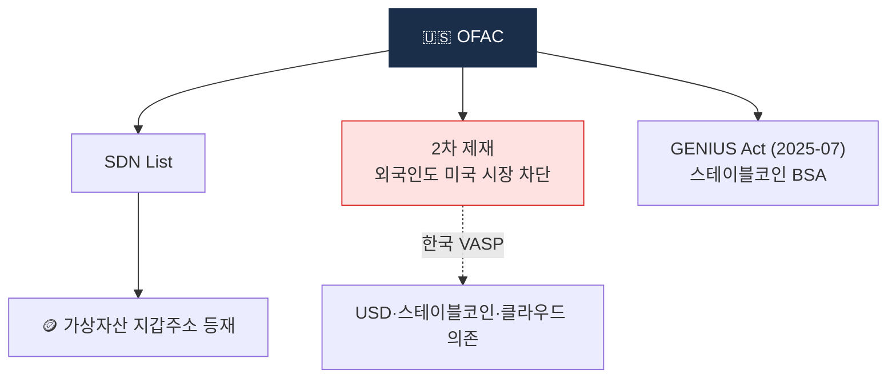

# Day 19 — 미국 OFAC + 2차 제재 + GENIUS Act

> 가상자산을 SDN List에 올리는 그 기관 + 스테이블코인 신법. ⏱️ ~80분.

## 📖 오늘 뭘 배우나

OFAC 2차 제재가 **한국 VASP에도 실질적 강제력**을 가지는 이유(USD 결제망·SDN·클라우드 의존·스테이블코인)를 정리하고, 2025-07 통과된 **GENIUS Act**가 스테이블코인을 BSA에 편입시킨 의미를 확인합니다. 한국에서만 영업해도 OFAC은 "항시 의식"해야 한다는 원칙이 왜 나왔는지 체감.


<!-- MAP-START -->
## 🗺 오늘의 지도


<!-- MAP-END -->

## 🎯 핵심 질문
1. OFAC 2차 제재가 외국인에게도 적용되는 이유?
2. SDN에 가상자산 지갑주소가 등재된 첫 사례?
3. GENIUS Act 시행 일정?

## 📖 읽기 (~50분)
- 메인: [`../notes/2-regulations/us-bsa-fincen.md`](../notes/2-regulations/us-bsa-fincen.md) — 3~6절

## 🌐 외부 자료 (~20분)
- [OFAC 공식](https://ofac.treasury.gov/)
- [OFAC SDN 검색](https://sanctionssearch.ofac.treas.gov/) — "crypto"로 검색해보기
- [PwC — FinCEN 2026-04 AML overhaul](https://www.pwc.com/us/en/industries/financial-services/library/our-take/fincen-proposes-aml-overhaul-apr-13-2026.html)

## 🛠️ 미니 챌린지 (~10분)
- OFAC SDN 검색에서 "crypto" 또는 알려진 mixer 이름 검색해서 실제 주소 1개 메모
- GENIUS Act 시행 일정 (2026-07-18 / 2027-01-18) 캘린더 표시

## ✅ 체크포인트
- [ ] OFAC = 미국 재무부 제재 집행 안다
- [ ] 2차 제재 = 외국인도 미 시장 차단 가능 안다
- [ ] SDN List에 wallet 주소 등재됨 알다
- [ ] GENIUS Act = 스테이블코인 BSA 적용 안다

## 💭 오늘의 한 줄

## 💼 실무 현장 (Industry Reality)

### 한국 VASP에서는

**OFAC은 한국 AML 조직도에서 별도 섹션**. 컴플라이언스팀 내 Sanctions Specialist 1~2명이 **OFAC SDN 일일 diff**를 자동 수집·내부 블랙리스트 sync 운영. 특히 북한 관련 제재(**Lazarus Group**)는 한국이 최전선 — 2022-08 Tornado Cash SDN 등재, 2024 TraderTraitor·WagemoleIO 그룹 주소 수백 개 추가. Upbit은 2025 Upbit 해킹($50M) 조사에서 Chainalysis Reactor + 자체 SOC팀으로 Lazarus 지갑 cluster를 **24시간 내 식별**해 한국 경찰청 사이버수사대와 공조.

### 글로벌에서는

OFAC 2차 제재의 파괴력은 **Binance DOJ 합의 $4.3B**(2023-11) 조항 중 OFAC 벌금 $968M이 단적으로 보여줌. Binance는 이란·시리아·크림반도 고객 서비스 차단 실패로 제재. **Bittrex 2022 $29M**, **Kraken 2022 $362K**(이란 IP 접속 차단 부실)도 같은 맥락. 이후 글로벌 VASP는 **IP geolocation + 지갑 SDN 매칭 + KYC 국적 cross-check** 3중 제재 통제로 이동.

### SDN 지갑주소 실전 샘플

OFAC SDN 가상자산 주소 등재 역사 (AMLO가 암기):

- **2018-11** 이란인 개인 2명 BTC 주소 첫 등재
- **2020-09** 북한 Lazarus 관련 주소
- **2022-05** Blender.io (첫 mixer SDN)
- **2022-08** Tornado Cash 스마트컨트랙트 주소 (첫 프로토콜 SDN)
- **2024~2025** 북한·랜섬웨어 그룹 대량 추가

실제 샘플 구조:
```
SDN Entry:
  name: TORNADO CASH
  program: CYBER2
  addresses:
    - 0x8589427373D6D84E98730D7795D8f6f8731FDA16 (ETH)
    - 0x722122dF12D4e14e13Ac3b6895a86e84145b6967 (ETH)
```

### GENIUS Act (2025-07 통과)

스테이블코인을 BSA에 편입 — 핵심 일정:

- **2025-07-18** 대통령 서명·발효
- **2026-07-18** 18개월 준비기간 종료 → 스테이블코인 발행자 BSA AML 프로그램·SAR·CTR 적용
- **2027-01-18** 전면 시행

발행자(Circle·Paxos)뿐 아니라 **유통자**(거래소·결제사)에도 단계적 적용 예정. 한국 거래소는 USDC·PYUSD 상장 정책 재검토.

### Sanctions 하루 루틴

- **매일 09:00** OFAC SDN 전일 업데이트 diff 확인, 자동 email alert + 내부 위키 업데이트
- 신규 wallet 주소 등재 → **즉시 내부 블랙리스트**에 추가, KYT 엔진에 sync
- **분기별** UN·EU·한국 외교부 제재 목록 cross-reference

### 자주 나오는 오해

- **"OFAC은 미국 회사만 적용"** — 2차 제재로 외국인도 미 달러 결제망·미국 IaaS 통해 제재 가능
- **"SDN만 보면 된다"** — **50% Rule**도 중요 (SDN 법인이 50% 이상 소유한 비등재 법인도 자동 차단)
