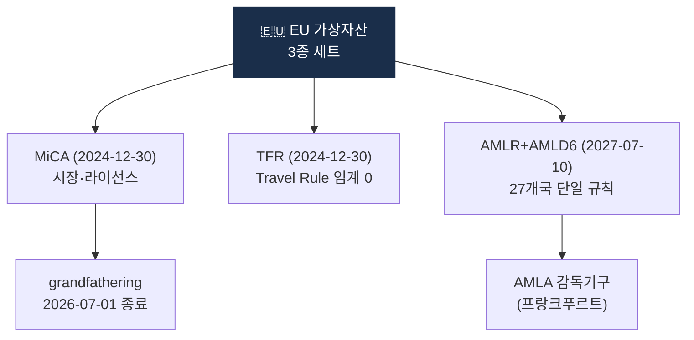

# Day 20 — EU MiCA + AMLR/AMLD6 + TFR

> EU 가상자산 규제 3종 세트. ⏱️ ~80분.

## 📖 오늘 뭘 배우나

EU는 **MiCA(시장) + AMLR·AMLD6(AML) + TFR(Travel Rule)** 3종 세트로 가장 체계적인 가상자산 규제를 완성했습니다. 특히 **TFR의 임계금액 0**이 전 세계에서 가장 엄격한 기준이라, 글로벌 VASP들이 EU 기준을 설계 baseline으로 삼는 경향도 오늘 이해합니다. 2026-07 grandfathering 종료가 EU 시장 구조 변화의 분기점.

<!-- MAP-START -->
## 🗺 오늘의 지도

<!-- MAP-END -->

## 🎯 핵심 질문
1. MiCA, AMLR, TFR 각각의 정체성 한 줄?
2. EU TFR 임계금액은? (왜 그런가?)
3. MiCA grandfathering 종료일은?

## 📖 읽기 (~55분)
- 메인: [`../notes/2-regulations/eu-mica-amlr.md`](../notes/2-regulations/eu-mica-amlr.md)

## 🌐 외부 자료 (~15분)
- [ESMA MiCA 페이지](https://www.esma.europa.eu/esmas-activities/digital-finance-and-innovation/markets-crypto-assets-regulation-mica)
- [Sumsub — MiCA 2026 가이드](https://sumsub.com/blog/crypto-regulations-in-the-european-union-markets-in-crypto-assets-mica/)

## 🛠️ 미니 챌린지 (~10분)
- MiCA 토큰 3분류 (ART/EMT/Other) 외우기
- "한국 사업자가 EU 진출 시 추가 의무" 5개 작성

## ✅ 체크포인트
- [ ] MiCA 2024-12-30 시행 안다
- [ ] CASP = EU의 VASP 안다
- [ ] EU TFR 임계 없음 (모든 거래) 안다
- [ ] AMLR/AMLD6 2027-07-10 적용 안다
- [ ] AMLA = 신규 EU AML 감독기구 안다

## 💭 오늘의 한 줄

## 💼 실무 현장 (Industry Reality)

### 한국 VASP에서는

한국 VASP 중 EU 진출 검토 단계는 주로 **Upbit·Bithumb**. MiCA **grandfathering 2026-07-01 종료**가 가시화되면서 2025~2026 **CASP 라이선스 선확보 경쟁**이 가열 — 독일 BaFin·프랑스 AMF·몰타 MFSA 3국이 선호 관할. 한국 본사가 직접 라이선스 받기보다 **EU 현지 자회사 설립 + 현지 AMLO(거주 요건) 고용**이 표준. EU TFR 임계 0은 한국 기준(100만원) 대비 매우 엄격 → IVMS101 메시지 전송량이 수십 배 늘어나므로 벤더 비용 재협상 필수.

### 글로벌에서는

**Coinbase Europe**(아일랜드)·**Kraken**(아일랜드)·**Crypto.com**(몰타)·**Bitstamp**(룩셈부르크) 등 이미 MiCA 체계 선진입. **Binance**는 2023~2024 유럽 라이선스 반납 러시 후 2026 현재 일부국 재신청 중. **Tether(USDT)**는 MiCA ART/EMT 요건 미충족으로 **EU 상장 제한** — Bitstamp 등 일부 거래소 USDT 상폐. USDC는 Circle이 프랑스 ACPR EMI 라이선스 받아 MiCA 적합.

### MiCA 토큰 3분류 (CASP 상장 심사 기준)

| 분류 | 풀이 | 예시 |
|---|---|---|
| **ART** | Asset-Referenced Token | 통화 바스켓 담보 (구 Libra 스타일) |
| **EMT** | E-Money Token | 단일 법정화폐 1:1 담보 스테이블코인 (USDC·PYUSD) |
| **Other** | 기타 가상자산 | BTC·ETH·알트코인 일반 |

ART·EMT는 **발행인 별도 라이선스** 필요, Other는 CASP가 **백서(white paper) 공시** 후 상장.

### EU AMLR/AMLD6 + AMLA

- **AMLR** (EU Regulation 2024/1624): 직접 적용 법령, 27개국 단일 규칙
- **AMLD6** (EU Directive 2024/1640): 각국 국내법화 필요
- **AMLA** (EU Anti-Money Laundering Authority): 2025 출범, 프랑크푸르트 본부, 대형 금융기관 40개 직접 감독 (대형 CASP 포함 예정)
- **적용일**: 2027-07-10 전면

### 한국 사업자 EU 진출 체크리스트

- CASP 라이선스 신청 관할 선정 (독일·아일랜드·몰타·에스토니아)
- EU 거주 AMLO·이사 1명 이상 고용
- IVMS101 + EU TFR 임계 0 대응 Travel Rule 솔루션 (Notabene Gateway 유력)
- 백서(white paper) 공시, GDPR + PIPA 이중 compliance
- AMLA 감독 대상 여부 판단 (EU 내 고객 수·거래량 기준)

### 자주 나오는 오해

- **"MiCA가 AML 법이다"** — MiCA는 **시장 규제**, AML은 AMLR/AMLD6 별도. TFR이 Travel Rule. 3종을 구분해야 함
- **"grandfathering으로 2026까지 안전"** — 2026-07-01 종료. 실무적으로 2025 하반기부터 CASP 신청 필요 (심사 6~12개월)
