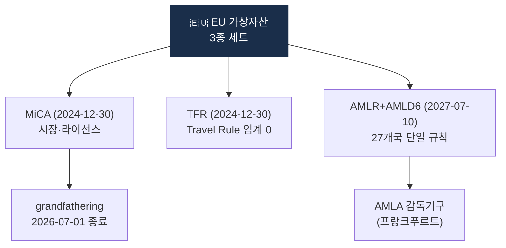

# Day 20 — EU MiCA + AMLR/AMLD6 + TFR

> EU 가상자산 규제 3종 세트. ⏱️ ~80분.

## 📖 오늘 뭘 배우나

EU는 **MiCA(시장) + AMLR·AMLD6(AML) + TFR(Travel Rule)** 3종 세트로 가장 체계적인 가상자산 규제를 완성했습니다. 특히 **TFR의 임계금액 0**이 전 세계에서 가장 엄격한 기준이라, 글로벌 VASP들이 EU 기준을 설계 baseline으로 삼는 경향도 오늘 이해합니다. 2026-07 grandfathering 종료가 EU 시장 구조 변화의 분기점.

<!-- MAP-START -->
## 🗺 오늘의 지도

<!-- MAP-END -->

## 🎯 핵심 질문
1. MiCA, AMLR, TFR 각각의 정체성 한 줄?
2. EU TFR 임계금액은? (왜 그런가?)
3. MiCA grandfathering 종료일은?

## 📖 읽기 (~55분)
- 메인: [`../notes/2-regulations/eu-mica-amlr.md`](../notes/2-regulations/eu-mica-amlr.md)

## 🌐 외부 자료 (~15분)
- [ESMA MiCA 페이지](https://www.esma.europa.eu/esmas-activities/digital-finance-and-innovation/markets-crypto-assets-regulation-mica)
- [Sumsub — MiCA 2026 가이드](https://sumsub.com/blog/crypto-regulations-in-the-european-union-markets-in-crypto-assets-mica/)

## 🛠️ 미니 챌린지 (~10분)
- MiCA 토큰 3분류 (ART/EMT/Other) 외우기
- "한국 사업자가 EU 진출 시 추가 의무" 5개 작성

## ✅ 체크포인트
- [ ] MiCA 2024-12-30 시행 안다
- [ ] CASP = EU의 VASP 안다
- [ ] EU TFR 임계 없음 (모든 거래) 안다
- [ ] AMLR/AMLD6 2027-07-10 적용 안다
- [ ] AMLA = 신규 EU AML 감독기구 안다

## 💭 오늘의 한 줄
