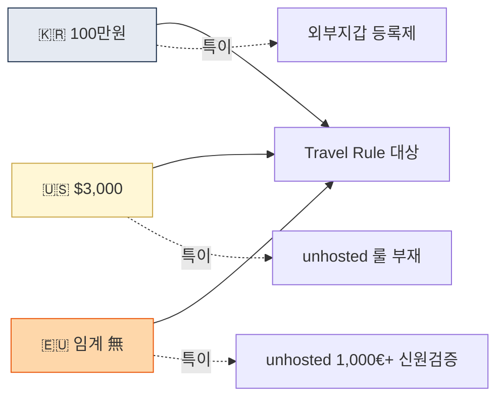

# Day 21 — 🛠️ 한·미·EU Travel Rule 비교표 + 3주 리뷰

> 글로벌 규제 정리 + 시각화. ⏱️ ~120분.

## 📖 오늘 뭘 배우나

한국·미국·EU 규제를 각각 배웠으니 이제 **한 장에 나란히** 놓고 차이를 정리합니다. Travel Rule 임계금액·stablecoin 접근·unhosted wallet 처리 등 실무에서 바로 판단이 필요한 6~8개 축을 표로 만듭니다. 이 표가 있으면 글로벌 거래 시나리오에서 "어느 나라 룰을 기준으로 설계할지" 결정이 빨라집니다.

<!-- MAP-START -->
## 🗺 오늘의 지도

<!-- MAP-END -->

## 🎯 회고 질문
1. 한·미·EU 중 가장 빡빡한 임계금액은?
2. 미국과 EU의 stablecoin 접근 차이는?
3. 한국 사업자가 글로벌 영업 시 1순위 호환 이슈는?

## 🛠️ 메인 미니 프로젝트 (~90분)

**목표**: 한·미·EU Travel Rule + AML 핵심 항목 비교표 작성

### 형식 (예시)
| 항목 | 한국 | 미국 | EU |
|---|---|---|---|
| 모법 | 특금법 | BSA + USA PATRIOT | AMLR (2027-07~) |
| 가상자산 모법 | 가상자산이용자보호법 | GENIUS Act (stablecoin) | MiCA + TFR |
| 사업자 명칭 | VASP | MSB | CASP |
| 라이센스/신고 | FIU 신고 (3년) | FinCEN MSB + 주별 MTL | NCA 라이센스 (EU passporting) |
| Travel Rule 임계 | 100만원 | $3,000 | 없음 |
| TR 시행 | 2022-03-25 | 1996+ | 2024-12-30 |
| Unhosted wallet | 외부지갑 등록제 | 부재 | 1,000 EUR+ 신원검증 |
| KYC | 특금법 §5의2 | BSA CDD Rule | AMLR |
| EDD 트리거 | RBA 가이드 | BSA + OFAC | AMLR + 27개국 통합 |
| STR/SAR | 특금법 §4 | SAR (BSA) | STR (AMLR) |
| CTR/임계 | 1천만원 | $10,000 | EU 현금 €10K |
| 기록보관 | 5년 (특금법) / **15년 (이용자보호법)** | 5년 | 5년 |
| 제재기관 | 외교부 + FIU | OFAC | EU + AMLA |
| 미신고 처벌 | 5년/5천만원 | $250K+ + 형사 | 최대 €10M / 매출 5% |

→ 자기 손으로 다시 작성 (외운 척 하지 말고 노트 보면서 OK, 핵심은 구조 머릿속)

→ 결과물 저장: `aml/curriculum/_artifacts/d21_global_travel_rule_compare.md`

## ✅ 체크포인트
- [ ] 비교표 산출
- [ ] [`progress.md`](progress.md) Week 3 7개 모두 체크
- [ ] 한·미·EU 핵심 차이 5개 즉답 가능

## 💭 3주차 회고

가장 까다로운 관할:
가장 단순한 관할:
실무에서 1순위로 호환 봐야 할 것:

## 💼 실무 현장 (Industry Reality)

### 한국 VASP 멀티관할 실무

한·미·EU를 동시에 운영하는 한국 VASP(주로 Upbit·Bithumb 글로벌팀)는 **"가장 엄격한 기준으로 단일화"** 원칙. 즉 Travel Rule 임계는 **EU 기준 0**, STR 품질 기준은 **FinCEN SAR narrative 품질**, KYC는 **한국 실명확인 + MiCA KYC + BSA CDD 합집합**. 이 "최대공약수 정책"이 벤더 비용은 올리지만 관할별 따로 운영 대비 **운영 리스크 3~5배 감소**. 반대로 **관할별 optimizer 전략**은 법무비용이 올라가서 중소 VASP는 감당 어려움.

### 글로벌 AML Program의 대표 구조 (Tri-regime 기업)

- **Policy Layer**: 단일 글로벌 정책 + 3개 관할별 annex (Korea Annex, US Annex, EU Annex)
- **Operations Layer**: 글로벌 단일 케이스 관리 시스템(Jira AML project) + 관할별 큐 분기
- **Reporting Layer**: 한국은 FIU-TIS(수기) / 미국은 FinCEN BSA E-Filing(API) / EU는 각국 FIU portal
- **Sanctions Layer**: OFAC·UN·EU·한국 외교부 4중 스크리닝

### 한국 VASP 글로벌 진출 순서 (실무 전형)

1. 한국 특금법 신고 확보 (기본)
2. 싱가포르 MAS PSA (영어권 진입 1순위, 심사 18~24개월)
3. 일본 FSA 또는 홍콩 SFC (아시아 확장)
4. EU CASP 라이선스 (몰타 또는 독일 BaFin)
5. 미국 MSB + 일부 주 MTL (비용·시간 최대)

### 호환 체크리스트 (자주 부딪히는 충돌)

- **한국 실명확인 vs EU GDPR**: 주민번호 해시 저장·pseudonymization 필요
- **미국 Travel Rule $3K vs EU 0**: EU 쪽 표준 채택이 단순
- **한국 외부지갑 등록제 vs EU self-custody 1,000€**: 둘 다 대응하는 UI 플로우 별도 필요
- **한국 이용자보호법 15년 기록 vs 미·EU 5년**: 긴 쪽 기준 단일화

### 자주 나오는 오해

- **"한 관할만 커버하면 충분"** — 스테이블코인·USD 결제망·클라우드 3축으로 간접 관할 성립, 단일 관할 영업은 이론적
- **"EU가 가장 복잡"** — 실무에서 미국이 가장 복잡 (연방 + 50개 주 MTL, OFAC 별도)
