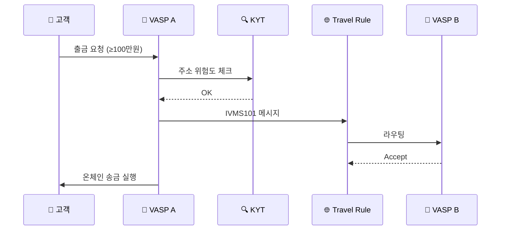

# Day 22 — Travel Rule 운영 흐름 (한국 100만원 시나리오)

> Travel Rule이 거래소 시스템에서 실제로 어떻게 흘러가는가. ⏱️ ~70분.

## 📖 오늘 뭘 배우나

이론적 Travel Rule에서 **실제 거래소 출금 요청 한 건이 어떻게 처리되는지**의 9단계로 줌인합니다. KYT 차단·IVMS101 메시지 생성·카운터파티 응답·Sunrise 폴백까지 각 단계에서 멈출 수 있는 지점이 명확해집니다. 이해하고 나면 "왜 이 출금이 멈췄나"를 고객에게 설명하는 언어가 생깁니다.


<!-- MAP-START -->
## 🗺 오늘의 지도


<!-- MAP-END -->

## 🎯 핵심 질문
1. 한국 거래소 출금 시 Travel Rule 9단계 흐름은?
2. 카운터파티 VASP가 미연결이면?
3. Personal data 보호와 Travel Rule의 충돌 지점?

## 📖 읽기 (~50분)
- 메인: [`../notes/3-crypto-aml/travel-rule.md`](../notes/3-crypto-aml/travel-rule.md) — 6~10절

## 🛠️ 미니 챌린지 (~20분)
- 출금 흐름 9단계를 종이에 직접 그리기
- "단계별로 멈출 수 있는 지점" 표시 (KYT 차단 / TR 거절 / Sunrise 폴백)

## ✅ 체크포인트
- [ ] 한국 임계 100만원 안다
- [ ] VerifyVASP ↔ CODE 연동 구조 안다
- [ ] 외부지갑(unhosted wallet) 등록제 안다
- [ ] PII 보호 + GDPR/PIPA 호환 이슈 인지

## 💭 오늘의 한 줄

## 💼 실무 현장 (Industry Reality)

### 한국 VASP에서는

한국 4대 거래소 출금 플로우(100만원 이상):

1. 고객 출금 요청 → 주소·금액 입력
2. **외부지갑 등록제** 체크: 등록된 지갑 맞는지, 본인 명의 확인 완료됐는지
3. **KYT 엔진**(Chainalysis/VerifyVASP) → 목적지 주소 위험도 평가 (~500ms)
4. KYT Severe → **자동 차단 + 컴플라이언스 큐**로 라우팅
5. **Travel Rule 솔루션**(VerifyVASP 또는 CODE) → 카운터파티 VASP identify
6. IVMS101 메시지 생성·송신 → 카운터파티 accept 대기
7. 카운터파티 **미연결**(Sunrise) → Upbit·Bithumb은 **출금 거절** 정책(보수적)
8. Accept 수령 → 온체인 broadcasting
9. 사후 감사 로그 저장 (이용자보호법 15년)

### 글로벌에서는

Coinbase·Kraken은 한국과 달리 **Sunrise 상황에서 "보류/수동 심사"** 쪽으로 관대. 이유는 관할마다 Travel Rule 이행 수준이 다르고 legitimate VASP도 미연결 상태가 흔하기 때문. Kraken은 2024년 기준 Sunrise 거래의 ~60%를 **KYC + 자금출처 확인 후 통과** 시키는 hybrid 정책 운영. 한국은 금융위 가이드라인상 이런 재량이 제한적.

### 출금 멈추는 3가지 지점 (Analyst가 고객에게 설명하는 언어)

```
STOP 1: KYT 차단
  → "목적지 주소가 고위험 섹터(mixer/sanctions)에 연결"
  → 고객 대응: 자금출처 증빙 요구 또는 거절

STOP 2: Travel Rule 거절
  → "카운터파티 거래소가 수신자 정보 불일치 사유로 거절"
  → 고객 대응: 수신측 KYC 재확인 요청

STOP 3: Sunrise 폴백
  → "수신 거래소가 Travel Rule 미연결 상태"
  → 고객 대응: 한국은 보수 차단, 글로벌은 수동 심사
```

### PII 보호 vs Travel Rule 충돌

IVMS101 메시지에 송신인 실명·주소·생년월일이 포함 → **GDPR/PIPA 관점 개인정보 국외이전**. 해결책:

- **pseudonymization**: 주민번호 대신 해시 ID 사용 (한국 선호)
- **encryption in transit**: TRISA는 PKI, VerifyVASP·CODE는 TLS + 회원 인증
- **카운터파티 DPA 체결**: 각 VASP 간 개인정보처리자 위수탁 계약

### Analyst 하루 (Travel Rule 담당)

- **09:00~10:00** 카운터파티 연결 상태 대시보드 확인 (신규 연결·단절 VASP 파악)
- **10:00~12:00** Sunrise 큐 처리: 수동 심사 대상 거래 5~20건
- **13:00~15:00** IVMS101 필드 매핑 오류 티켓 (이름 표기·주소 포맷 불일치)
- **15:00~17:00** GDPR/PIPA 데이터 삭제 요청 대응

### 자주 나오는 오해

- **"Travel Rule = 송금 성공률 낮춤"** — 실제로는 운영 안정화 후 성공률 95%+ (한국 4사 기준)
- **"외부지갑 등록제 = 한국만"** — EU TFR도 self-custody 1,000€+ 시 수신자 신원 검증 의무화