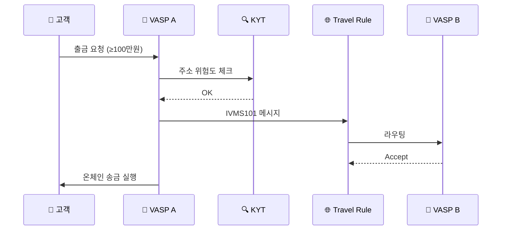

# Day 22 — Travel Rule 운영 흐름 (한국 100만원 시나리오)

> Travel Rule이 거래소 시스템에서 실제로 어떻게 흘러가는가. ⏱️ ~70분.

## 📖 오늘 뭘 배우나

이론적 Travel Rule에서 **실제 거래소 출금 요청 한 건이 어떻게 처리되는지**의 9단계로 줌인합니다. KYT 차단·IVMS101 메시지 생성·카운터파티 응답·Sunrise 폴백까지 각 단계에서 멈출 수 있는 지점이 명확해집니다. 이해하고 나면 "왜 이 출금이 멈췄나"를 고객에게 설명하는 언어가 생깁니다.

<!-- MAP-START -->
## 🗺 오늘의 지도

<!-- MAP-END -->

## 🎯 핵심 질문
1. 한국 거래소 출금 시 Travel Rule 9단계 흐름은?
2. 카운터파티 VASP가 미연결이면?
3. Personal data 보호와 Travel Rule의 충돌 지점?

## 📖 읽기 (~50분)
- 메인: [`../notes/3-crypto-aml/travel-rule.md`](../notes/3-crypto-aml/travel-rule.md) — 6~10절

## 🛠️ 미니 챌린지 (~20분)
- 출금 흐름 9단계를 종이에 직접 그리기
- "단계별로 멈출 수 있는 지점" 표시 (KYT 차단 / TR 거절 / Sunrise 폴백)

## ✅ 체크포인트
- [ ] 한국 임계 100만원 안다
- [ ] VerifyVASP ↔ CODE 연동 구조 안다
- [ ] 외부지갑(unhosted wallet) 등록제 안다
- [ ] PII 보호 + GDPR/PIPA 호환 이슈 인지

## 💭 오늘의 한 줄
