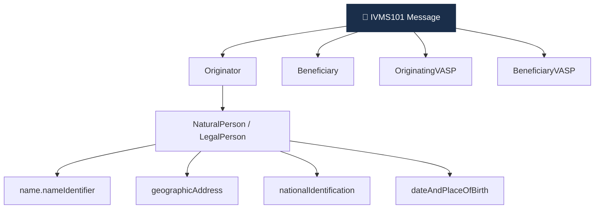

# Day 23 — IVMS101 표준 deep

> Travel Rule 메시지의 글로벌 공통 언어. ⏱️ ~80분.

## 📖 오늘 뭘 배우나

Travel Rule의 **"무엇을"** 을 담당하는 IVMS101. JSON 스키마로 Originator·Beneficiary·VASP 정보를 표준화하며, TRISA·TRP·VerifyVASP·CODE 등 **모든 프로토콜이 페이로드로 사용**합니다. 오늘 NaturalPerson 필수 vs 선택 필드를 보고 나면 D28의 IVMS101 빌더 프로젝트를 훨씬 수월하게 작성할 수 있습니다.

<!-- MAP-START -->
## 🗺 오늘의 지도

<!-- MAP-END -->

## 🎯 핵심 질문
1. IVMS101의 풀이는?
2. 메시지 핵심 5개 객체는? (Originator/Beneficiary/OriginatingVASP/BeneficiaryVASP/TransferPath)
3. NaturalPerson 필수 필드 vs 선택 필드?

## 📖 읽기 (~50분)
- 메인: [`../notes/4-technology/travel-rule-protocols.md`](../notes/4-technology/travel-rule-protocols.md) — 1~2절

## 🌐 외부 자료 (~25분)
- [Notabene — IVMS101 분석](https://notabene.id/travel-rule-messaging-protocols/ivms-101)
- [VerifyVASP IVMS101 문서](https://docs.verifyvasp.com/reference/ivms101/ivms101)

## 🛠️ 미니 챌린지 (~10분)
- IVMS101 JSON 스키마 의사코드 작성 (Originator → name + address + accountNumber 만)
- 한국 사용자 송금 시 채워야 할 필드 체크리스트

## ✅ 체크포인트
- [ ] IVMS101 = InterVASP Messaging Standard 안다
- [ ] JSON 기반, 모든 프로토콜의 페이로드 안다
- [ ] NaturalPerson 핵심 객체 구조 이해
- [ ] 관할별 필수 필드 차이 안다

## 💭 오늘의 한 줄
