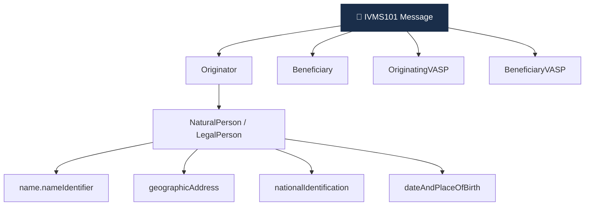

# Day 23 — IVMS101 표준 deep

> Travel Rule 메시지의 글로벌 공통 언어. ⏱️ ~80분.

## 📖 오늘 뭘 배우나

Travel Rule의 **"무엇을"** 을 담당하는 IVMS101. JSON 스키마로 Originator·Beneficiary·VASP 정보를 표준화하며, TRISA·TRP·VerifyVASP·CODE 등 **모든 프로토콜이 페이로드로 사용**합니다. 오늘 NaturalPerson 필수 vs 선택 필드를 보고 나면 D28의 IVMS101 빌더 프로젝트를 훨씬 수월하게 작성할 수 있습니다.


<!-- MAP-START -->
## 🗺 오늘의 지도


<!-- MAP-END -->

## 🎯 핵심 질문
1. IVMS101의 풀이는?
2. 메시지 핵심 5개 객체는? (Originator/Beneficiary/OriginatingVASP/BeneficiaryVASP/TransferPath)
3. NaturalPerson 필수 필드 vs 선택 필드?

## 📖 읽기 (~50분)
- 메인: [`../notes/4-technology/travel-rule-protocols.md`](../notes/4-technology/travel-rule-protocols.md) — 1~2절

## 🌐 외부 자료 (~25분)
- [Notabene — IVMS101 분석](https://notabene.id/travel-rule-messaging-protocols/ivms-101)
- [VerifyVASP IVMS101 문서](https://www.verifyvasp.com/)

## 🛠️ 미니 챌린지 (~10분)
- IVMS101 JSON 스키마 의사코드 작성 (Originator → name + address + accountNumber 만)
- 한국 사용자 송금 시 채워야 할 필드 체크리스트

## ✅ 체크포인트
- [ ] IVMS101 = InterVASP Messaging Standard 안다
- [ ] JSON 기반, 모든 프로토콜의 페이로드 안다
- [ ] NaturalPerson 핵심 객체 구조 이해
- [ ] 관할별 필수 필드 차이 안다

## 💭 오늘의 한 줄

## 💼 실무 현장 (Industry Reality)

### 한국 VASP에서는

IVMS101은 한국 4대 거래소의 **"Travel Rule 코어 데이터 모델"**. VerifyVASP·CODE 양 솔루션 모두 내부 페이로드가 IVMS101. 한국 특수 필드:

- `nationalIdentification`: 한국은 **주민번호 뒷자리 마스킹 + 해시 ID** (PIPA 대응)
- `geographicAddress.countryCode`: ISO 3166-1 alpha-2 "KR" 고정
- `name.nameIdentifier`: 한글 이름 + 영문 transliteration (카운터파티 해외 VASP 대응)
- 금액 필드는 `originatorOnChainIdentifier` 지갑 주소 필수

### 글로벌에서는

Notabene·Sumsub 조사 기준 IVMS101 필드 오류 top3:

1. **주소 포맷 불일치**: 국가별 우편 주소 표기 차이 (영문/자국어, 층/호수 분리)
2. **이름 transliteration 불일치**: 한글 → 영문 로마자 표기 다양 (Kim Gil-dong vs Kim Gildong)
3. **`dateAndPlaceOfBirth` 선택 필드 처리**: 관할마다 필수/선택 차이

Coinbase는 2024 Q3 "IVMS101 Standardization Initiative"로 필드 정규화 엔진 공개 — 한국 이름·주소 validator도 포함.

### IVMS101 핵심 객체 구조 (실제 JSON)

```json
{
  "originator": {
    "originatorPersons": [{
      "naturalPerson": {
        "name": {
          "nameIdentifier": [{
            "primaryIdentifier": "홍길동",
            "secondaryIdentifier": "Hong Gildong",
            "nameIdentifierType": "LEGL"
          }]
        },
        "geographicAddress": [{
          "addressType": "HOME",
          "streetName": "세종대로 110",
          "townName": "서울",
          "countryCode": "KR"
        }],
        "nationalIdentification": {
          "nationalIdentifier": "HASH_REDACTED",
          "nationalIdentifierType": "RAID",
          "countryOfIssue": "KR"
        },
        "dateAndPlaceOfBirth": {
          "dateOfBirth": "1990-01-01",
          "placeOfBirth": "Seoul, KR"
        }
      }
    }],
    "accountNumber": ["0x742d35Cc6634C0532925a3b844Bc9e7595f5e3E4"]
  }
}
```

### 관할별 필수 필드 차이 (체크리스트)

| 필드 | 한국 | 미국 | EU TFR |
|---|---|---|---|
| name | 필수 | 필수 | 필수 |
| address | 필수 | 필수 | 필수 |
| accountNumber(지갑) | 필수 | 필수 | 필수 |
| nationalID | 필수 (주민번호 해시) | 선택 | 선택 |
| dateOfBirth | 선택 | 선택 | 필수 |
| placeOfBirth | 선택 | 선택 | 필수 |

EU TFR이 가장 넓은 필수 필드 세트 → 글로벌 기준 EU 기준으로 설계하는 VASP 증가.

### 자주 나오는 오해

- **"IVMS101이 프로토콜이다"** — IVMS101은 **데이터 표준(JSON 스키마)**. TRISA·TRP·VerifyVASP·CODE가 **전송 프로토콜**. 4개 프로토콜 모두 페이로드로 IVMS101 사용
- **"IVMS101 알면 Travel Rule 끝"** — 필드 표준은 IVMS101이지만 라우팅(VASP Discovery)·암호화·DPA는 별개 문제