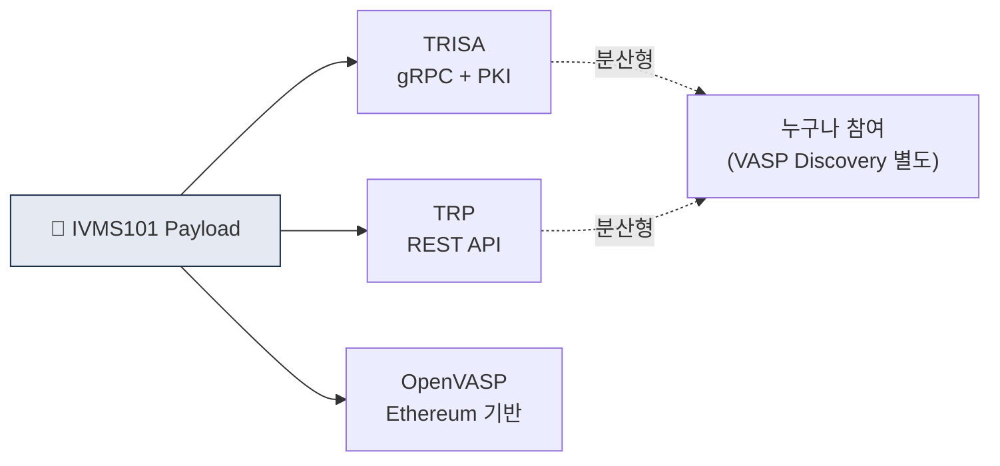

# Day 24 — TRP, TRISA 프로토콜

> 분산형 Travel Rule 전송 프로토콜. ⏱️ ~70분.

## 📖 오늘 뭘 배우나

IVMS101이 "무엇을"이라면 프로토콜은 "어떻게". **TRISA**(PKI·gRPC·분산형)와 **TRP**(REST·가벼움)는 분산형의 두 기둥이며, 누구나 참여 가능한 오픈 모델의 장단점을 보여줍니다. 이 분산형과 폐쇄형(VerifyVASP·CODE)의 차이를 이해하는 게 내일 한국 양강을 보는 배경 지식입니다.


<!-- MAP-START -->
## 🗺 오늘의 지도


<!-- MAP-END -->

## 🎯 핵심 질문
1. TRISA의 신뢰 모델 (PKI 인증서)?
2. TRP가 가벼운 이유 (REST API)?
3. 분산형 vs 폐쇄형 트레이드오프?

## 📖 읽기 (~50분)
- 메인: [`../notes/4-technology/travel-rule-protocols.md`](../notes/4-technology/travel-rule-protocols.md) — 3~4절

## 🌐 외부 자료 (~15분)
- [TRISA 공식](https://trisa.io/)
- [21 Analytics — Open-source IVMS101](https://www.21analytics.co/blog/21-analytics-open-sources-its-intervasp-ivms-101-implementation/)

## 🛠️ 미니 챌린지 (~5분)
- TRISA / TRP / OpenVASP 비교 한 줄씩 정리

## ✅ 체크포인트
- [ ] TRISA = 분산 PKI gRPC 안다
- [ ] TRP = REST API 안다
- [ ] OpenVASP = Ethereum 기반, 활용 낮음 안다
- [ ] 분산형의 한계 (VASP Discovery 별도 필요) 안다

## 💭 오늘의 한 줄

## 💼 실무 현장 (Industry Reality)

### 한국 VASP에서는

한국 4대 거래소는 **분산형(TRISA/TRP) 직접 구현 사례 없음** — 모두 폐쇄형 컨소시엄(VerifyVASP·CODE)로 운영. 이유:

- 4개 거래소로 시장 집중 → 폐쇄형 신뢰망 구축이 쉬움
- 특금법상 **카운터파티 VASP 실사** 의무 → 사전 KYB 완료된 회원사 모델이 규제 친화적
- GDPR/PIPA 호환 위해 암호화 보증이 PKI 수준까지 요구됨

다만 **해외 카운터파티 연결**에는 TRISA/TRP 필요 → **Notabene Gateway**가 이 역할. 한국 VASP가 Gateway를 통해 해외 TRISA 노드와 연결되는 구조.

### 글로벌에서는

- **TRISA**: CipherTrace 주도, GDPR 친화적 PKI 기반, ~200+ 노드. 오픈소스 gRPC 구현
- **TRP (Travel Rule Protocol)**: 21 Analytics·Sygna 공동 개발, REST API 단순성. 주요 사용처 영국·스위스
- **OpenVASP**: Bitcoin Suisse 주도, Ethereum 기반 메시징. 시장 채택 거의 실패
- **Shyft Network**: 최근 메인넷 blockchain 기반, 실사용 미미

Coinbase는 **자체 프로토콜 구현 + TRISA·TRP·Notabene 3중 연결**로 글로벌 커버리지 확보.

### TRISA vs TRP 비교표 (Architect 의사결정)

| 축 | TRISA | TRP |
|---|---|---|
| 프로토콜 | gRPC + PKI | REST + OAuth |
| 신뢰 모델 | X.509 인증서 체인 | API Key + mutual TLS |
| 오픈소스 | O (Apache 2.0) | 부분 (spec만) |
| Directory | Global Directory Service | 각자 운영 |
| GDPR 친화 | 높음 (end-to-end encrypted) | 중간 |
| 구현 난이도 | 높음 (PKI 운영) | 낮음 |

### TRISA gRPC 간단 호출 예시

```
service TRISANetwork {
  rpc Transfer(SecureEnvelope) returns (SecureEnvelope);
  rpc TransferStream(stream SecureEnvelope) returns (stream SecureEnvelope);
  rpc KeyExchange(SigningKey) returns (SigningKey);
}
// SecureEnvelope 안에 IVMS101 JSON이 암호화되어 들어감
```

### 분산형 vs 폐쇄형 트레이드오프

- **분산형(TRISA/TRP)**: 장점 — 누구나 참여, 확장성 / 단점 — Discovery 별도 필요, Sunrise 심화
- **폐쇄형(VerifyVASP/CODE)**: 장점 — 회원사 사전 검증 완료 / 단점 — 해외 확장 어려움

**현실적 결론**: 대부분 대형 VASP는 **Notabene Gateway로 다중 프로토콜 허브 연결** → 분산/폐쇄 구분이 사라지는 추세.

### 자주 나오는 오해

- **"TRISA는 OFAC이 쓰는 표준이다"** — TRISA는 민간 오픈소스, OFAC 공식 인증 아님
- **"프로토콜 하나만 붙이면 충분"** — 글로벌 Sunrise 이슈로 2~3개 프로토콜 동시 지원이 실무 표준