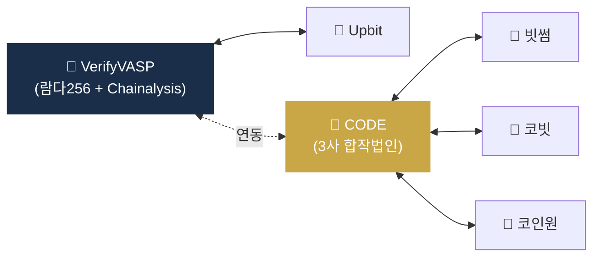
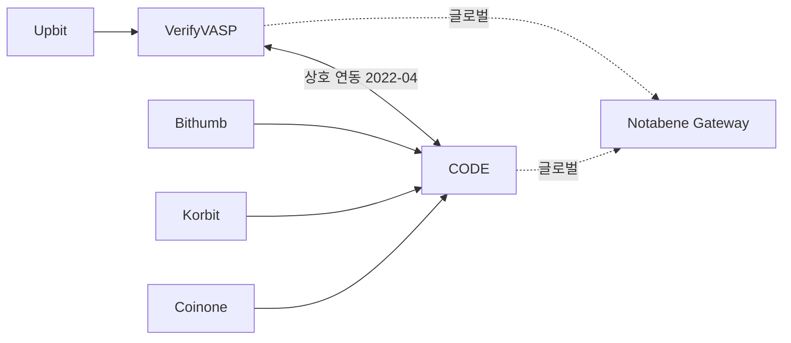

# Day 25 — VerifyVASP, CODE (한국 양강)

> 한국 시장 Travel Rule 솔루션 deep. ⏱️ ~70분.

## 📖 오늘 뭘 배우나

한국은 **VerifyVASP(Upbit계) vs CODE(빗썸·코빗·코인원 합작)** 의 컨소시엄 양강 구조. 분산형보다 폐쇄형을 택한 이유(시장 규모가 작고 4대 거래소 신뢰 구축이 쉬움)를 이해하고, 두 솔루션 연동으로 **4대 거래소 간 자유 송금**이 가능해진 사정을 확인합니다. 신규 한국 VASP 진입 시 솔루션 선택의 판단 기준도.

<!-- MAP-START -->
## 🗺 오늘의 지도

<!-- MAP-END -->

## 🎯 핵심 질문
1. VerifyVASP를 누가 운영하나?
2. CODE를 누가 만들었나?
3. 두 솔루션이 어떻게 연동되었나?

## 📖 읽기 (~45분)
- 메인: [`../notes/7-vendors/travel-rule-vendors.md`](../notes/7-vendors/travel-rule-vendors.md) — 2절 B,C
- 보조: [`../notes/7-vendors/korea-solutions.md`](../notes/7-vendors/korea-solutions.md) — 4절 (Travel Rule)

## 🌐 외부 자료 (~20분)
- [VerifyVASP 공식](https://www.verifyvasp.com/)
- [CodeVASP 공식](https://www.codevasp.com/ko)
- [TokenPost — 한국 4대 거래소 트래블룰](https://www.tokenpost.kr/article-88025)

## 🛠️ 미니 챌린지 (~5분)
- 한국 4대 거래소가 어느 솔루션을 쓰는지 메모
- "신규 한국 VASP가 한 솔루션 선택 시 결정 기준" 3가지 적기

## ✅ 체크포인트
- [ ] VerifyVASP = 람다256(두나무) + Chainalysis 안다
- [ ] CODE = 빗썸+코빗+코인원 합작법인 안다
- [ ] 양 솔루션 연동 = 4대 거래소 송금 가능 안다
- [ ] 컨소시엄형 = 사전 검증 회원사만 안다

## 💭 오늘의 한 줄

## 💼 실무 현장 (Industry Reality)

### 한국 VASP 양강 연결 매트릭스

| 거래소 | Travel Rule 솔루션 | KYT | 은행 |
|---|---|---|---|
| Upbit (두나무) | **VerifyVASP** (람다256 자회사) | Chainalysis + VerifyVASP | K뱅크 |
| Bithumb | **CODE** | CODE + Chainalysis | NH농협 |
| Coinone | **CODE** | CODE + Chainalysis | 카카오뱅크 |
| Korbit | **CODE** | CODE (+ 일부 Chainalysis) | 신한은행 |
| Gopax | **CODE** 또는 Notabene | Chainalysis | 전북은행 |

2022-04 VerifyVASP ↔ CODE **상호 연동 합의** 이후 한국 4대 거래소 간 Travel Rule 송금 자유화 — 이게 한국 시장의 **사실상 표준**이 된 배경.

### VerifyVASP(람다256) 내부 구조

- 운영사: **람다256** (두나무 100% 자회사, 독립 법인)
- 기술: **Chainalysis KYT 내장** + VerifyVASP IVMS101 페이로드 교환
- 프로토콜: 자체 폐쇄형 API + Notabene Gateway 연동으로 글로벌 확장
- 회원사: Upbit 중심 + 일부 해외 VASP

### CODE 내부 구조

- 운영사: **코드(CODE)** 합작법인 (빗썸·코빗·코인원 공동 출자)
- 기술: 자체 폐쇄형 메시징 + Chainalysis·CertiK 등 KYT 파트너
- 프로토콜: REST 기반, 회원사 간 직접 연결
- 회원사: 한국 3대 + 중소 VASP 다수

### 신규 한국 VASP 진입 시 솔루션 선택 기준

1. **주요 고객 출금 경로**: 고객이 어느 거래소로 많이 보내는가? (Upbit 중심 → VerifyVASP, 3사 중심 → CODE)
2. **비용 구조**: CODE가 공통적으로 저렴한 편, VerifyVASP는 람다256 의존성
3. **글로벌 연결**: 둘 다 Notabene Gateway 연결 가능하지만 우선순위 차이
4. **기존 KYT 벤더**: 이미 Chainalysis 쓰면 VerifyVASP가 통합 쉬움

### VerifyVASP·CODE 연동 아키텍처

### 실무 팁

- 한국 카운터파티 미연결 시 → 거의 없음 (4사 완결)
- 해외 카운터파티 미연결 시 → VerifyVASP/CODE 모두 Gateway 라우팅으로 처리, 실패율 ~10~20%
- **DAXA 공동 제재 주소 리스트**: 4사가 공유하는 블랙리스트, VerifyVASP/CODE 모두 반영

### 자주 나오는 오해

- **"VerifyVASP가 글로벌 솔루션"** — 한국 특화, 글로벌 확장은 Notabene Gateway 경유가 현실
- **"CODE는 3사 연합체"** — 법적으로 독립 합작법인. 3사 의사결정 구조 있지만 운영은 별도 회사