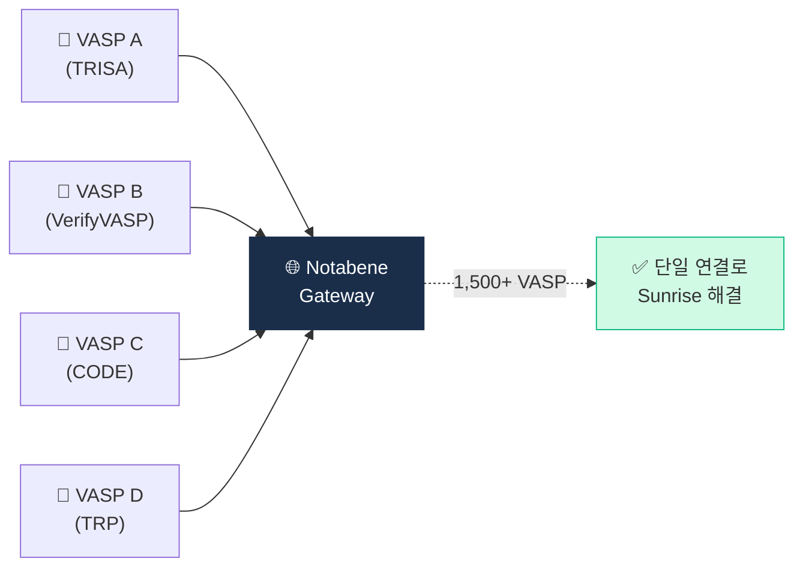

# Day 26 — Notabene Gateway + Sunrise Issue

> 멀티프로토콜 게이트웨이가 부상한 이유. ⏱️ ~70분.

## 📖 오늘 뭘 배우나

Travel Rule의 구조적 난제는 **Sunrise Issue** — 전 세계 VASP가 서로 다른 프로토콜·시행 수준을 가진 상황. Notabene은 "다양한 프로토콜을 다 중개해주는 허브" 포지션으로 1,500+ VASP를 모았고, 이게 글로벌 Travel Rule의 사실상 표준이 된 사정을 오늘 이해합니다.


<!-- MAP-START -->
## 🗺 오늘의 지도


<!-- MAP-END -->

## 🎯 핵심 질문
1. Sunrise Issue가 뭔가? (한 줄)
2. Notabene Gateway가 어떻게 해결?
3. Notabene 회원 VASP 수 (대략)?

## 📖 읽기 (~50분)
- 메인: [`../notes/4-technology/travel-rule-protocols.md`](../notes/4-technology/travel-rule-protocols.md) — 5~6절
- 보조: [`../notes/7-vendors/travel-rule-vendors.md`](../notes/7-vendors/travel-rule-vendors.md) — 2절 A

## 🌐 외부 자료 (~15분)
- [Notabene 공식](https://notabene.id/)
- [Notabene — 멀티프로토콜 게이트웨이 페이지](https://notabene.id/)

## 🛠️ 미니 챌린지 (~5분)
- "멀티프로토콜 Gateway 도입 결정 매트릭스" 작성 (장단점 각 3개)

## ✅ 체크포인트
- [ ] Sunrise Issue 정의 (관할별 시행 격차) 안다
- [ ] Notabene = 글로벌 1위 + 멀티프로토콜 안다
- [ ] 1500+ VASP 회원 안다
- [ ] 폴백 정책 종류 (거절/보류/수동) 안다

## 💭 오늘의 한 줄

## 💼 실무 현장 (Industry Reality)

### 한국 VASP에서는

한국 4대 거래소는 VerifyVASP·CODE로 국내 커버 완결이지만 **해외 송금의 ~30%가 Sunrise 상태**. 이 갭을 Notabene Gateway가 메움. Upbit은 2024 Notabene 멤버십 가입, Bithumb·Coinone도 유사 검토 중. 실제 운영에서 해외 출금 요청 시:

- 카운터파티가 VerifyVASP·CODE 회원 → 직접 라우팅
- 미연결 → Notabene Gateway로 폴백 → Gateway가 TRISA·TRP·자체 프로토콜 중 하나로 연결
- 3중 폴백 실패 → 수동 심사 or 거절

### 글로벌에서는

Notabene은 **2024 Q4 기준 1,500+ VASP** 회원, 지원 프로토콜 TRISA·TRP·Sygna·OpenVASP·자체. Coinbase·Kraken·OKX·Binance 등 Top 20 대부분 가입. 가격: 월 기본 $2K~+ 메시지당 과금 모델. Sumsub 보고서 기준 Notabene 미사용 시 Travel Rule 커버리지 ~40%, 사용 시 ~85%로 상승.

### Sunrise Issue 3가지 양상

1. **규제 부재**: 해당국에 Travel Rule 법 없음 (예: 2026 기준 남미·아프리카 상당수)
2. **규제 있으나 시행 지연**: 법은 있지만 감독기관이 단속 안 함
3. **규제·시행 있으나 VASP 미연결**: 기술 스택·비용 문제로 개별 VASP가 프로토콜 미연동

각각 대응 방식이 다름 — 1은 거절·보류, 2는 수동 심사, 3은 Gateway 연결 유도.

### Sunrise 폴백 정책 (실무 템플릿)

```
IF counterparty_vasp_connected:
    SEND ivms101_message
ELIF counterparty_jurisdiction IN travel_rule_jurisdictions:
    # 관할은 있으나 VASP 미연결
    ACTION = ENHANCED_DUE_DILIGENCE
    REQUIRE source_of_funds_proof
    HOLD 24h for compliance review
ELSE:
    # 관할 자체에 규제 없음
    ACTION = REJECT or MANUAL_REVIEW
    NOTIFY customer with reason
```

### Notabene 도입 결정 매트릭스

| 기준 | 직접 통합(TRISA/TRP) | Notabene Gateway |
|---|---|---|
| 초기 비용 | 높음 (개발 6개월~) | 낮음 (2~4주 온보딩) |
| 월 운영비 | 서버·인증서 ~$2~5K | $2~10K + 메시지 과금 |
| 커버리지 | 단일 프로토콜 | 1,500+ VASP 즉시 |
| 통제권 | 자체 | Gateway 의존 |
| 적합 규모 | Tier 1 글로벌 (Coinbase급) | 중소~중형 VASP |

### 자주 나오는 오해

- **"Notabene이 표준이다"** — Notabene은 민간 SaaS, FATF·ISO 공식 표준 아님. 사실상 표준(de facto)일 뿐
- **"Sunrise는 곧 해결된다"** — 2030 FATF R.16 발효 후에도 각국 시행 격차는 5~10년 잔존 예상