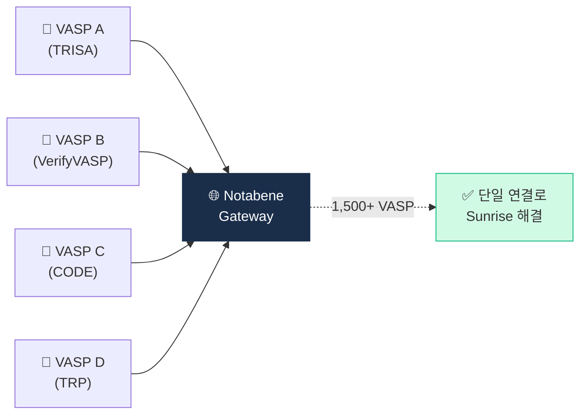

# Day 26 — Notabene Gateway + Sunrise Issue

> 멀티프로토콜 게이트웨이가 부상한 이유. ⏱️ ~70분.

## 📖 오늘 뭘 배우나

Travel Rule의 구조적 난제는 **Sunrise Issue** — 전 세계 VASP가 서로 다른 프로토콜·시행 수준을 가진 상황. Notabene은 "다양한 프로토콜을 다 중개해주는 허브" 포지션으로 1,500+ VASP를 모았고, 이게 글로벌 Travel Rule의 사실상 표준이 된 사정을 오늘 이해합니다.

<!-- MAP-START -->
## 🗺 오늘의 지도

<!-- MAP-END -->

## 🎯 핵심 질문
1. Sunrise Issue가 뭔가? (한 줄)
2. Notabene Gateway가 어떻게 해결?
3. Notabene 회원 VASP 수 (대략)?

## 📖 읽기 (~50분)
- 메인: [`../notes/4-technology/travel-rule-protocols.md`](../notes/4-technology/travel-rule-protocols.md) — 5~6절
- 보조: [`../notes/7-vendors/travel-rule-vendors.md`](../notes/7-vendors/travel-rule-vendors.md) — 2절 A

## 🌐 외부 자료 (~15분)
- [Notabene 공식](https://notabene.id/)
- [Notabene — 멀티프로토콜 게이트웨이 페이지](https://notabene.id/)

## 🛠️ 미니 챌린지 (~5분)
- "멀티프로토콜 Gateway 도입 결정 매트릭스" 작성 (장단점 각 3개)

## ✅ 체크포인트
- [ ] Sunrise Issue 정의 (관할별 시행 격차) 안다
- [ ] Notabene = 글로벌 1위 + 멀티프로토콜 안다
- [ ] 1500+ VASP 회원 안다
- [ ] 폴백 정책 종류 (거절/보류/수동) 안다

## 💭 오늘의 한 줄
