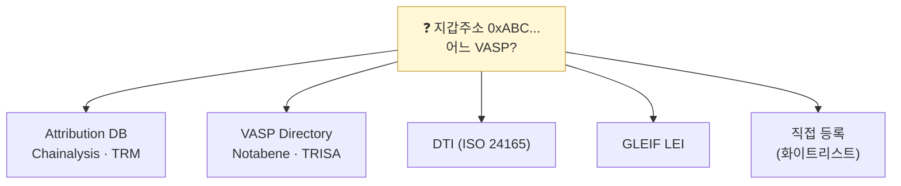

# Day 27 — VASP Discovery + DTI / GLEIF LEI

> 지갑 주소 → 어느 VASP인가? 라우팅의 핵심. ⏱️ ~75분.

## 📖 오늘 뭘 배우나

Travel Rule의 숨은 난제 — **지갑주소만으로는 카운터파티 VASP를 식별할 수 없다**. 이를 해결하기 위한 5가지 접근(Attribution DB·Directory·DTI·LEI·직접 등록)을 오늘 정리. **DTI**(ISO 24165 토큰 식별자)와 **GLEIF LEI**(법인 식별 글로벌 표준)가 어떻게 Travel Rule 라우팅의 기반이 되는지 알아둡니다.


<!-- MAP-START -->
## 🗺 오늘의 지도


<!-- MAP-END -->

## 🎯 핵심 질문
1. 지갑주소만 보고 카운터파티 VASP를 어떻게 식별?
2. DTI = 무엇? (ISO 24165)
3. GLEIF LEI = 무엇?

## 📖 읽기 (~50분)
- 메인: [`../notes/4-technology/travel-rule-protocols.md`](../notes/4-technology/travel-rule-protocols.md) — 5절
- 보조: [`../notes/4-technology/blockchain-analytics.md`](../notes/4-technology/blockchain-analytics.md) — 3절 (Attribution)

## 🌐 외부 자료 (~20분)
- [DTI Foundation](https://dtif.org/)
- [GLEIF LEI 공식](https://www.gleif.org/en/about-lei/this-is-lei)

## 🛠️ 미니 챌린지 (~5분)
- VASP Discovery 5가지 방법 (Attribution DB / VASP Directory / DTI / LEI / 직접 등록) 각 한 줄 정리

## ✅ 체크포인트
- [ ] 주소 → VASP 식별이 별도 인프라 문제임을 안다
- [ ] DTI = 토큰 식별 표준 안다
- [ ] LEI = 법인 식별 글로벌 표준 안다
- [ ] Chainalysis 등 attribution DB의 역할 안다

## 💭 오늘의 한 줄

## 💼 실무 현장 (Industry Reality)

### 한국 VASP에서는

VASP Discovery는 한국에서 **KYT 벤더가 사실상 해결**. Chainalysis Reactor·Elliptic Navigator가 attribution DB(지갑 주소 ↔ VASP 라벨)를 보유 → 출금 주소 조회 시 "Upbit hot wallet" "Bithumb cold wallet" 등 라벨 반환. 정확도 한국 VASP ~95%, 해외 대형 VASP ~80~90%, 중소·신규 VASP ~50% 이하. 나머지 미식별은 **수동 조회**(카운터파티 문의) 또는 **unhosted wallet** 처리.

### 글로벌에서는

- **Chainalysis**: Reactor 제품이 시장 점유율 1위, 지갑 라벨 2,000만+ 보유
- **TRM Labs**: 2020년대 후반 부상, 머신러닝 기반 attribution
- **Elliptic**: Navigator + Lens, 영국 기반 EU 시장 강세
- **Notabene Directory**: Travel Rule 맥락에서 VASP 회원사 DB (1,500+)
- **TRISA Global Directory Service**: 오픈소스 VASP identity

### DTI (ISO 24165) — 토큰 식별 표준

**DTI**(Digital Token Identifier)는 **ISO 24165** 공식 표준. 토큰마다 고유 9자 alphanumeric 코드 부여 — Bitcoin = `4H95J0R2X`, Ether = `X9J9K872S`. ISIN·CUSIP의 가상자산판. 2024년부터 EU MiCA·ESMA 거래 보고에 필수 식별자로 채택. 한국은 아직 의무화 전이나 2026~2027 도입 검토.

### GLEIF LEI — 법인 식별 표준

**LEI**(Legal Entity Identifier)는 ISO 17442 표준, 20자 코드. GLEIF(Global LEI Foundation)가 발급. 예: Coinbase Inc의 LEI는 `5493006QMFDDMYWIAM13`. Travel Rule에서 **OriginatingVASP.nationalIdentification.nationalIdentifier**에 LEI 기입이 EU TFR 권장. 한국 VASP도 FIU 신고 시 LEI 확보 권고 중.

### 5가지 Discovery 방법 비교

| 방법 | 장점 | 단점 | 실무 비중 |
|---|---|---|---|
| Attribution DB (Chainalysis/TRM) | 광범위 커버리지 | 신규 VASP 공백 | ~60% |
| VASP Directory (Notabene/TRISA) | 정확한 회원사 | 비회원 공백 | ~20% |
| DTI (ISO 24165) | 글로벌 표준 | 토큰 식별만 | 보조 |
| LEI (GLEIF) | 법인 식별 표준 | VASP 등록 부족 | 보조 |
| 직접 등록 (화이트리스트) | 100% 확실 | 수작업·유지비 | ~10% |

### 실제 조회 pseudocode

```
def identify_counterparty(wallet_address):
    # 1. Chainalysis attribution
    result = chainalysis.attribution(wallet_address)
    if result.confidence > 0.9:
        return result.vasp_name, result.lei

    # 2. Notabene Directory
    result = notabene.lookup(wallet_address)
    if result:
        return result.vasp_name, result.lei

    # 3. Internal whitelist
    if wallet_address in internal_whitelist:
        return internal_whitelist[wallet_address]

    # 4. Unhosted wallet로 처리
    return None, "UNHOSTED"
```

### 자주 나오는 오해

- **"지갑 주소만 보면 VASP를 알 수 있다"** — 온체인 데이터만으로는 불가능, off-chain attribution DB 필요
- **"DTI와 LEI는 같은 것"** — DTI는 **토큰** 식별, LEI는 **법인** 식별. 상호 보완