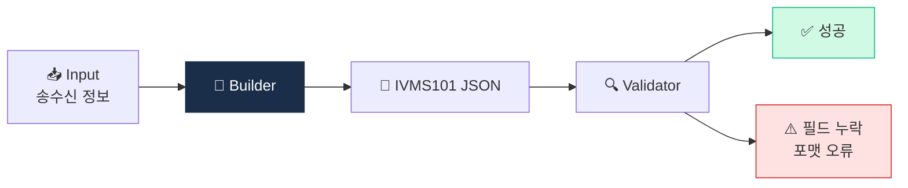

# Day 28 — 🛠️ 미니 프로젝트 1: IVMS101 메시지 빌더 + 4주 리뷰

> 손으로 IVMS101 만들어보면서 표준 체화. ⏱️ ~150분.

## 📖 오늘 뭘 배우나

Week 4의 결산인 첫 미니 프로젝트. Python으로 **IVMS101 메시지를 직접 생성·검증**하는 코드를 짜면서, 지난 6일간 배운 Travel Rule·프로토콜·VerifyVASP·CODE의 내용이 손에 익도록 만듭니다. 완성된 코드는 이후 D35(온체인 tracer)·D56(KYT wrapper)과 결합되어 Capstone의 리스크 엔진으로 확장됩니다.


<!-- MAP-START -->
## 🗺 오늘의 지도


<!-- MAP-END -->

## 🎯 회고 질문
1. Travel Rule이 왜 가상자산 운영의 가장 큰 골칫거리인가?
2. IVMS101이 표준이라는 게 왜 중요한가?
3. 한국 시장 특수성 1가지?

## 🛠️ 미니 프로젝트 (~120분)

### 목표
**Python으로 IVMS101 메시지 빌더 + 검증 함수 작성**

### 사양
- 입력: 송신인/수신인 정보 + 금액 + 카운터파티 VASP 정보
- 출력: IVMS101 JSON 메시지 (스키마 호환)
- 검증: 필수 필드 누락 / 타입 오류 / 포맷 오류 체크

### 구현 가이드
프로젝트 폴더: `aml/projects/01-ivms101-builder/`

```python
# main.py 의사코드
def build_ivms101_message(
    originator: dict,      # name, address, account_number, dob
    beneficiary: dict,     # name, account_number
    originating_vasp: dict,
    beneficiary_vasp: dict,
    amount: float,
    asset: str
) -> dict:
    """IVMS101 호환 JSON 빌드"""
    ...

def validate_ivms101(msg: dict) -> tuple[bool, list[str]]:
    """필수 필드 + 타입 검증, (성공 여부, 에러 리스트)"""
    ...

# 테스트 케이스 (~5개)
# 1. 정상 케이스 (한국 100만원 시나리오)
# 2. 송신인 이름 누락
# 3. 잘못된 wallet 주소 형식
# 4. 비표준 통화 코드
# 5. 200만원 + EU TFR 호환 케이스
```

### 산출물
- `projects/01-ivms101-builder/main.py`
- `projects/01-ivms101-builder/test.py`
- `projects/01-ivms101-builder/README.md` (사양 + 사용법)
- `projects/01-ivms101-builder/sample_messages/` (5개 JSON 예시)

→ 자세한 가이드: [`../projects/01-ivms101-builder/README.md`](../projects/01-ivms101-builder/README.md)

## ✅ 체크포인트
- [ ] IVMS101 메시지 빌더 작동
- [ ] 5개 테스트 케이스 통과
- [ ] [`progress.md`](progress.md) Week 4 7개 모두 체크 + W4 미니 프로젝트 체크
- [ ] 산출물 git commit + push

## 💭 4주차 회고 (1개월 마감!)

1개월 학습 완료. 가장 큰 변화:
가장 의외였던 것:
다음 1개월 (W5~W8) 기대:
