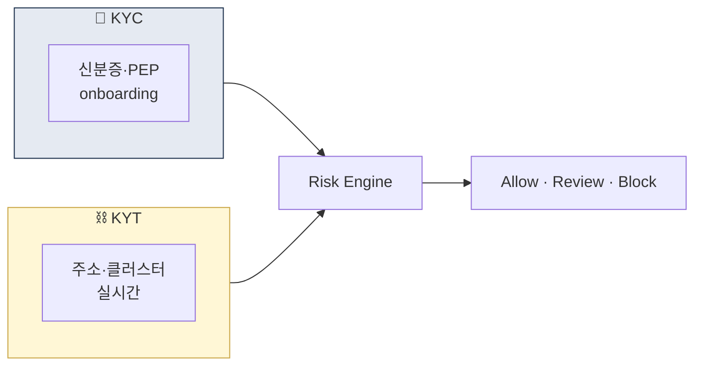

# Day 29 — KYC vs KYT 운영

> 사람을 안다 vs 거래/지갑을 안다. ⏱️ ~70분.

## 📖 오늘 뭘 배우나

Week 5는 온체인 분석 주간. 먼저 **KYC(사람)와 KYT(거래·지갑)**가 상호 보완적임을 확실히 하고, KYT 5단계 파이프라인(Discovery → Attribution → Exposure → Behavior → Decision)을 이해합니다. 두 시스템이 하나의 Risk Engine에서 통합되어야 STR 작성이 가능한 구조까지.

<!-- MAP-START -->
## 🗺 오늘의 지도

<!-- MAP-END -->

## 🎯 핵심 질문
1. KYC와 KYT 차이 핵심 5가지?
2. KYC 5단계 + KYT 5단계 흐름은?
3. 통합 Risk Engine 아키텍처는?

## 📖 읽기 (~50분)
- 메인: [`../notes/4-technology/kyc-kyt.md`](../notes/4-technology/kyc-kyt.md)

## 🛠️ 미니 챌린지 (~15분)
- "온보딩 → 거래 → 알람 → STR" 전체 흐름을 한 그림에 (KYC + KYT 통합)
- 자기 회사 입장에서 KYC와 KYT 중 어디부터 강화할지 선택 + 이유

## ✅ 체크포인트
- [ ] KYC vs KYT 즉답 가능
- [ ] KYC 5단계 (식별/검증/스크리닝/위험평가/모니터링) 외운다
- [ ] KYT 5단계 (Address Discovery/Attribution/Exposure/Behavior/Decision) 안다
- [ ] Alert Fatigue 개념 안다

## 💭 오늘의 한 줄

## 💼 실무 현장 (Industry Reality)

### 한국 VASP 조직 분리

한국 거래소는 KYC와 KYT를 **별도 팀**으로 운영 — 사람을 보는 눈과 거래를 보는 눈이 다르기 때문:

- **KYC팀** (온보딩 CS 성격): 신분증 OCR·PASS API·PEP 스크리닝 담당, 3~8명
- **KYT팀** (엔지니어링·Analyst): Chainalysis API·룰 엔진·실시간 alert, 4~10명
- **Risk Engine팀**: 두 신호를 통합, ML 모델·스코어링. Upbit·Bithumb 등 대형만 별도 팀

신규 고객 온보딩이 KYC, 가입 후 거래가 KYT. **STR은 둘의 교차점** — KYC 위험 + KYT 이상 패턴 결합해야 STR narrative가 설득력 있음.

### 글로벌에서는

- **Coinbase**: Identity Team(KYC) + Financial Crimes Investigations(KYT·STR) 완전 분리 + Data Science가 통합 Risk Score 담당
- **Kraken**: KYC·KYT 하나의 "Compliance Operations" 아래 세부 분업
- **Binance**: 지역 Hub별로 KYC/KYT 조직 다름 — 두바이는 통합, 싱가포르는 분리
- **Sumsub**: KYC SaaS 1위, Jumio·Onfido와 경쟁. Persona는 신흥 강자

### 한국 KYC 벤더·인프라

- **본인확인기관**: PASS(SK·KT·LGU+ 통신 3사), NICE(신용평가사), KCB — 3개사 독점
- **ARGOS**: 한국 KYC SaaS, 신분증 OCR·얼굴인식·PEP 통합
- **Sumsub**: 글로벌 고객사 한국 진출 시 주로 사용
- **자체 구축**: Upbit·Bithumb은 부분 자체, PEP·제재 스크리닝만 벤더

### KYT 5단계 + KYC 통합 플로우

```mermaid
flowchart LR
    N[신규 고객] --> K1[KYC: 신분증·PEP]
    K1 --> T1[Risk Tier 부여]
    T1 --> TR[거래]
    TR --> K2[KYT: Address Discovery]
    K2 --> K3[Attribution]
    K3 --> K4[Exposure]
    K4 --> K5[Behavior]
    K5 --> K6[Decision]
    K6 --> RE[Risk Engine 통합]
    RE -->|Alert| A[Analyst 리뷰]
    A -->|High| STR[STR 초안]
    STR --> F[FIU 제출]
```

### Alert Fatigue 실상

- **FP rate**: 한국 VASP 평균 **70~90%** — Chainalysis 기본 룰 기준
- **일일 Alert 수**: Upbit 규모 ~50~150건, 중소 VASP ~10~30건
- **Alert당 처리 시간**: 단순 케이스 5~10분, EDD 필요 시 30분~2시간
- **대응**: ML 기반 Alert 우선순위 지정(Coinbase "Lynx"·Elliptic "Holistic") + 룰 튜닝 월례

### 자주 나오는 오해

- **"KYC 철저하면 KYT 안 해도 된다"** — KYC는 입구, KYT는 거래 중 탐지. 둘 다 필수
- **"알람 많으면 안전하다"** — FP 폭증은 **Alert Fatigue**로 진짜 의심거래 놓치는 원인. 품질 중심이 원칙