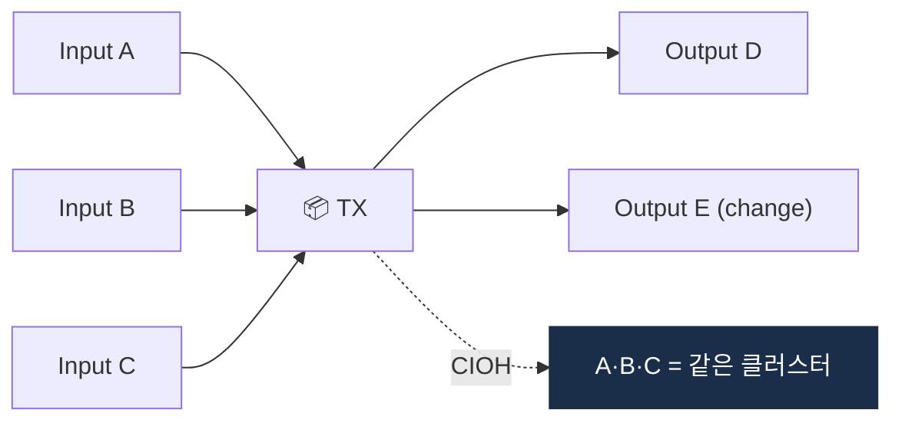

# Day 30 — UTXO + Common Input Ownership Heuristic

> 비트코인 분석의 가장 중요한 휴리스틱. ⏱️ ~80분.

## 📖 오늘 뭘 배우나

비트코인이 계좌가 아닌 **"돈봉투(UTXO)" 모음**으로 작동하는 구조, 그리고 이 구조에서 자연스럽게 도출되는 **Common Input Ownership Heuristic(CIOH)** 를 이해합니다. "한 트랜잭션의 여러 input은 같은 사람이 통제한다"는 단순한 논리가 왜 Chainalysis 같은 회사의 기술적 moat가 됐는지, CoinJoin이 어떻게 이를 깨는지까지.


<!-- MAP-START -->
## 🗺 오늘의 지도


<!-- MAP-END -->

## 🎯 핵심 질문
1. UTXO 모델이 뭔가? (vs Account 모델)
2. Common Input Ownership 휴리스틱의 논리?
3. CoinJoin이 이 휴리스틱을 무력화하는 방식?

## 📖 읽기 (~50분)
- 메인: [`../notes/4-technology/blockchain-analytics.md`](../notes/4-technology/blockchain-analytics.md) — 1~2절

## 🌐 외부 자료 (~20분)
- [Heuristic-Based Address Clustering in Bitcoin (논문)](https://www.researchgate.net/publication/347083664_Heuristic-Based_Address_Clustering_in_Bitcoin)
- [Elementus — Data Science Heuristics](https://www.elementus.io/blog-post/decoding-the-chain-how-data-science-based-heuristics-reveal-blockchain-networks)

## 🛠️ 미니 챌린지 (~10분)
- 트랜잭션 1개에 input 3개 (A, B, C) → output 2개 (D, E) 예시 그리기
- Common Input Ownership 적용 → 어느 주소들이 같은 클러스터?
- CoinJoin 시나리오를 추가하면 어떻게 깨지는지 메모

## ✅ 체크포인트
- [ ] UTXO 모델 이해
- [ ] Common Input Ownership 직접 설명 가능
- [ ] CoinJoin이 무력화하는 이유 안다
- [ ] 비트코인이 ETH보다 클러스터링이 강한 이유 안다

## 💭 오늘의 한 줄

## 💼 실무 현장 (Industry Reality)

### 한국 VASP에서는

Bitcoin UTXO 클러스터링은 한국 VASP 보안팀·AML팀 공통 무기. **2025-02 Bybit 해킹** 조사에서 한국 Upbit·Bithumb SOC팀이 Chainalysis Reactor로 Lazarus 지갑 cluster 식별 시 핵심이 된 게 **Common Input Ownership Heuristic(CIOH)** 기반 address clustering. Upbit 2019 해킹($50M)도 같은 휴리스틱으로 수년에 걸쳐 추적해 일부 회수.

실무에서는 Chainalysis·TRM이 클러스터링 결과를 API로 제공 → 한국 AML팀은 **"이 주소가 어느 entity 소속인가"**만 조회. 직접 클러스터링 연산은 거의 안 함(연산 비용·데이터 규모 문제).

### 글로벌에서는

- **Chainalysis**: 내부 Bitcoin cluster DB, 2014년부터 축적, 주소 20억+ 분류. 회사의 기술적 moat
- **Elliptic**: "Elliptic Navigator", 유사 접근 + attribution 확장
- **TRM Labs**: ML 기반 후발주자, 2023년 이후 cluster 정확도 Chainalysis 근접
- **Coinbase "Lynx"** (2024): Graph Neural Network 기반, 자체 cluster engine

### CIOH + 보조 휴리스틱

Bitcoin address clustering은 CIOH만으로 부족 → 조합 사용:

- **CIOH (Common Input Ownership)**: 한 TX의 여러 input = 같은 주인
- **Change Address Heuristic**: TX output 중 "새로 생성된 주소 + 작은 금액"이 change
- **Consolidation Heuristic**: 여러 주소에서 하나로 모으는 패턴 = 같은 주인
- **Peel Chain Heuristic**: 긴 체인 중 일정한 outgoing 주소 = 서비스 지갑

### CIOH 깨는 방법 (CoinJoin·PayJoin)

- **CoinJoin** (Wasabi·Samourai·JoinMarket): 여러 사용자 TX를 하나로 합침 → CIOH 가정 깨짐
- **PayJoin (BIP 78)**: 수신자도 input 추가 → CIOH가 수신자까지 같은 주인으로 오판
- **Lightning Network**: Channel close 시 on-chain TX만 보이고 내부 경로 숨김

2022 **Samourai Wallet** 운영자 DOJ 기소, 2023 **Wasabi Wallet** 미국 서비스 중단 → mixer·CoinJoin 서비스에 대한 당국 압박 지속. 한국 VASP는 Wasabi·Samourai **출금 시 자동 차단** 정책 표준.

### 실무 SQL 예시 (Postgres 기반 자체 클러스터링)

```sql
-- Step 1: 같은 TX의 input 주소 쌍 추출
WITH co_inputs AS (
  SELECT i1.address AS a1, i2.address AS a2
  FROM tx_inputs i1
  JOIN tx_inputs i2 ON i1.tx_hash = i2.tx_hash
  WHERE i1.address < i2.address
)
-- Step 2: Union-Find로 cluster 생성 (recursive CTE)
SELECT cluster_id, array_agg(address) AS addresses
FROM address_clusters
GROUP BY cluster_id;
```

대용량에서는 Spark GraphX·Neo4j 또는 전용 엔진 필요.

### UTXO vs Account 모델 클러스터링

- **Bitcoin (UTXO)**: CIOH·change address로 강한 클러스터링, address 재사용 적음
- **Ethereum (Account)**: nonce·address 재사용 많음 → CIOH 불가, 행동 기반 클러스터링 (거래 패턴·시간·가스비)

한국 VASP는 Bitcoin(+계열)은 Chainalysis, Ethereum(+L2)은 TRM·Elliptic을 병행하는 경우 많음 — 각 체인 특성에 맞는 attribution 엔진 선택.

### 자주 나오는 오해

- **"CIOH가 100% 정확하다"** — CoinJoin 등장 후 정확도 ~85~95%로 하락. attribution DB와 교차 검증 필수
- **"Ethereum도 CIOH 적용"** — Account 모델이라 input 개념 자체가 다름. 별도 휴리스틱 필요