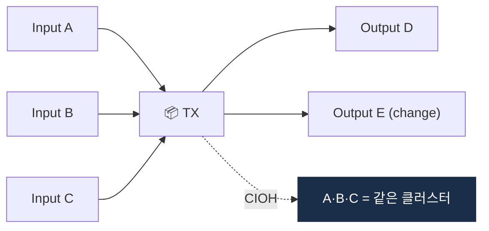

# Day 30 — UTXO + Common Input Ownership Heuristic

> 비트코인 분석의 가장 중요한 휴리스틱. ⏱️ ~80분.

## 📖 오늘 뭘 배우나

비트코인이 계좌가 아닌 **"돈봉투(UTXO)" 모음**으로 작동하는 구조, 그리고 이 구조에서 자연스럽게 도출되는 **Common Input Ownership Heuristic(CIOH)** 를 이해합니다. "한 트랜잭션의 여러 input은 같은 사람이 통제한다"는 단순한 논리가 왜 Chainalysis 같은 회사의 기술적 moat가 됐는지, CoinJoin이 어떻게 이를 깨는지까지.


<!-- MAP-START -->
## 🗺 오늘의 지도


```mermaid
flowchart LR
    I1["Input A"] --> TX["📦 TX"]
    I2["Input B"] --> TX
    I3["Input C"] --> TX
    TX --> O1["Output D"]
    TX --> O2["Output E (change)"]
    TX -.CIOH.-> CL["A·B·C = 같은 클러스터"]
    style CL fill:#1a2e4a,color:#fff,stroke:#1a2e4a
```
<!-- MAP-END -->

## 🎯 핵심 질문
1. UTXO 모델이 뭔가? (vs Account 모델)
2. Common Input Ownership 휴리스틱의 논리?
3. CoinJoin이 이 휴리스틱을 무력화하는 방식?

## 🧮 핵심 알고리즘 (구현 가능 수준)

### Common Input Ownership Heuristic (CIOH)

```python
def common_input_ownership(tx: Transaction) -> set[Address] | None:
    if len(tx.inputs) < 2:
        return None
    if is_coinjoin(tx):
        return None
    return {inp.address for inp in tx.inputs}
```

**전제**: Bitcoin UTXO 모델에서 여러 input을 한 tx에 소비하려면 각 key 소유 → 통계적 "동일 소유자" 가정.

**한계**:
- Ethereum Account 모델에 적용 불가 (from 주소 1개)
- CoinJoin 의도적 합치기 시 가정 위반
- Custodial 거래소 hot wallet은 거래소=entity로 맞지만 고객까지는 아님

### CoinJoin Fingerprint Detection (필수 전처리)

```python
def is_coinjoin(tx: Transaction) -> bool:
    if len(tx.inputs) < 2:
        return False
    amounts = [o.value for o in tx.outputs]
    uniform = [a for a in amounts if amounts.count(a) >= 3]
    if not uniform:
        return False
    # Wasabi 0.1 BTC, Samourai Whirlpool 0.001/0.01/0.1 BTC 고정 denomination
    KNOWN_DENOMS = {0.1e8, 0.01e8, 0.001e8}
    if any(a in KNOWN_DENOMS for a in uniform):
        return True
    # Whirlpool 5:5 같은 대칭 구조
    if len(tx.inputs) >= 5 and abs(len(tx.inputs) - len(tx.outputs)) <= 1:
        return True
    return False
```

### 정확도 수치를 찾지 마세요 — 없습니다

> ⚠️ **2026-08-04 정정.** 이 자리에 CIOH·Fingerprint의 Precision/Recall/F1 비교표가 있었고 Möser 2017·Bellei 2024를 출처로 달았습니다. **두 논문 모두 그 수치를 담고 있지 않습니다.** 원논문을 받아 확인한 결과입니다.
> - Bellei 2024(Elliptic2)는 `common input`·`multi-input`·`CIOH` 언급이 **0회**입니다. 자금세탁 탐지 GNN 논문이지 주소 클러스터링 논문이 아닙니다.
> - Möser & Narayanan은 주제는 맞지만(multi-input 13회·fingerprint 12회) 그 수치가 **하나도 없고**, 2017년이 아니라 2021/22년 논문입니다. 저장소가 "Möser 2017"로 적은 것은 별개 논문(*Anonymous Alone?*, 믹서 측정)입니다.
>
> 판정 근거는 [`kb/facts/contradictions.jsonl`](../kb/facts/contradictions.jsonl) `CTR:00007`.

학계의 실제 입장은 정반대입니다. Möser & Narayanan은 초록에서 이렇게 씁니다.

> *"current techniques rely on heuristics that **have not been rigorously evaluated or optimized**"*

즉 **표준화된 정확도 수치 자체가 존재하지 않습니다.** 데이터셋·시기·지갑 소프트웨어 구성에 따라 결과가 달라지기 때문입니다.

### 그래서 무엇을 봐야 하나 — Cluster Collapse

이 논문의 기여는 (1) 거스름돈 식별의 **ground truth 집합 구축**, (2) 낮은 오탐률을 목표로 한 예측 모델, (3) **클러스터 붕괴 탐지·예방**입니다.

붕괴가 실무 급소입니다. 휴리스틱이 한 번 잘못 병합하면 무관한 엔티티가 한 클러스터로 뭉치고, 그 위에 올린 위험 점수·노출도가 통째로 오염됩니다. 되돌리기도 어렵습니다.

**벤더 PoC 질문을 바꾸세요.** "정확도 몇 %인가"가 아니라 —
- 클러스터 붕괴를 어떻게 탐지하는가
- 붕괴가 발견되면 과거 판정을 어떻게 되돌리는가
- ground truth는 무엇으로 잡았고 언제 기준인가

**핵심 참고**: Meiklejohn 2013 "A Fistful of Bitcoins" · Möser & Narayanan 2022 "Resurrecting Address Clustering in Bitcoin" ([arXiv 2107.05749](https://arxiv.org/abs/2107.05749)) · Bellei 2024 "The Shape of Money Laundering" (Elliptic2, [arXiv 2404.19109](https://arxiv.org/abs/2404.19109) — 자금세탁 **탐지** GNN이지 클러스터링 논문 아님)

**심화**: [`../notes/4-technology/blockchain-analytics.md`](../notes/4-technology/blockchain-analytics.md) §2 참조.

## 📖 읽기 (~50분)
- 메인: [`../notes/4-technology/blockchain-analytics.md`](../notes/4-technology/blockchain-analytics.md) — 1~2절

## 🌐 외부 자료 (~20분)
- [Heuristic-Based Address Clustering in Bitcoin (논문)](https://www.researchgate.net/publication/347083664_Heuristic-Based_Address_Clustering_in_Bitcoin)
- [Elementus — Data Science Heuristics](https://www.elementus.io/blog-post/decoding-the-chain-how-data-science-based-heuristics-reveal-blockchain-networks)

## 🛠️ 미니 챌린지 (~10분)
- 트랜잭션 1개에 input 3개 (A, B, C) → output 2개 (D, E) 예시 그리기
- Common Input Ownership 적용 → 어느 주소들이 같은 클러스터?
- CoinJoin 시나리오를 추가하면 어떻게 깨지는지 메모

## ✅ 체크포인트
- [ ] UTXO 모델 이해
- [ ] Common Input Ownership 직접 설명 가능
- [ ] CoinJoin이 무력화하는 이유 안다
- [ ] 비트코인이 ETH보다 클러스터링이 강한 이유 안다

## 💭 오늘의 한 줄

## 💼 실무 현장 (Industry Reality)

### 한국 VASP에서는

Bitcoin UTXO 클러스터링은 한국 VASP 보안팀·AML팀 공통 무기. **2025-02 Bybit 해킹** 조사에서 한국 Upbit·Bithumb SOC팀이 Chainalysis Reactor로 Lazarus 지갑 cluster 식별 시 핵심이 된 게 **Common Input Ownership Heuristic(CIOH)** 기반 address clustering. Upbit 2019 해킹($50M)도 같은 휴리스틱으로 수년에 걸쳐 추적해 일부 회수.

실무에서는 Chainalysis·TRM이 클러스터링 결과를 API로 제공 → 한국 AML팀은 **"이 주소가 어느 entity 소속인가"**만 조회. 직접 클러스터링 연산은 거의 안 함(연산 비용·데이터 규모 문제).

### 글로벌에서는

- **Chainalysis**: 내부 Bitcoin cluster DB, 2014년부터 축적, 주소 20억+ 분류. 회사의 기술적 moat
- **Elliptic**: "Elliptic Navigator", 유사 접근 + attribution 확장
- **TRM Labs**: ML 기반 후발주자, 2023년 이후 cluster 정확도 Chainalysis 근접
- **Coinbase "Lynx"** (2024): Graph Neural Network 기반, 자체 cluster engine

### CIOH + 보조 휴리스틱

Bitcoin address clustering은 CIOH만으로 부족 → 조합 사용:

- **CIOH (Common Input Ownership)**: 한 TX의 여러 input = 같은 주인
- **Change Address Heuristic**: TX output 중 "새로 생성된 주소 + 작은 금액"이 change
- **Consolidation Heuristic**: 여러 주소에서 하나로 모으는 패턴 = 같은 주인
- **Peel Chain Heuristic**: 긴 체인 중 일정한 outgoing 주소 = 서비스 지갑

### CIOH 깨는 방법 (CoinJoin·PayJoin)

- **CoinJoin** (Wasabi·Samourai·JoinMarket): 여러 사용자 TX를 하나로 합침 → CIOH 가정 깨짐
- **PayJoin (BIP 78)**: 수신자도 input 추가 → CIOH가 수신자까지 같은 주인으로 오판
- **Lightning Network**: Channel close 시 on-chain TX만 보이고 내부 경로 숨김

2022 **Samourai Wallet** 운영자 DOJ 기소, 2023 **Wasabi Wallet** 미국 서비스 중단 → mixer·CoinJoin 서비스에 대한 당국 압박 지속. 한국 VASP는 Wasabi·Samourai **출금 시 자동 차단** 정책 표준.

### 실무 SQL 예시 (Postgres 기반 자체 클러스터링)

```sql
-- Step 1: 같은 TX의 input 주소 쌍 추출
WITH co_inputs AS (
  SELECT i1.address AS a1, i2.address AS a2
  FROM tx_inputs i1
  JOIN tx_inputs i2 ON i1.tx_hash = i2.tx_hash
  WHERE i1.address < i2.address
)
-- Step 2: Union-Find로 cluster 생성 (recursive CTE)
SELECT cluster_id, array_agg(address) AS addresses
FROM address_clusters
GROUP BY cluster_id;
```

대용량에서는 Spark GraphX·Neo4j 또는 전용 엔진 필요.

### UTXO vs Account 모델 클러스터링

- **Bitcoin (UTXO)**: CIOH·change address로 강한 클러스터링, address 재사용 적음
- **Ethereum (Account)**: nonce·address 재사용 많음 → CIOH 불가, 행동 기반 클러스터링 (거래 패턴·시간·가스비)

한국 VASP는 Bitcoin(+계열)은 Chainalysis, Ethereum(+L2)은 TRM·Elliptic을 병행하는 경우 많음 — 각 체인 특성에 맞는 attribution 엔진 선택.

### 자주 나오는 오해

- **"CIOH가 100% 정확하다"** — CoinJoin 등장 후 정확도 ~85~95%로 하락. attribution DB와 교차 검증 필수
- **"Ethereum도 CIOH 적용"** — Account 모델이라 input 개념 자체가 다름. 별도 휴리스틱 필요