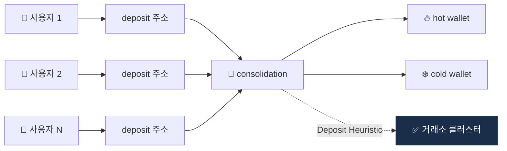

# Day 31 — Change Detection + Deposit Heuristic

> 거스름돈 식별 + 거래소 입금 패턴. ⏱️ ~70분.

## 📖 오늘 뭘 배우나

CIOH 다음으로 중요한 두 휴리스틱. **Change Detection**은 거스름돈 주소를 같은 클러스터로 묶고, **Deposit Heuristic**은 거래소의 consolidation 패턴으로 거래소 전체 주소 체계를 드러냅니다. 이 두 휴리스틱이 결합되면 Chainalysis 같은 회사의 attribution DB가 어떻게 거래소 계정까지 연결하는지 감이 잡힙니다.

<!-- MAP-START -->
## 🗺 오늘의 지도

<!-- MAP-END -->

## 🎯 핵심 질문
1. 비트코인 거스름돈 주소는 어떻게 식별?
2. Deposit Heuristic이 거래소 attribution의 핵심인 이유?
3. 두 휴리스틱의 정확도 한계?

## 📖 읽기 (~50분)
- 메인: [`../notes/4-technology/blockchain-analytics.md`](../notes/4-technology/blockchain-analytics.md) — 2절 (B, C)

## 🛠️ 미니 챌린지 (~15분)
- 거래소 deposit 흐름 예시 그리기:
  - 사용자 100명 → 각자 deposit 주소 → consolidation 주소 → cold/hot wallet
- 분석가 관점에서 어떻게 거래소 클러스터를 식별하는지 단계 정리

## ✅ 체크포인트
- [ ] Change Detection 휴리스틱 안다
- [ ] Deposit Heuristic 안다
- [ ] Consolidation 주소 = 거래소 코어 안다
- [ ] 휴리스틱 한계 (false positive) 인지

## 💭 오늘의 한 줄
